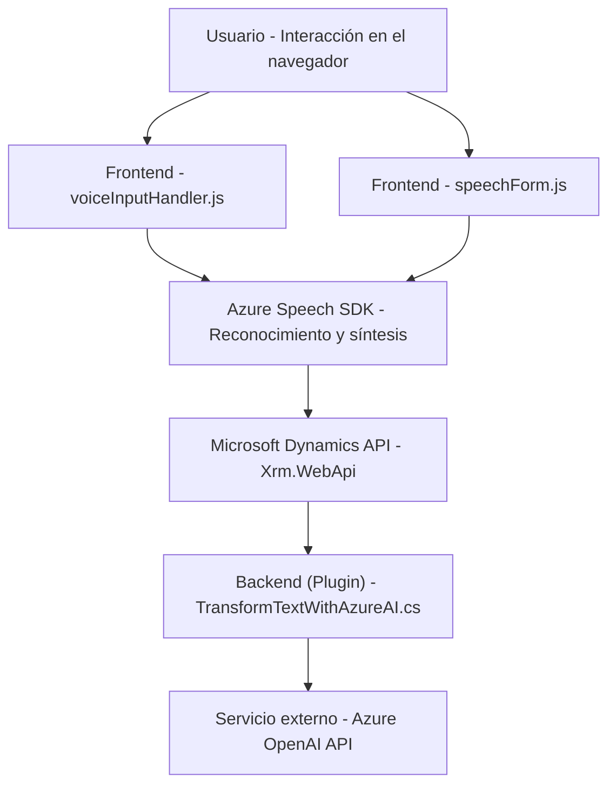

### Breve resumen técnico

El repositorio analiza elementos relacionados con un sistema interactivo de frontend y backend para manejo de voz y procesamiento de datos dinámicos en Microsoft Dynamics CRM utilizando servicios de Azure. La solución parece ser un conjunto integrado que combina funcionalidades de cliente (frontend), complementos servidores (backend) y servicios externos.

---

### Descripción de arquitectura

La arquitectura utiliza un enfoque híbrido:
- **N capas**: Existe una separación clara en frontend para manejar la interacción del usuario, mientras que el backend con plugins realiza operaciones en conjunto con Dynamics y Azure OpenAI API.
- **Integración con servicios externos**: Uso de **Azure Speech SDK** en el cliente para reconocimiento y síntesis de voz, y **Azure OpenAI API** en el servidor para procesamiento avanzado de texto.
- La arquitectura del frontend cataliza la experiencia interactiva en tiempo real, mientras que los plugins server-side actúan como microservicios en segundo plano. Esto muestra elementos que combinan estructuración orientada a servicios (SOA) y arquitectura n capas.

---

### Tecnologías usadas

1. **Frontend**:
   - **JavaScript**: Implementación en `voiceInputHandler.js` y `SpeechInputHandler.js` para lógica de reconocimiento y síntesis de voz.
   - **Azure Speech SDK**: Utilizado para la interacción voz-texto en el navegador.
   - **Microsoft Dynamics SDK - Xrm.WebApi**: Integración dinámica con formularios de CRM.

2. **Backend**:
   - **C#**: Lenguaje utilizado en `TransformTextWithAzureAI.cs` para crear un plugin de Dynamics CRM y conexión con Azure OpenAI API.
   - **ASP.NET Framework**: Posible framework usado, dada la referencia a `Microsoft.Xrm.Sdk`.

3. **Servicios externos**:
   - **Azure OpenAI API**: Manejo de procesamiento avanzado de texto (transformación según reglas).

4. **Formatos y herramientas**:
   - **JSON**: Estructuración de datos y respuesta de las APIs externas.

---

### Diagrama Mermaid válido para GitHub

---

### Conclusión final

La solución parece ser una extensión para Microsoft Dynamics que agrega funcionalidades avanzadas de voz y procesamiento textual utilizando tecnologías de Azure. 

#### Aspectos destacados:
1. **Híbrido cliente-servidor**: Cubre tanto la interacción directa en el frontend como el procesamiento avanzado en el backend.
2. **Modularidad**: Las funciones están divididas claramente para manejo de voz, llamado a APIs, y procesamiento desde el contexto del formulario.
3. **Integración extensiva**: Conexión directa con Dynamics CRM y servicios de Azure (Speech y OpenAI).

#### Mejora sugerida:
Si el sistema opera en producción, la seguridad en el manejo de claves API y acceso dinámico a los servicios debería reforzarse con tokens más robustos y almacenamiento cifrado para credenciales sensibles.