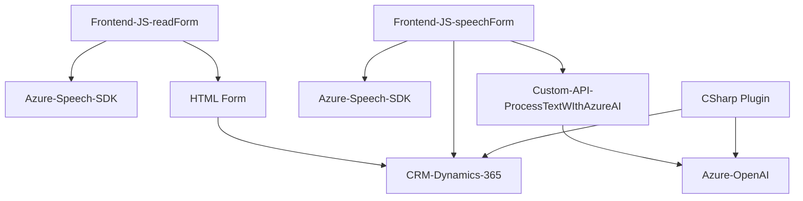

### Resumen técnico
La solución parece ser una integración diseñada para ofrecer capacidades de síntesis y reconocimiento de voz, además de la transformación de texto mediante inteligencia artificial. Este sistema interactúa con formularios de un CRM (Dynamics 365), utilizando servicios externos como Azure Speech SDK y Azure OpenAI para realizar tareas específicas, como lectura en voz alta, reconocimiento de voz y procesamiento del texto.

---

### Descripción de arquitectura
1. **Tipo de solución**: 
   - Este repositorio implementa una **API integrada** con capacidades de voz, procesamiento IA y actualización de formularios en un CRM como Dynamics 365. Incluye archivos JavaScript para la capa frontend (interacción directa con el usuario y reconocimiento/síntesis de voz) y un archivo de plugin en C# para procesamiento automando mediante IA.

2. **Tipo de arquitectura**:
   - **Monolítica extendida**: La arquitectura de la solución se basa en una estructura monolítica típica de Dynamics 365, donde se añaden plugins y scripts JavaScript como extensiones. Aunque utiliza integraciones externas (Azure OpenAI y Speech SDK), no se observa un diseño completamente desacoplado como el de microservicios.
   - Utiliza principalmente **arquitectura de capas** (n capas), donde:
     - La capa de presentación (Frontend/JS) interactúa directamente con los formularios.
     - La capa de negocio (Plugins/TransformTextWithAzureAI.cs) maneja la lógica central, trabajando en el servidor del CRM.
     - Los servicios externos (Azure Speech SDK y OpenAI) son utilizados como componentes complementarios.

---

### Tecnologías usadas
1. **Lenguajes y plataformas**:
   - **JavaScript**: Scripts frontend que interactúan con los formularios en el CRM (Dynamics 365).
   - **C# (.NET Framework)**: Implementación del plugin para Dynamics específico.
2. **Frameworks y servicios**:
   - **Microsoft Dynamics 365 SDK**: Utilizado para la interacción con formularios, atributos y APIs internas del CRM.
   - **Azure Speech SDK**: Proporciona capacidades de síntesis y reconocimiento de voz.
   - **Azure OpenAI API**: Utilizada para procesar texto mediante inteligencia artificial.
   - **Newtonsoft.Json**: Manejo de JSON en el plugin C#.
3. **Patrones usados**:
   - **Event-driven architecture en frontend**: Verificación de SDK y ejecución condicional de funciones según eventos.
   - **Plugin architecture en backend**: Uso de `IPlugin` para implementar lógica personalizada en Dynamics.
   - **Strategy pattern**: Normas para transformar texto proporcionadas como parámetro al servicio de IA.
   - **Modular design**: Funciones y clases específicas para distintas funcionalidades.

---

### Dependencias o componentes externos
1. **Servicios externos**:
   - **Azure Speech SDK**: Reconocimiento de voz y texto a voz.
   - **Azure OpenAI API**: Para transformar texto.
2. **API interna del CRM**:
   - **Dynamics 365 WebApi (Xrm.WebApi)**: Consultas a las entidades de datos y actualización de campos en el CRM.
   - **Custom API (trial_TransformTextWithAzureAI)**: API interna para realizar transformaciones avanzadas de texto mediante Azure OpenAI.

3. **Bibliotecas adicionales**:
   - **Newtonsoft.Json**: Manejo de objetos JSON para datos dinámicos.
   - **System.Net.Http**: Realización de llamadas REST al API de OpenAI.
   - **System.Text.Json**: Análisis y construcción de JSON de salida en los plugins C#.

---

### Diagrama Mermaid

---

### Conclusión final
La solución es bien diseñada para entornos CRM con necesidades de reconocimiento y síntesis de voz, además de procesamiento avanzado mediante IA. Sin embargo:
1. La arquitectura extendida monolítica limita la escalabilidad. Un diseño multidominio (microservicios) podría optimizar la separación de responsabilidades y mejorar la disponibilidad de los servicios.
2. La dependencia en servicios externos como Azure aumenta la complejidad operativa y los costos asociados, aunque añade capacidades de alta calidad. Se recomienda un monitoreo constante de costos y rendimiento.
3. Aunque los datos sensibles (como claves de API) están en el código fuente, sería óptimo trasladarlos a almacenamiento seguro como Azure Key Vault.

Pese a estas consideraciones, este repositorio presenta una solución funcional y eficiente para proyectos que requieran capacidades de síntesis, reconocimiento de voz, y uso de IA en sistemas de CRM.