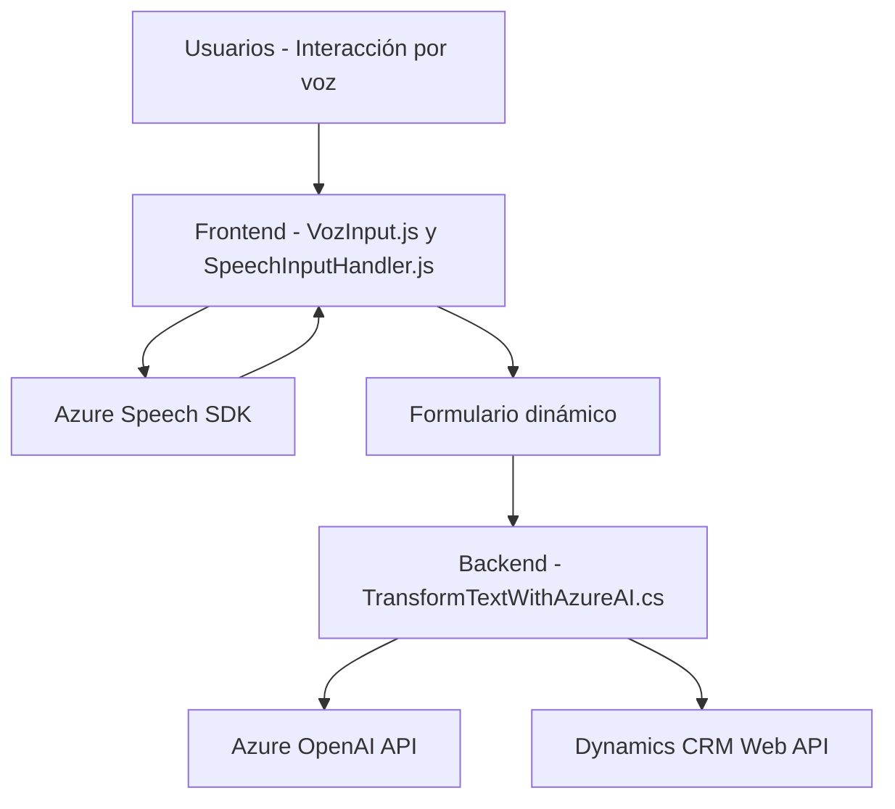

### Resumen técnico
El repositorio presenta una solución basada en **servicios orientados a eventos**, que integra directamente con **Microsoft Azure (Speech SDK y OpenAI API)** para la gestión de voz y transformación de texto. La implementación incluye dos archivos JavaScript en la carpeta `FRONTEND/JS`, enfocados en interacción de voz con formularios, y un archivo C# como plugin en Dynamics CRM para interacción con Azure OpenAI.  

### Descripción de arquitectura
La arquitectura es **n-capas** con una alta dependencia de servicios externos para la lógica de negocio. El frontend gestiona la interacción directa con usuarios mediante voz y entrada de datos, mientras que el backend usa un plugin en Dynamics CRM para las transformaciones de texto usando una API de OpenAI hospedada en Azure.

**Patrones detectados:**
1. **Orientación a eventos** (JavaScript): Se cargan dependencias solo cuando son necesarias y se usan callbacks para respuesta.
2. **Plugin Pattern (Dynamics CRM)**: Define una arquitectura extensible que interactúa con puntos específicos del flujo de trabajo del CRM.
3. **Integración de servicios externos (microservicios)**: Usar Azure Speech SDK y OpenAI API como servicios desacoplados refleja un patrón de microservicios.
4. **Encapsulación funcional**: Todas las funciones tienen un rol claro y acotado.

### Tecnologías, frameworks y patrones presentes
1. **Frontend:**
   - **JavaScript**: Base para interacción de voz y transcripción.
   - **Azure Speech SDK**: Reconocimiento y síntesis de voz, con enfoque de eventos (asíncrono).
   - **Framework CRM Dynamics**: Uso de contextos dinámicos para la gestión de formularios.
   - **Event-driven Programming**: Callbacks en la carga y procesamiento.

2. **Backend:**
   - **C#, Microsoft Dynamics CRM SDK**: Para integración directa con el sistema.
   - **Azure OpenAI API**: Transformación de texto según reglas específicas.
   - **Newtonsoft.Json y System.Text.Json**: Para manejar datos JSON estructurados.

3. **Infraestructura externa:**
   - **Microsoft Azure**: Servicios usados para Speech SDK y OpenAI.

### Dependencias o componentes externos
- **Azure Speech SDK**: Servicio de síntesis y reconocimiento de voz.
- **Azure OpenAI API**: Modelo transformador de texto basado en IA.
- **Dynamics Web API (Xrm.WebApi)**: Llamadas a servicios del CRM.
- **Newtonsoft.Json y System.Text.Json**: Librerías para serialización JSON.

---

### Diagrama Mermaid (válido para GitHub Markdown)

---

### Conclusión final
La solución implementada combina tecnologías modernas de reconocimiento de voz y procesamiento de texto basado en inteligencia artificial, para mejorar la capacidad de interacción entre usuarios y los formularios de Dynamics CRM. La arquitectura utiliza un modelo de **componentes distribuidos** con servicios fuertemente desacoplados y despliega integración con APIs de Microsoft Azure para realizar tareas especializadas. Aunque la implementación sigue patrones comunes como la orientación a eventos y la arquitectura n-capas, podría evolucionar hacia un modelo más modular como **hexagonal** en un futuro, adaptando dependencias externas como puertos.