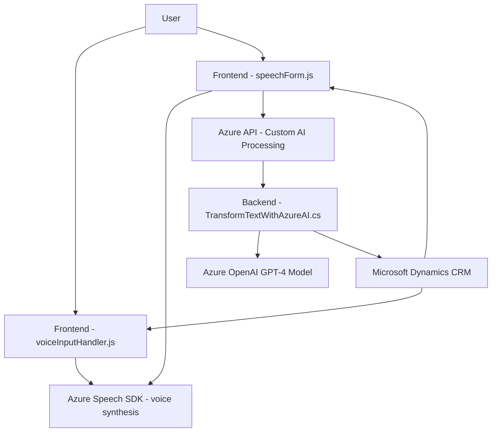

### Breve resumen técnico
El repositorio implementa un sistema para formularios interactivos que incluye funcionalidades de síntesis y reconocimiento de voz, además de integración con una API de inteligencia artificial basada en Azure. La solución está pensada para operar dentro de Microsoft Dynamics CRM y utiliza un plugin en la capa backend para conectar con Azure OpenAI. Los scripts en JavaScript manejan la interacción con el frontend del sistema CRM para procesar voz y texto.

---

### Descripción de arquitectura
El sistema combina una arquitectura de **n capas** (con lógica para el backend en el archivo C# y lógica para el frontend en los scripts JavaScript) con elementos del diseño de **arquitectura de microservicios**. Los scripts JavaScript se encargan de la interacción del usuario, extracción y procesamiento de datos del formulario mediante Azure Speech SDK. La parte backend (plugín en C#) actúa como conectividad intermedia entre Dynamics CRM y los servicios de Azure OpenAI. Aunque se aprecia la interacción modular entre componentes, la solución no cumple completamente los principios de arquitectura hexagonal, al estar la lógica del plugin parcialmente dependiente de configuraciones internas.

---

### Tecnologías usadas
1. **Frontend:**
   - **JavaScript:** Lógica para manipulación de formularios y síntesis/reconocimiento de voz.
   - **Azure Speech SDK:** Procesamiento de texto a voz y reconocimiento de voz desde el frontend.

2. **Backend:**
   - **C#:** Plugin implementado dentro de Dynamics CRM para integración con un modelo de Azure OpenAI (GPT-4).
   - **Microsoft Dynamics CRM SDK:** Para manejar la lógica de servidor.
   - **Azure AI API:** Para llamadas a modelo GPT-4.
   - **JSON parsers:** `System.Text.Json` y `Newtonsoft.Json.Linq`.

3. **Integración externa:**
   - Conexión con Azure se realiza usando APIs (implica uso de HTTP requests).
   - Dependencia de la infraestructura de Microsoft Dynamics CRM para ejecución del plugin.

---

### Diagrama Mermaid válido para GitHub
El diagrama describe la interacción entre las capas y componentes principales en la solución.

---

### Conclusión final
La solución combina una interacción entre frontend (implementado en JavaScript) y backend (Microsoft Dynamics CRM plugin) para ofrecer funcionalidades avanzadas de síntesis y reconocimiento de voz, integradas con servicios de IA (Azure GPT-4). Se observa un diseño modular basado en la interacción de componentes y APIs externas, siguiendo una **arquitectura de n capas** con elementos de microservicio. Sin embargo, la gestión directa de configuraciones críticas en el código C# presenta problemas potenciales de seguridad, como la fuga de claves de API de Azure.