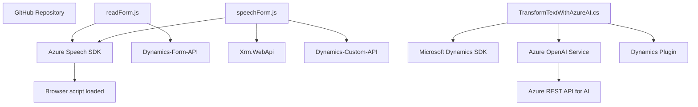

## Breve resumen técnico
El repositorio tiene 3 partes principales que conforman una solución basada en el uso de la plataforma Microsoft Dynamics 365 y el SDK de Azure Speech para la integración de funcionalidades de síntesis de voz, comandos por voz y generación de texto procesado. 

1. **Archivo `readForm.js`**: Extrae datos desde un formulario y los sintetiza en voz.
2. **Archivo `speechForm.js`**: Procesa comandos de voz para manipular dinámicamente atributos en formularios Dynamics 365.
3. **Archivo `TransformTextWithAzureAI.cs`**: Plugin de Dynamics CRM diseñado para transformar texto usando Azure OpenAI y normas predefinidas.

---

## Descripción de arquitectura
La solución parece estar basada en una combinación de arquitecturas:
1. **Integración de servicios externos (AI y SDK)**: Usa dependencias externas para cada funcionalidad de voz/IA (Azure Speech SDK, Azure OpenAI).
2. **Arquitectura orientada al cliente-servidor**:
   - Parte frontend basada en integración con Dynamics 365 y SDK en JavaScript.
   - Parte backend con plugins de Dynamics CRM que ejecutan lógica e interactúan con Azure OpenAI API.
3. **Capa de comunicación con servicios externos**: Todas las llamadas a servicios como Azure Speech SDK y Azure OpenAI se encuentran encapsuladas, cada una con un propósito específico.

Esto indica una arquitectura **n-capas**, donde cada componente tiene una responsabilidad bien definida. Por otro lado, la solución no es completamente microservicios, pero las interacciones con APIs externas toman cierto enfoque hacia patrones de microservicio.

---

## Tecnologías usadas
### Frontend:
- JavaScript.
- **Azure Speech SDK**: Para procesamiento de texto a voz y reconocimiento de voz.
- **Dynamics 365 SDK (Contexto del Formulario)**: Actúa como API de manipulación y comunicación con datos de Dynamics.

### Backend:
- C#: Para el plugin en Dynamics CRM.
- **Microsoft Dynamics CRM SDK**.
- **Azure OpenAI Service API**: Para transformación avanzada de texto.
- **System.Net.Http**: Implementación de cliente HTTP para consumir servicios de Azure.

### Patrones implementados:
- **Asynchronous Programming**: Manejo mediante callbacks y promesas.
- **Plugin architecture**: Enfocado en Dynamics 365 como destino.
- **Modularidad y Encapsulación**: Funciones con propósito único.
- **Adaptador**: Conversión de datos (texto, JSON) hacia estructuras requeridas.
- **Event-driven architecture**: Procesamiento basado en eventos del usuario en frontend.

---

## Diagrama Mermaid

---

## Conclusión final
Este repositorio presenta una solución híbrida que combina un frontend funcional en JavaScript para manipulación de formularios usando voz y síntesis, junto con un backend basado en plugins para Dynamics CRM que utiliza capacidades avanzadas de AI y procesamiento semántico/textual. Utiliza una arquitectura n-capas, y aunque los elementos como SDK y APIs no forman microservicios propiamente dichos, están descentralizados y especializados.

Ventajas:
- Modularidad y claridad de funciones.
- Extensibilidad mediante APIs de Azure y Dynamics.
- Patrones definidos orientados a separación de responsabilidades.

Observaciones:
1. No se utilizaron configuraciones avanzadas para manejo de claves/credenciales externas.
2. Sería posible beneficiar la implementación de patrones como "Chained responsibility" o "Retry pattern" en algunas áreas.