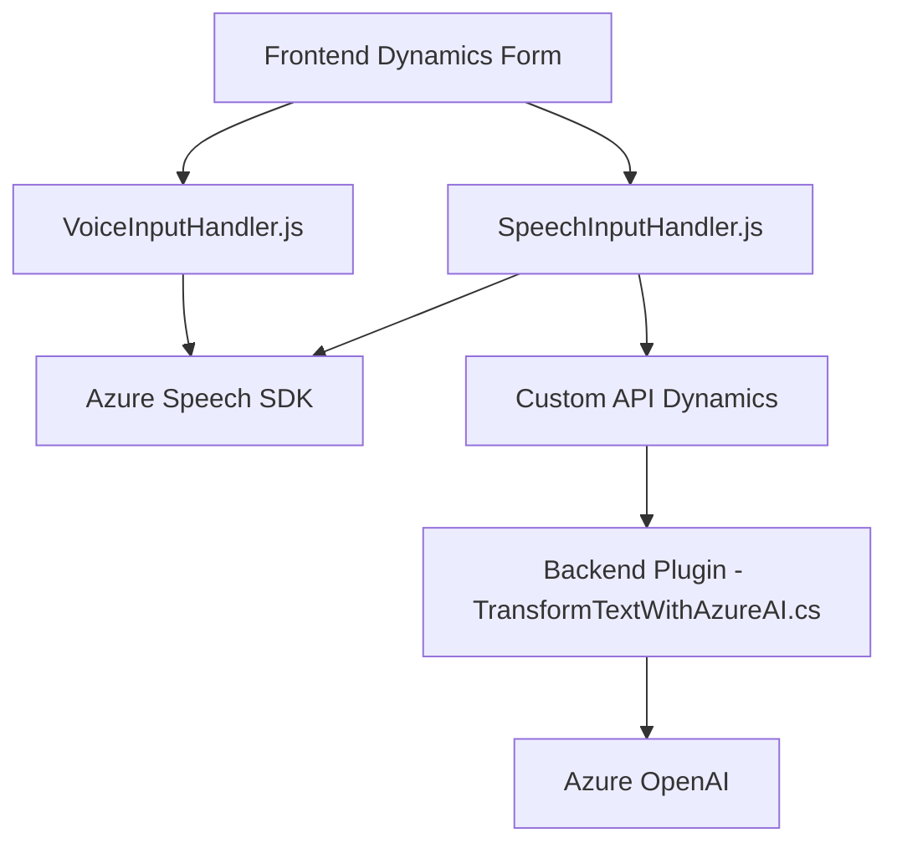

### Breve resumen técnico
El repositorio está orientado a soluciones de interacción entre un frontend basado en formularios, un servicio de síntesis/reconocimiento de voz (Azure Speech SDK) y procesamiento de datos estructurado utilizando IA (Azure OpenAI). Además, incluye un componente backend en forma de un plugin .NET para Dynamics CRM destinado a transformar datos textuales en respuestas estructuradas.

---

### Descripción de arquitectura
La solución tiene un enfoque **híbrido**, donde se combinan un **frontend monolítico** (formularios en Dynamics 365) con integraciones hacia servicios externos (API Azure Speech y Azure OpenAI) y un **plugin orientado a eventos** en Dynamics CRM. Estas partes interactúan para permitir captura de voz, síntesis de texto, procesamiento mediante IA y actualización dinámica de datos de formularios.

Esta arquitectura puede clasificarse como **n-capas**, con:
1. **Capa de presentación** (frontend en Dynamics 365).
2. **Capa lógica del frontend** (JS scripts que integran el Speech SDK).
3. **Plugin backend** (TransformTextWithAzureAI.cs) que ejerce lógica avanzada de integración con Azure OpenAI.
4. Servicios externos (Azure Speech SDK y Azure OpenAI).

---

### Tecnologías usadas
1. **Frontend:**
   - JavaScript.
   - Azure Cognitive Services Speech SDK (para reconocimiento y síntesis de voz).
   - Dynamics 365 JavaScript context API (`Xrm.WebApi`).

2. **Backend/Plugins:**
   - .NET Framework.
   - Microsoft.Xrm.Sdk: Para desarrollo de plugins orientados a Dynamics 365.
   - Azure OpenAI.
   - Newtonsoft.Json y System.Text.Json para manejo de datos JSON.

3. **Servicios externos:**
   - Azure Speech SDK.
   - Azure OpenAI API.

---

### Dependencias o componentes externos
1. **Azure Speech SDK**: Usado en el frontend para procesos de voz.
2. **Azure OpenAI**: Servicios de IA integrados en el backend para procesamiento de datos textuales.
3. **Dynamics 365 API**: Integración dentro del ecosistema de Dynamics para manipulación de datos de formularios.
4. **FrontEnd JavaScript**: Manejo de formularios con elementos DOM dinámicos.

---

### Diagrama Mermaid válido para GitHub Markdown

---

### Conclusión final
El repositorio presenta una solución modular y extensible que permite la captura y síntesis de voz en un frontend basado en formularios de Dynamics 365, procesando estos datos hacia un backend para transformación avanzada mediante IA. La arquitectura **n-capas** se ajusta bien al modelo de Dynamics combinado con servicios de Azure. Además, el uso de dinámicas funciones de mapeo y la modularidad del código facilitan la escalabilidad y adaptabilidad a nuevas funcionalidades.