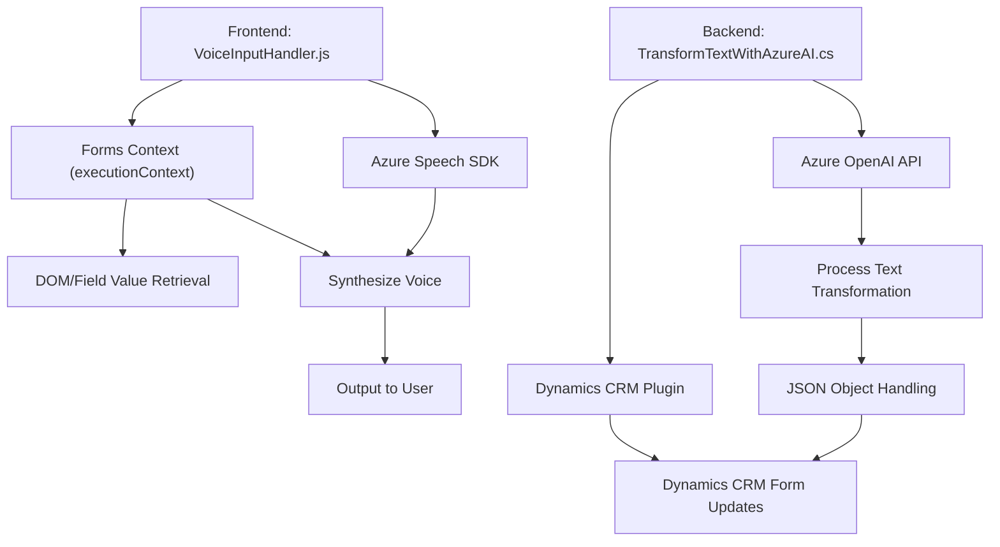

### Breve Resumen Técnico
El repositorio tiene una estructura que integra soluciones de **frontend** (con lógica en JavaScript) y **backend** (MS Dynamics CRM + Azure Services). Se enfoca en la interacción dinámica entre sistemas de procesamiento de voz, inteligencia artificial (OpenAI), y la automatización de formularios.

---

### Descripción de Arquitectura
1. **Tipo de solución:**  
   La solución consiste principalmente en dos partes:
   - **Frontend orientado a formularios:** Modulos en JavaScript que integran el SDK de Azure Speech para lectura de voz y reconocimiento hablado, aplicado a formularios dinámicos (posiblemente en Microsoft Dynamics).
   - **Backend en Dynamics CRM:** Plugins que interactúan con Azure OpenAI para el procesamiento de texto, acoplados al sistema CRM mediante la arquitectura basada en plugins.

2. **Capas y modelo arquitectónico:**  
   - **Frontend Multicapa:** Se basa en una arquitectura N-capas (API - SDK - procesos de datos en formularios).  
   - **Backend Hexagonal/N-capas:** El plugin, basado en la interfaz `IPlugin`, sigue un diseño centrado en el dominio de Dynamics CRM.
   - **Integración de servicios externos:** El sistema depende de servicios externos (Azure Speech SDK, Azure OpenAI) con interacciones claramente definidas.

---

### Tecnologías Usadas
- **Frontend:**  
  - **JavaScript** como lenguaje principal.  
  - **Azure Speech SDK:** Reconocimiento de voz, síntesis de texto a voz.  
  - Llamada dinámica al SDK desde `https://aka.ms/csspeech/jsbrowserpackageraw`.  
  - Interacción con formularios y datos DOM (`executionContext`, `formContext`).  

- **Backend:**  
  - **Microsoft Dynamics CRM:** Plugins basados en `IPlugin`.  
  - **Azure OpenAI:** Procesamiento de texto mediante inteligencia artificial.
  - **Newtonsoft.Json** / `.Net Core System.Text.Json` para manejo de objetos JSON.  
  - **System.Net.Http** para peticiones HTTP a servicios externos.

**Patrones principales:**
- Función modular y encadenada en JavaScript.
- Modelo de Plugins para backend.
- Dependency Injection en SDK y servicios.
- API Gateway para manejo de servicios externos en backend (Azure Speech y OpenAI).

---

### Dependencias o Componentes Externos
- **SDKs externos:**
  - **Azure Speech SDK**: Para síntesis y reconocimiento de voz.  
  - **Azure OpenAI API**: Para procesamiento avanzado de texto.  
- **Plataformas:**  
  - **Microsoft Dynamics CRM:** Para arquitectura de plugins y extensiones en backend.  
- **Frameworks internos:**  
  - **Newtonsoft.Json** para serialización.  
  - **Microsoft.Xrm.Sdk** para interacción con Dynamics.  

---

### Diagrama **Mermaid**

---

### Conclusión Final
La solución combina la capacidad de interactividad y automatización de formularios dinámicos usando tecnologías modernas como **Azure Speech SDK** y **Azure OpenAI API**. Utiliza principios como separación por capas en el frontend y arquitectura centrada en el dominio del backend. El uso de APIs externas (Azure Services) lo clasifica como una solución híbrida que depende de servicios en la nube y componentes locales de Dynamics CRM.