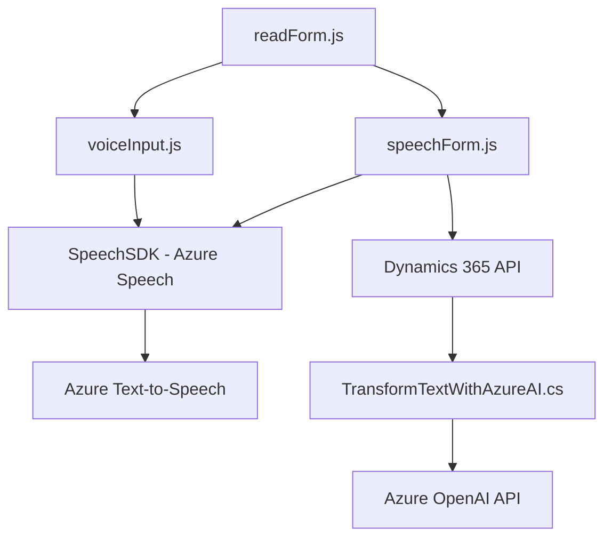

### Resumen técnico

1. **Tipo de solución:** Se trata de un sistema compuesto por una solución híbrida que incluye tres capas principales:
   - Una capa de frontend (JavaScript) que integra directamente con Microsoft Dynamics 365 y el servicio de Azure Speech SDK.
   - Una capa de middleware (Azure Functions potencialmente, o algún backend remoto) que interactúa con el Azure OpenAI API.
   - Una capa de plugins para Dynamics CRM mediante componentes de C# (`TransformTextWithAzureAI.cs`), extendiendo la funcionalidad de la plataforma CRM.

2. **Tecnologías, frameworks y patrones:**
   - **Frontend:** JavaScript, integración con web APIs, manejo de eventos en formularios.
   - **Middleware:** Azure AI (Speech SDK y OpenAI API), backend con C# y Dynamics CRM SDK, uso de HttpClient para solicitudes REST.
   - **Patrones de diseño:**
     - Separación de responsabilidades (SoC).
     - Uso de servicios en la nube y SDKs para funcionalidades específicas.
     - Comunicación con APIs externas (RESTful).
     - Mapeo dinámico de campos visiblemente utilizando un patrón de Mapper.

3. **Tipo de arquitectura:** La solución general representa una arquitectura híbrida orientada a microservicios. El frontend interactúa con servicios en tiempo de ejecución, mientras que el backend (plugins de Dynamics CRM) utiliza componentes acoplados para extender la funcionalidad local de la plataforma.

4. **Dependencias o componentes externos:**
   - **Azure Speech SDK:** Para la síntesis de voz y reconocimiento.
   - **Dynamics 365:** Contexto de formularios y planeación de datos.
   - **Azure OpenAI API:** Para la transformación inteligente de texto.
   - **HttpClient:** Para solicitudes REST externas desde el plugin.
   - **Newtonsoft.Json y System.Text.Json:** Para procesar respuestas JSON.

---

### Diagramas Mermaid

---

### Conclusión final:

Este repositorio implementa una solución orientada a mejorar la accesibilidad y procesamiento de datos mediante dos tipos de interacción principales: la conversión de texto visible en voz (ideal para usuarios con discapacidades o necesidades asistidas) y la integración de comandos basados en voz para interactuar con plataformas empresariales como Dynamics CRM.

Se identifica que el diseño favorece una arquitectura híbrida de microservicios debido al uso de servicios en la nube que complementan la lógica local en Dynamics CRM y el frontend. Las principales dependencias externas fortalecen el aspecto de interoperabilidad en tiempo real, proporcionando un flujo continuo entre las capas de la solución.

Aunque la integración es sólida, se podría optimizar la gestión de puntos críticos como el manejo de errores en servicios externos y mejorar la seguridad implementando gestores de credenciales seguros como Azure Key Vault para claves sensibles.