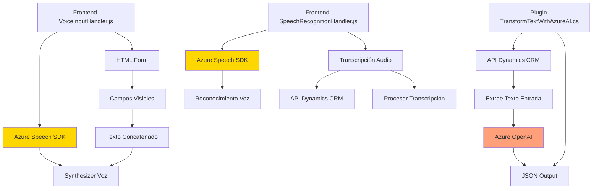

### Breve Resumen Técnico
El repositorio contiene una solución compuesta principalmente por integraciones con APIs externas. Se enfoca en funcionalidad de reconocimiento de voz y síntesis para formularios CRM, utilizando Azure Speech SDK y servicios de Azure OpenAI para interactuar y procesar datos. Está organizada en tres niveles: frontend (JavaScript), backend plugin (C#) y servicios externos (Azure).

### Descripción de Arquitectura
La arquitectura combina elementos de un sistema **n-capas** con características propias de sistemas **orientados a eventos** y **hexagonal**.  
- **N-capas**: Existe un frontend JavaScript (sintetización y reconocimiento de voz), lógica del backend (plugin en C#), y una capa de integración APS con Azure Speech/OpenAI.  
- **Hexagonal**: Muestra separación explícita entre lógica central del negocio (Dynamics CRM) y dependencias externas (Azure Speech/OpenAI).  
- **Event-driven**: La interacción está condicionada por eventos como la carga del SDK, el inicio del reconocimiento de voz y la activación de plugins.

### Tecnologías Usadas
- **Frontend (JavaScript)**:
  - Azure Speech SDK: Para sintetizar y reconocer voz.
  - DOM Manipulation: Acceso a contexto de formularios HTML/CRM (ej. Dynamics 365).
- **Backend (C#)**:
  - Microsoft Dynamics CRM SDK: Plugin para extender funcionalidades nativas.
  - Azure OpenAI: Servicio de procesamiento de datos con modelos GPT-4.
- **Servicios externos**:
  - APIs de Azure Speech y OpenAI: Integración directa para procesamiento dinámico.
  - REST APIs: Para llamar servicios externos (ej., desde el plugin).

### Dependencias o Componentes Externos
- **Azure Speech SDK**: Cargado dinámicamente para manejo y reconocimiento de voz.
- **Azure OpenAI Service**: Usado en el plugin del backend para transformar texto usando IA.
- **Microsoft Dynamics CRM SDK**: Conectividad directa con formularios y eventos del CRM.
- **HTTP Requests**: Se utilizan para llamadas REST a servicios externos.

### Diagrama Mermaid

### Conclusión Final
El repositorio está diseñado como una solución integral de interacción con sistemas CRM mediante voz y procesamiento IA. Está basado en una arquitectura **n-capas** con elementos de **hexagonal** y **orientada a eventos**. La integración con Azure Speech SDK y Azure OpenAI demuestra una fuerte dependencia de servicios externos, ideal para entornos dinámicos que requieran adaptación de datos y asistencia. Su organización modular facilita la escalabilidad y encapsulación de responsabilidades.