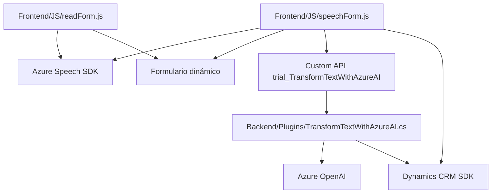

### Resumen Técnico  
El repositorio contiene tres áreas principales enfocadas en la integración de funcionalidades de voz y texto, utilizando tecnologías de Azure, Dynamics CRM y otros servicios externos. La solución está orientada a la interacción con formularios dinámicos, la síntesis y transcripción de voz, y la transformación avanzada de textos por medio de servicios de inteligencia artificial.

---

### Descripción de Arquitectura  
La arquitectura general parece ser **n-capas** o **modular**, donde cada componente está diseñado con una responsabilidad específica:
- **Frontend**: Implementación de síntesis de voz y transcripción de voz a texto.
- **Backend (Plugins)**: Interacción con Dynamics CRM mediante integración de APIs y lógica personalizada empaquetada como plugins.
El enfoque es desacoplado en el sentido de dividir responsabilidades en distintos puntos del flujo, aunque no implementa estrictamente patrones como **hexagonal** o **clean architecture**, pero sigue principios para la modularidad y bajo acoplamiento.

---

### Tecnologías Usadas  
1. **Azure Speech SDK**: Para síntesis de voz y transcripción.
2. **Dynamics CRM/Xrm SDK**: Framework para integrar lógica a sistemas CRM.
3. **Azure OpenAI (GPT-4)**: Uso avanzado de modelos IA para procesamiento estructurado de texto.
4. **JavaScript**: Frontend/entrada con manipulación de DOM y contexto.
5. **C#**: Backend (Plugins) para compatibilidad con servicios proporcionados por Dynamics CRM.
6. **APIs Personalizadas**: Para manejar reglas de negocio definidas en la solución.

---

### Diagrama Mermaid válido para GitHub  

---

### Conclusión Final  
El repositorio implementa una solución modular con dependencias externas críticas en Azure (Speech SDK y OpenAI), adecuada para mejorar la experiencia de interacción con Dynamics CRM mediante voz y texto procesados. La arquitectura se orienta a **n-capas modulares**, con una clara separación entre funcionalidades frontend para manejo de voz y texto, y backend para integración dinámica y transformación avanzada. Es una solución efectiva para casos de uso en entornos empresariales con acceso a servicios de Microsoft y Azure.