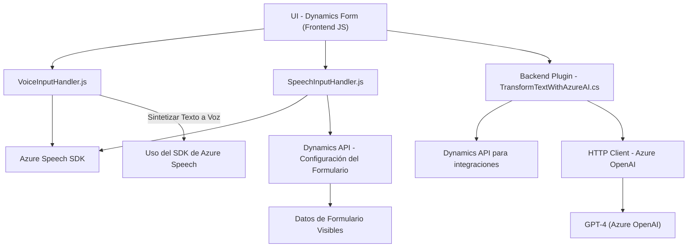

### Breve resumen técnico
El repositorio analiza tres componentes clave que implementan funcionalidades avanzadas con integraciones a servicios externos, principalmente el **Azure Speech SDK** y **Azure OpenAI**. Estos archivos están diseñados para trabajar en el ecosistema **Microsoft Dynamics 365**, proporcionando soluciones basadas en entrada de voz y manipulación de texto.

### Descripción de arquitectura
- **Tipo de solución:** La solución general se enfoca en: **frontend personalizado para Dynamics 365**. Incluye dos módulos frontend en JavaScript que interactúan directamente con la API de Dynamics 365 y un plugin backend en C# que se ejecuta dentro del entorno de Dynamics 365.
- **Arquitectura general:** Modelo **n capas**. Combina una interacción frontend con lógica y procesamiento en el backend mediante plugins en una aplicación monolítica, aunque posee elementos de **microservicios** por la comunicación con servicios externos.

### Tecnologías y características usadas
#### Frontend (JavaScript)
- **Frameworks/Librerías:**
  - **Azure Speech SDK**: Procesamiento de entrada y salida de voz.
  - **APIs de Dynamics 365**: Manipulación de datos de formularios.
- **Patrones:**
  - Modularidad y separación de responsabilidades.
  - Delegación con callbacks.
  - Uso de principios del **Builder Pattern** para configurar el SDK de voz.
  - **API Wrapper Pattern**: Simplifica la interacción con Azure Speech SDK.
  - **Data Mapper:** Relaciona datos del formulario con atributos internos.

#### Backend (C# Plugin)
- **Frameworks/Librerías:**
  - **Microsoft Dynamics SDK**: Para interacción con el modelo CRM.
  - **Newtonsoft.Json y System.Text.Json:** Manipulación de JSON.
- **Servicios externos:**
  - **Azure OpenAI Service**: Transformación avanzada de texto mediante GPT-4.
- **Patrones:**
  - **Plugin Pattern**: En eventos predefinidos se ejecuta el código dentro del modelo CRM.
  - **Encapsulación** y delegación al método `GetOpenAIResponse` para integración con IA.
  
### Dependencias o componentes externos
Algunas dependencias clave:
1. **Azure Speech SDK:** Para sintetizar y transcribir voz.
2. **Dynamics 365 Web API:** Manipulación de formularios CRM.
3. **Azure OpenAI Service:** Procesamiento de texto mediante GPT-4.
4. **Librerías de JSON:** Para manejo estructurado de datos devueltos por la IA.
5. **Servicios de búsqueda en entidades relacionadas** (`lookup`).

---

### Diagrama Mermaid

---

### Conclusión final
La solución presenta un diseño robusto con integración avanzada entre **Dynamics 365**, **Azure Speech SDK** y **Azure OpenAI**, procesando voz y texto para mejorar la interacción con formularios CRM. La arquitectura sigue un estilo **n capas** con elementos de integración hacia microservicios para casos específicos. Se podrían mejorar algunos aspectos como la implementación de asincronía en el plugin o estrategias para desacoplar la gestión del SDK y las llamadas a APIs externas del código principal. Ideal para escenarios que requieran alto grado de automatización y sonorización en entornos empresariales.