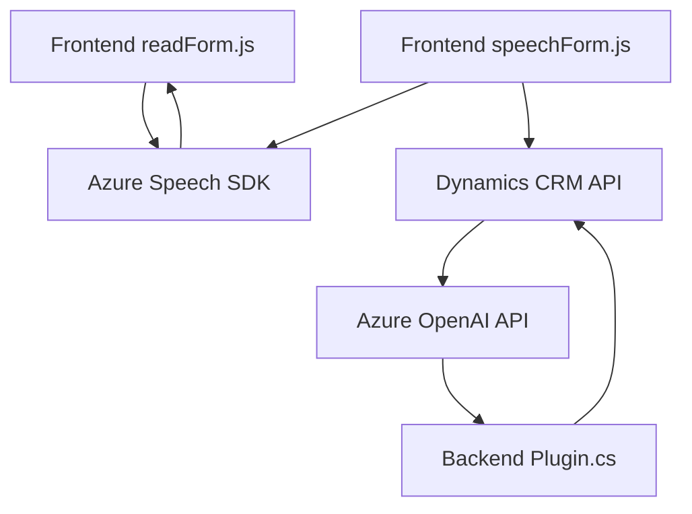

### Breve Resumen Técnico
El código proporcionado hace parte de una solución integral que se divide en componentes de frontend y backend. Se integra con servicios externos como **Azure Speech SDK**, **Azure OpenAI**, y **Microsoft Dynamics CRM**. La solución implementa procesamiento de voz, síntesis de texto hablado, reconocimiento de voz, y transformación de datos mediante IA. Tiene arquitectura modular y está diseñada para interactuar con formularios dinámicos en Dynamics CRM.

---

### Descripción de Arquitectura
La arquitectura de la solución tiene las siguientes características:
1. **Multicapa y de integración**: Combina frontend para la presentación e interacción del usuario con servicios backend que interactúan con APIs y lógica empresarial.
2. **Service-Oriented Architecture (SOA)**: Las funciones consumen servicios externos como Azure Speech SDK y APIs específicas, lo que permite desacoplar la lógica de negocio del procesamiento de datos.
3. **Plugin-Based Design**: En el backend (archivo `TransformTextWithAzureAI.cs`), se sigue una arquitectura basada en plugins para extender dinámicamente las funcionalidades del sistema CRM.

---

### Tecnologías Usadas
1. **Frontend**:
   - Javascript ES6.
   - Azure Speech SDK para síntesis y reconocimiento de voz.
   - Microsoft Dynamics Web API para integración de formularios.
2. **Backend**:
   - Microsoft Dynamics SDK (`Microsoft.Xrm.Sdk`) para desarrollo de plugins.
   - Azure OpenAI para transformación avanzada de texto.
   - .NET Framework (posiblemente v4.x) para la aplicación CRM.
3. **API externa**:
   - Azure OpenAI y Azure Speech API para procesamiento de lenguaje natural y síntesis de voz.

---

### Diagrama Mermaid válido para GitHub

---

### Conclusión Final
La solución utiliza una arquitectura orientada a servicios y multicapa, con módulos bien separados para gestionar la interacción del frontend, reconocimiento de voz, síntesis de texto hablado, y procesamiento avanzado mediante IA. Se basa principalmente en tecnologías Microsoft y Azure, destacándose patrones como la carga dinámica del SDK, llamadas REST para integración con APIs externas, uso de plugins y desacoplamiento de responsabilidades.  
Es una solución adecuada para implementaciones concretas en entornos corporativos, pero podría evolucionar más en cuanto a manejo de errores y optimización del flujo de datos end-to-end.