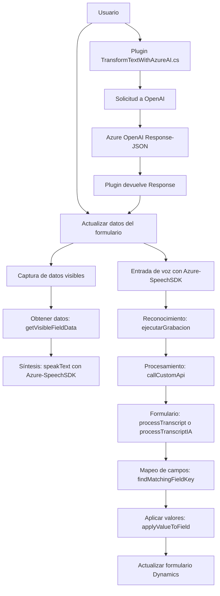

### Resumen Técnico
Este repositorio implementa una solución con varios componentes relacionados con Dynamics 365 CRM, integración con los servicios Azure Speech SDK y Azure OpenAI. Incluye módulos para convertir entrada de voz en datos estructurados, sintetizar voz basada en datos de formularios, y transformar texto con inteligencia artificial mediante un plugin.

---

### Arquitectura y Tipo de Solución
1. **Tipo de Solución:**
   - La solución es una **aplicación híbrida**:
     - **Frontend**: Partes relacionados con interacción de formularios usando JavaScript.
     - **Backend**: Plugins y lógica en C# para ampliar la funcionalidad de Microsoft Dynamics CRM.
     - **Externa**: Integra APIs de Azure para servicios como Speech SDK y OpenAI.

2. **Arquitectura:**
   - **Multicapa (n-capas)**:
     - Capa de presentación: Los scripts JavaScript manejan la interacción de usuario en formularios.
     - Capa de negocio: Plugins de Dynamics CRM y lógica backend procesan los datos.
     - Capa de servicios externos: Se interactúa mediante APIs con Azure Speech SDK y Azure OpenAI.
   - **Orientación a Servicios**:
     - Módulos como `TransformTextWithAzureAI.cs` y `voiceInputHandler.js` integran servicios externos como Azure Data Services y AI APIs.
   - **Event-Driven Architecture**: Implementa eventos asincrónicos en el frontend para capturar entradas y procesarlas (por ejemplo, con reconocimiento de voz). De igual forma, los plugins en C# responden a eventos definidos en Dynamics CRM.

---

### Tecnologías, Frameworks y Patrones
1. **Frontend (JavaScript):**
   - **Frontend Framework:** No explícitamente indicado, pero los módulos JS están diseñados para integrarse en aplicaciones web o Dynamics 365 CRM.
   - **Servicios Azure**: Speech SDK.
   - **Patrones**:
     - Carga dinámica de dependencias: `ensureSpeechSDKLoaded()` carga el SDK de Speech sólo cuando se necesita.
     - Separación de responsabilidades: Funciones bien definidas (captura de voz, llenado de formularios, interacción SDK).

2. **Backend (C#):**
   - **Frameworks y APIs**:
     - Microsoft Dynamics CRM SDK y servicios Web API.
     - Azure OpenAI para transformación de texto con IA.
     - `Newtonsoft.Json` para manejo avanzado de JSON.
   - **Patrones**:
     - Single Responsibility Principle (SRP): Cada clase y método tiene una tarea específica.
     - Adaptador: Integración con Azure OpenAI y Speech sigue este patrón al transformar datos entre sistemas.

---

### Dependencias y Componentes Externos
- **Externa**:
  1. Azure Speech SDK para síntesis de voz y reconocimiento de voz.
  2. Azure OpenAI API para transformación de texto.
  3. Microsoft Dynamics CRM para contextualización del formulario e interacción con entidades.
  4. `Newtonsoft.Json` y `System.Text.Json` para manejo de formatos JSON.

- **Interna**:
  1. Contextos de ejecución de Dynamics CRM.
  2. Métodos y datos del modelo de entidad del CRM (`formContext` y `Xrm`).

---

### Diagrama Mermaid 100% compatible con GitHub Markdown

---

### Conclusión Final
La solución presentada combina APIs de Microsoft Dynamics CRM (plugins y frontend) con servicios avanzados de Azure para reconocimiento y síntesis de voz, además de procesamiento IA. La arquitectura sigue un enfoque multicapa con orientación a eventos y servicios, lo que asegura modularidad y escala. Es idónea para implementaciones en un ecosistema CRM como Dynamics 365. Aunque puede aprovecharse en otros contextos, su diseño es claramente direccionado hacia capacidades en nube y negocios.