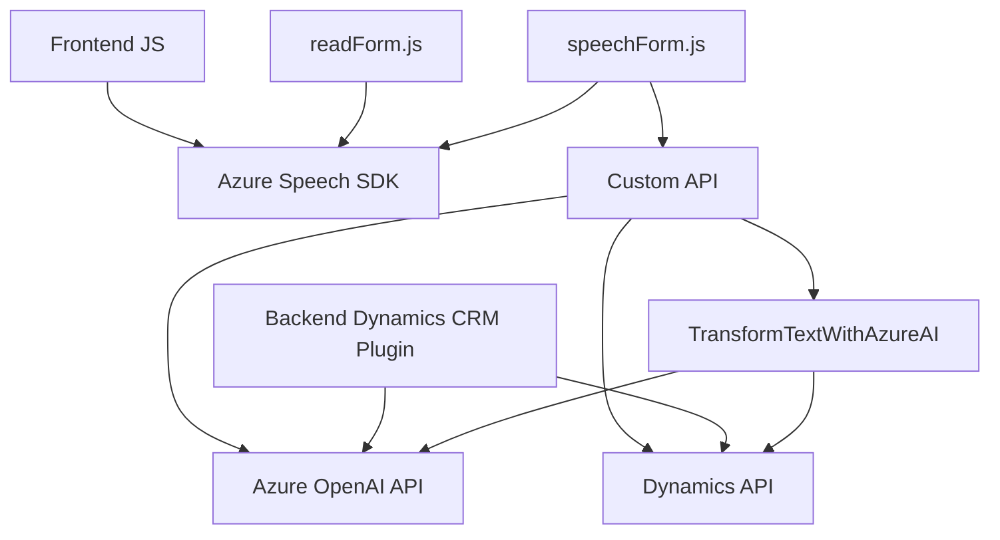

### Breve resumen técnico
Este repositorio contiene una solución orientada al procesamiento y interacción mediante voz, integrando funcionalidades de síntesis y reconocimiento de texto, además del uso de inteligencia artificial para transformar texto. Se hace uso de servicios de Microsoft como Azure Speech SDK para la interacción auditiva y Azure OpenAI para el procesamiento basado en modelos de lenguaje.

---

### Descripción de arquitectura
La arquitectura de la solución sigue un enfoque **Modular** en el cliente y un **Patrón de Plugin** en la integración backend. El frontend está diseñado para manejar formularios dentro de una interfaz, realizar síntesis de voz según los campos visibles y procesar entrada por voz mediante un SDK externo y una API personalizada. También interactúa con un plugin que aplica reglas definidas para transformar texto utilizando Azure OpenAI en el backend. La arquitectura general es una **arquitectura híbrida de microservicios y n capas**, con el frontend interactuando con servicios externos y un backend basado en Dynamics CRM.

---

### Tecnologías usadas
1. **Frontend:**
   - **JavaScript:** Para la interacción con el usuario y la lógica de procesamiento.
   - **Azure Speech SDK:** Sintetización de voz y reconocimiento.
   - **Microsoft Dynamics Web API/OData API**:
     - Manejo de registros y contexto de formularios (Ej.: `Xrm.WebApi.online.execute`).
   - **Promesas:** Estructura de programación para manejar tareas asíncronas.
   
2. **Backend:**
   - **Microsoft Dynamics CRM SDK:** Framework base para el desarrollo del plugin.
   - **Azure OpenAI Service:** Transformación de texto mediante inteligencia artificial.
   - **Newtonsoft.Json:** Manejo de JSON en el plugin backend.
   - **System.Net.Http:** Comunicación HTTP con el servicio de Azure OpenAI.

---

### Diagrama Mermaid válido para GitHub

---

### Arquitectura en detalle

1. **Frontend (JS/readForm.js y JS/speechForm.js):**
   - Interacción principal ocurre aquí. Usuarios ingresan datos mediante un formulario o entrada de voz. Los datos son convertidos en texto y sintetizados en voz por **Azure Speech SDK**.
   - Se utilizan funciones `startVoiceInput`, `leerFormulario`, `speakText` y funciones para extraer, mapear o procesar datos del formulario.
   - También hay funciones para procesar texto obtenido de entrada por voz y enviarlo a una **Custom API**, aprovechando el método de llamadas HTTP (`Xrm.WebApi.online.execute`) para interactuar con Dynamics CRM y Azure APIs.

2. **Backend (Plugins/TransformTextWithAzureAI.cs):**
   - Implementación centrada en un **Plugin de Dynamics CRM**, siguiendo el patrón estándar de Microsoft Dynamics.
   - Procesa texto utilizando el servicio externo **Azure OpenAI Service**, haciendo uso de un modelo GPT que transforma texto según reglas personalizadas.
   - Realiza la comunicación con APIs externas utilizando **System.Net.Http** y retorna el resultado como un JSON estructurado que será enviado al frontend para su visualización e interacción.

3. **Dependencias externas:**
   - **Azure Speech SDK**: Provee capacidades de síntesis de voz y reconocimiento de entrada de voz.
   - **Azure OpenAI Service**: Procesa texto usando modelos GPT.
   - **Microsoft Dynamics Web API**: Herramienta estándar para interactuar con registros de CRM.
   - **Dependencies como Newtonsoft.Json:** Usadas para serialización y deserialización JSON.
   - **System.Net.Http:** Implementa el protocolo de comunicación con servicios externos mediante REST.

---

### Conclusión final
Este repositorio define una solución que combina frontend basado en **JavaScript** y backend desarrollado dentro del ecosistema de **Microsoft Dynamics CRM**, utilizando extensivamente servicios ofrecidos por Azure, específicamente Speech SDK y OpenAI API. Se muestra una implementación con múltiples patrones de diseño modernos, como modularidad, adaptadores y callbacks, que habilitan un flujo de interacción con el usuario basado en voz y datos transformados.

La arquitectura es híbrida: una combinación de frontend que consume servicios externos mediante métodos de integración, y un backend desarrollado mediante un patrón de plugin nativo en Dynamics CRM para realizar operaciones en su base de datos y orquestar el Azure OpenAI API. Recomiendo asegurar la correcta gestión de credenciales mediante tecnologías como **Azure Key Vault** y validar puntos que podrían ser vulnerables a ataques (como las solicitudes HTTP y manejo de datos personales).