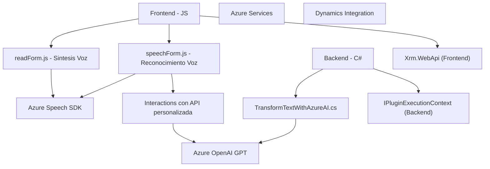

### Breve Resumen Técnico

El repositorio integra funcionalidades relacionadas con reconocimiento y síntesis de voz utilizando **Azure Speech SDK** y procesamiento avanzado de datos con **Azure OpenAI API**. Está orientado a la interacción con formularios en un entorno **Microsoft Dynamics CRM**. Es una solución que combina frontend (JS) y backend (C# Plugins), destinada a enriquecer experiencias de usuario mediante entrada por voz y procesamiento con inteligencia artificial.

---

### Descripción de Arquitectura

La arquitectura general es **n capas**, con una clara separación entre el frontend (Javascript: captura, síntesis y transcripción de voz) y el backend (C#: procesamiento y transformación avanzada). También adopta patrones de integración de servicios externos, combinando datos y funcionalidades de Dynamics CRM, Azure Speech SDK y OpenAI.

El frontend utiliza un enfoque modular, con funciones independientes organizadas por responsabilidad, y una estructura que favorece la extensión. Por otro lado, el backend se desarrolla bajo el **Plugin Pattern**, común en soluciones basadas en Microsoft Dynamics, interactuando con APIs externas (Azure OpenAI).

La solución podría ser adaptada a una **arquitectura microservicios**, aunque actualmente funciona como un binario acoplado al CRM (lo que sugiere una arquitectura monolítica extendida con servicios externos).

---

### Tecnologías Usadas

1. **Frontend (JS)**:
   - **Azure Speech SDK**: Procesos de síntesis y reconocimiento de voz.
   - **Dynamics 365 SDK Client (`Xrm.WebApi`)**: Manipulación y consulta de datos en formularios de Dynamics.
   - **APIs del navegador**: Manipulación DOM y eventos.
   - **Modularización**: División clara por funciones para cada flujo.

2. **Backend (C#)**:
   - **Azure OpenAI API**: Procesamiento avanzado de texto con modelos GPT.
   - **Microsoft Dynamics SDK (`IPlugin`)**: Estructura de desarrollo para plugins en CRM.
   - **System.Net.Http**: Integración con servicios externos mediante REST.
   - **Newtonsoft.Json / System.Text.Json**: Manejo de datos estructurados (serialización/deserialización JSON).

3. **Patrones**:
   - **Delegación/Modularidad**: Separación funcional por tarea específica.
   - **Responsabilidad única**: Cada función o componente realiza una tarea aislada.
   - **Integración API externa**: Comunicación con servicios RESTful (Azure Speech SDK y OpenAI).
   - **Plugin Pattern**: En backend para extender el CRM.

---

### Diagrama Mermaid Válido para GitHub

---

### Conclusión Final

La solución combina tecnologías de frontend y backend para habilitar funcionalidades avanzadas en un entorno CRM, manteniendo enfoques modulares y patrones estándares para brindar soporte a capacidades de voz y procesamiento con inteligencia artificial. Aunque la arquitectura actual es de tipo **n capas**, su composición modular y uso de servicios externos la hace susceptible de adaptarse hacia **microservicios** en sistemas desacoplados.

Si bien los objetivos funcionales están bien distribuidos y definidos, hay oportunidades para optimizar la comunicación entre componentes y mejorar la escalabilidad mediante contenedores en una infraestructura cloud-aligned.