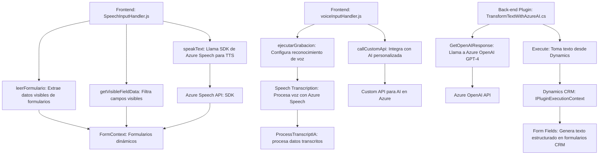

### Breve resumen técnico

El repositorio presenta archivos que implementan funcionalidades relacionadas con la entrada de datos por voz y procesamiento de formularios CRM. Estos archivos están integrados con Microsoft Dynamics y servicios externos como Azure Speech SDK y Azure OpenAI. La solución utiliza un enfoque modular para el manejo de datos, tanto en el front-end como en el back-end, y aplica patrones orientados a servicios y eventos.

---

### Descripción de arquitectura

La arquitectura del sistema parece ser de **n capas**:
1. **Capa de Presentación**: Archivos JS enfocados en interacción con el usuario, como manejar formularios y convertir voz en texto.
2. **Capa de Lógica de Dominio/Integración**: Incluye lógica para interactuar con formularios de Dynamics CRM y procesamiento de datos mediante un plugin en C#.
3. **Capa de Servicios Externos**: Comunicación con APIs externas de Azure para servicios como Speech SDK (voz a texto) y OpenAI (texto enriquecido).

El enfoque aquí es integrar funcionalidades con un **CRM empresarial** mediante un **modelo de extensiones/plugin** y **modularidad dinámica**.

---

### Tecnologías usadas

1. **Front-end**:
   - **JavaScript**: Manejo modular de funciones y carga dinámica de SDK.
   - **Azure Speech SDK**: Transformación de voz a texto y texto a voz.
   - **Xrm.WebApi.online**: API nativa para interacción en front-end con Dynamics CRM.

2. **Back-end**:
   - **C#**: Implementación del plugin para Dynamics CRM.
   - **Azure OpenAI GPT-4**: Integración para procesamiento avanzado de textos.
   - **ASP.NET Framework**: Base del plugin (probable implementación dentro del contexto Dynamics CRM).

3. **Utilities**:
   - **System.Net.Http**: HTTP para comunicación con APIs externas.
   - **System.Text.Json**: Manipulación y serialización de JSON.
   - **Regular Expressions**: Validación y transformación de texto en C#.

4. **Patrones**:
   - **Modularidad**: Cada archivo/división tiene una responsabilidad específica.
   - **Integración de SDK externo**: Uso dinámico de Azure Speech SDK.
   - **Extensiones orientadas a CRM**: Plugin y lógica nativa con Dynamics CRM.

---

### Diagrama Mermaid (100 % compatible con **GitHub Markdown**)

---

### Conclusión final

El sistema está diseñado para manejar datos dinámicos de formularios mediante interacción con servicios externos basados en AI y voz. El uso explícito de Azure Speech SDK facilita la interacción basada en voz, mientras que Azure OpenAI agrega poder de procesamiento adicional para manipulación y enriquecimiento de texto. La arquitectura de **n capas**, junto con la integración directa con APIs externas y la plataforma CRM, hace que el sistema sea altamente especializado para entornos empresariales en los que se utiliza Microsoft Dynamics.

Sin embargo, se deben implementar medidas adicionales:
1. **Seguridad**: Evitar exponer claves API en el código.
2. **Escalabilidad**: Explorar paralelismo en llamadas de transcripción o procesamiento con AI.
   
Es una solución ejemplar para entornos corporativos que optimizan flujo de trabajo mediante automatización avanzada.