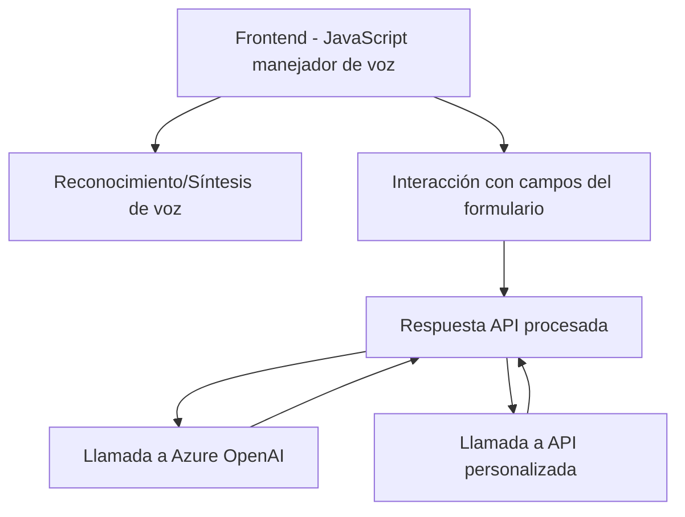

### Breve resumen técnico
El repositorio descrito contiene componentes para manejar la entrada y salida de datos mediante voz, integrándose con **Azure Speech SDK** y otros servicios externos como **Azure OpenAI**. Estos archivos permiten la interacción con formularios de sistemas como Dynamics 365 a través de comandos de voz, procesados y convertidos o generados como texto hablado.

---

### Descripción de arquitectura
La arquitectura es híbrida, combinando:
1. **N-Capas**: Los archivos del frontend tienen una capa de presentación responsable de interactuar con el usuario, mientras el backend, mediante plugins, actúa como capa de negocio, procesando datos con lógica interna.
2. **Service-Oriented Architecture (SOA)**: Utiliza servicios externos aislados, como Azure Speech SDK y Azure OpenAI, para cumplir responsabilidades claramente definidas (reconocimiento de voz y transformación de texto).
3. **Event-Driven Architecture**: En frontend, elementos como `callbacks` y eventos de SDK garantizan que las funcionalidades se ejecuten en respuesta a la entrada del usuario o la disponibilidad de dependencias.

---

### Tecnologías usadas
1. **Frontend**: 
   - JavaScript.
   - Azure Speech SDK (para reconocimiento, síntesis de voz).
   - Dynamics 365 JavaScript API (`executionContext`, `formContext`).
2. **Backend**:
   - C# (.NET Framework).
   - Dynamics CRM SDK (`IPlugin`, `Xrm.WebApi.Query`).
   - Azure OpenAI (GPT-4).
   - Bibliotecas para JSON (`Newtonsoft.Json` y `System.Text.Json`).
3. **Ecosistema de servicios cloud**:
   - Azure Speech Service (Voz a texto y Texto a voz).
   - Azure OpenAI (Transformación inteligente de texto).

---

### Dependencias externas posibles
- **Azure Speech SDK** (`https://aka.ms/csspeech/jsbrowserpackageraw`): Para funcionalidades de reconocimiento y síntesis de voz.
- **Dynamics CRM APIs** (`Xrm.WebApi`): Gestión de datos y manipulación de formularios en Dynamics 365.
- **Azure OpenAI Service**: Para transformación de texto (usualmente con GPT-4).
- **Custom API Dynamics CRM**: Por ejemplo, `"trial_TransformTextWithAzureAI"` para procesar texto con reglas predefinidas utilizando Azure OpenAI.

---

### Diagrama detallado en formato válido Mermaid

---

### Conclusión final
El repositorio combina capacidades de accesibilidad (entrada y salida por voz) con sistemas de manejo de datos dinámicos (Dynamics CRM) y servicios de IA avanzada para procesamiento de texto. La arquitectura es modular y orientada a servicios, asegurando escalabilidad y mantenibilidad. Sin embargo, se debe mejorar la seguridad del manejo de claves API y valorar el impacto de posibles fallos en servicios externos.