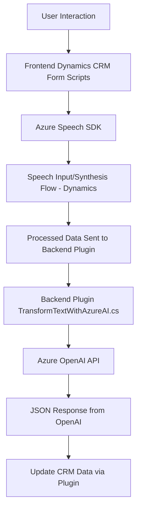

### **Breve Resumen Técnico**
El repositorio pertenece a una solución que extiende funcionalidades estándar de Microsoft Dynamics CRM utilizando dos tecnologías principales: reconocimiento/síntesis de voz (Azure Speech SDK) y procesamiento de texto basado en IA utilizando Azure OpenAI Service. 

La solución responde a flujos dirigidos por eventos en Dynamics CRM. Estos flujos incluyen lectura/transcripción y transformación de texto, así como procesamiento automatizado para interactuar con datos del CRM.

---

### **Descripción de Arquitectura**
El diseño del sistema utiliza **modularidad**, implementando cada funcionalidad como unidades independientes:
1. **Frontend JS**: Scripts para manipular formularios del CRM (lectura y entrada de datos).
2. **Backend Plugin (C#)**: Interacción con APIs externas (Azure OpenAI) y modificación directa de datos en el CRM.

La arquitectura general incluye los siguientes elementos:
1. **Integración con APIs Externas**:
   - Azure Speech SDK para reconocimiento y síntesis de voz.
   - Azure OpenAI Service para procesamiento avanzado de texto.
2. **Separación de Responsabilidades**:
   - Scripts JS para lógica del cliente frontend de Dynamics CRM.
   - Plugins en C# para lógica backend, transformando texto estructurado mediante OpenAI y APIs asociadas.
3. **Event-Driven Architecture**:
   - Los flujos se activan según señales recibidas en el contexto del CRM (eventos como creación, modificación de datos, o entrada de usuario).

En términos arquitectónicos, es una **solución basada en microservicios** o **arquitectura distribuida**, donde distintas capas de funcionalidad interactúan con servicios externos (Azure) y el CRM.

---

### **Tecnologías Usadas**
1. **Frontend**:
   - Lenguaje: JavaScript.
   - SDK: Azure Speech SDK (sobre navegador).
   - Framework de CRM: APIs de Microsoft Dynamics CRM (formContext, Xrm.WebApi.online).
   
2. **Backend**:
   - Lenguaje: C#.
   - Framework: Microsoft Dynamics SDK (Plugin Architecture).
   - Servicio externo: Azure OpenAI.

3. **Patrones**:
   - Modularidad: Separación de funciones/métodos en frontend y backend.
   - Callback Pattern: Usado ampliamente en scripts JS para asincronía (e.g., cargar SDK dinámicamente).
   - Integración API externa.
   - Pipeline Data Transformation: Transformación y procesamiento de voz/Texto.

---

### **Diagrama Mermaid**

---

### **Conclusión Final**
El repositorio implementa una solución híbrida compuesta por dos capas principales:
1. **Frontend**: Scripts JS diseñados para capturar voz, sintetizar respuestas y manipular formularios en el ambiente CRM de Dynamics.
2. **Backend**: Plugins en C# que aprovechan servicios avanzados de procesamiento de texto como Azure OpenAI, implementando flujos de datos automatizados, dirigidos a mejorar la interacción y procesamiento en Dynamics CRM.

La arquitectura y diseño promueven escalabilidad mediante una fuerte dependencia de servicios externos, favoreciendo capacidades avanzadas y flexibilidad. Sin embargo, la implementación también trae consigo requerimientos estrictos a nivel de conectividad y dependencias de Azure Services.