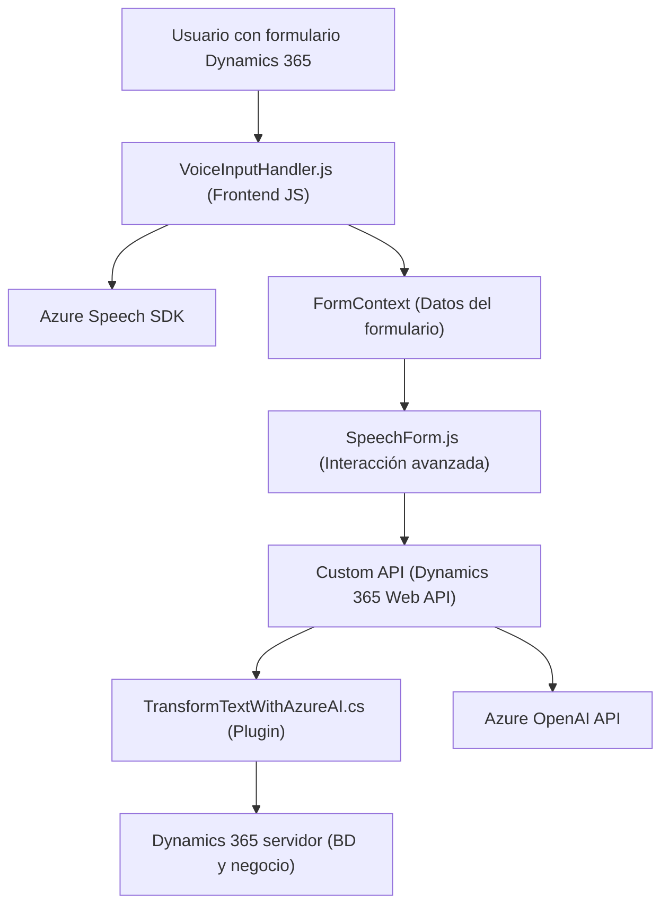

### Análisis del repositorio

#### Breve resumen técnico
Este repositorio representa una solución orientada a la integración entre una interfaz de usuario para formularios, una API personalizada y servicios de inteligencia artificial (Azure Speech SDK y Azure OpenAI). La solución está diseñada para trabajar con Microsoft Dynamics 365, destacando en la automatización y optimización de procesos de entrada, transformación y síntesis de voz/texto.

---

#### Descripción de arquitectura
La estructura sigue una arquitectura de **n capas**, donde tenemos:
1. **Capa de presentación/Frontend**: Implementada con JavaScript y conectada a Dynamics 365, controla la interfaz de usuario y las interacciones del formulario.
2. **Capa intermedia/API** (representada por `TransformTextWithAzureAI.cs`): Procesa los datos del usuario y se comunica con Azure OpenAI para realizar transformaciones avanzadas, devolviendo resultados como JSON estructurados.
3. **Capa de integración con servicios externos**: Utiliza dos APIs de Microsoft Azure (Speech SDK y OpenAI) para proporcionar funcionalidades avanzadas como la síntesis de voz y procesamiento de texto.
Esto refleja una **arquitectura orientada a servicios** (SOA) con un enfoque modular.

---

#### Tecnologías utilizadas
1. **Frontend**:
   - **Lenguaje**: JavaScript.
   - **Tecnologías**: Dynamics 365 `executionContext`, `formContext`.
   - **Framework de IA**: Azure Speech SDK.

2. **Backend (Plugins)**:
   - **Lenguaje**: C# (.NET).
   - **Framework**: Dynamics CRM Plugin Framework.
   - **API externa**: Azure OpenAI.

3. **Patrones de diseño**:
   - En frontend:
     - Organización **modular** de funciones.
     - **Lazy Loading** del Speech SDK para eficiencia.
     - **Callback Pattern** para la carga asíncrona del SDK.
   - En backend:
     - **Middleware Plugin Design**, utilizando la interfaz `IPlugin`.
     - **Service-Oriented Architecture** (SOA).
     - **Encapsulación de lógica de negocio** en métodos como `GetOpenAIResponse`.

---

#### Dependencias y componentes externos
1. **Azure Speech SDK**: Realiza síntesis y reconocimiento de voz en tiempo real. Se carga dinámicamente para optimizar el rendimiento.
2. **Azure OpenAI**:
   - Utilizado para transformar texto ingresado en una estructura JSON basada en reglas específicas.
   - La comunicación se realiza a través de solicitudes HTTP con encabezados y datos serializados en formato JSON.
3. **Microsoft Dynamics 365 SDK**: Proporciona herramientas para la interacción con formularios y la actualización de datos en el CRM.
4. **Librerías internas de C#**:
   - `System.Net.Http`: Para realizar solicitudes a APIs externas.
   - `System.Text.Json`: Gestión de datos JSON.
5. **API personalizada en Dynamics**: Se utiliza para transformar texto transcrito y actualizar automáticamente los campos del formulario.

---

#### Diagrama Mermaid compatible con Markdown en GitHub

---

#### Conclusión final
La solución es una aplicación basada en una arquitectura **n capas orientada a servicios**, que utiliza tecnologías modernas como Dynamics 365 SDK para el manejo de formularios y entidades, junto con la integración de IA mediante Azure Speech SDK y Azure OpenAI. La capa de frontend está diseñada para facilitar la entrada de datos mediante voz, mientras que el backend implementa un procedimiento automatizado y flexible usando plugins en Dynamics CRM.

Aunque la arquitectura es sólida, ciertas configuraciones rígidas (como reglas dentro del código del plugin) podrían beneficiarse de mayor externalización y parametrización para facilitar la adaptabilidad. Además, el uso de APIs externas como Azure OpenAI introduce dependencias significativas que necesitan una gestión robusta de fallos.

En resumen, es una solución eficiente enfocada en automatización y conveniencia para usuarios finales mediante la integración de las últimas herramientas de Azure y la plataforma Dynamics CRM.