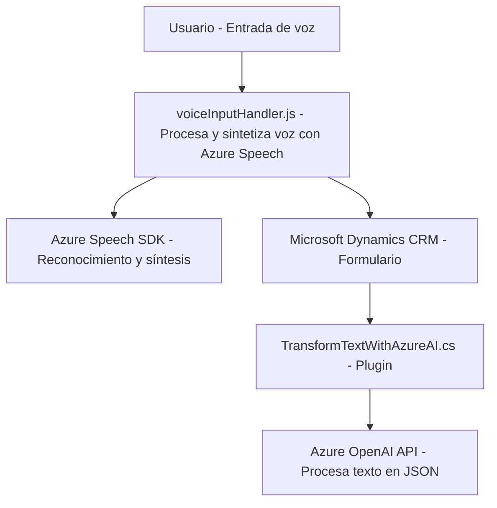

### Breve Resumen Técnico
El repositorio está parcialmente diseñado para interactuar con formularios y sistemas CRM (Microsoft Dynamics CRM) mediante integración con soluciones de reconocimiento de voz, síntesis de voz y procesamiento de texto en JSON estructurado. Se utiliza el SDK de Azure Speech y OpenAI en conjunto con Dynamics CRM.

Los componentes visibles apuntan a una solución híbrida donde el frontend gestiona interacción directa con los usuarios (entrada/salida por voz en formularios) y el backend utiliza un plugin para procesar texto con Azure OpenAI. 

---

### Descripción de Arquitectura
1. **Frontend:**
   - El componente `voiceInputHandler.js` y otros archivos en la carpeta `FRONTEND/JS` implementan funcionalidades de reconocimiento y síntesis de voz en el navegador, gestionando interacción directa con el usuario.
   - Sigue una arquitectura de módulos con patrones de reusabilidad orientados a servicios y a la dinámica del SDK de Azure Speech.

2. **Backend:**
   - El archivo `TransformTextWithAzureAI.cs` trabaja como un plugin para Microsoft Dynamics CRM, implementando lógica del lado del servidor. Utiliza una arquitectura orientada a servicios (SOA), centralizando el procesamiento intensivo en Azure OpenAI para transformar texto.

3. **Patrón Global:**
   - El sistema implementa una **arquitectura híbrida**:
     - **Frontend modular** con gestión de SDK externos.
     - **Backend basado en plugins**, siguiendo la convención de Dynamics CRM.
     - **Integraciones externas:** Azure Speech (voz a texto y síntesis) y Azure OpenAI (procesamiento complejo).

---

### Tecnologías Usadas
- **Frontend:**
  - JavaScript - Lenguaje principal.
  - Azure Speech SDK - Reconocimiento y síntesis de voz.
  - Integración dinámica del SDK de Azure Speech: Carga mediante URL (`https://aka.ms/csspeech/jsbrowserpackageraw`).

- **Backend:**
  - Microsoft Dynamics CRM SDK - Framework para definición de plugins.
  - Azure OpenAI API - Inteligencia artificial para la transformación de texto.
  - .NET Framework/C# - Base para el desarrollo del plugin.
  - JSON para estructuración de datos procesados.

- **Patrones y técnicas aplicadas:**
  - Modularización en el frontend para hacer que los métodos sean reutilizables.
  - Service-Oriented Architecture (SOA).
  - Integración de servicios externos mediante API Gateway.

---

### Diagrama Mermaid válido para GitHub

---

### Conclusión Final
Este repositorio representa una solución híbrida diseñada para integrar frontend con capacidades avanzadas de interacción por voz y un backend que se apoya en inteligencia artificial para procesar información textual. La arquitectura combina modularización para el frontend y patrones orientados a servicios en el backend. La dependencia de Azure Speech y OpenAI permite extender las capacidades de interacción natural e inteligencia artificial, haciéndola ideal para sistemas de gestión empresarial basados en formularios.