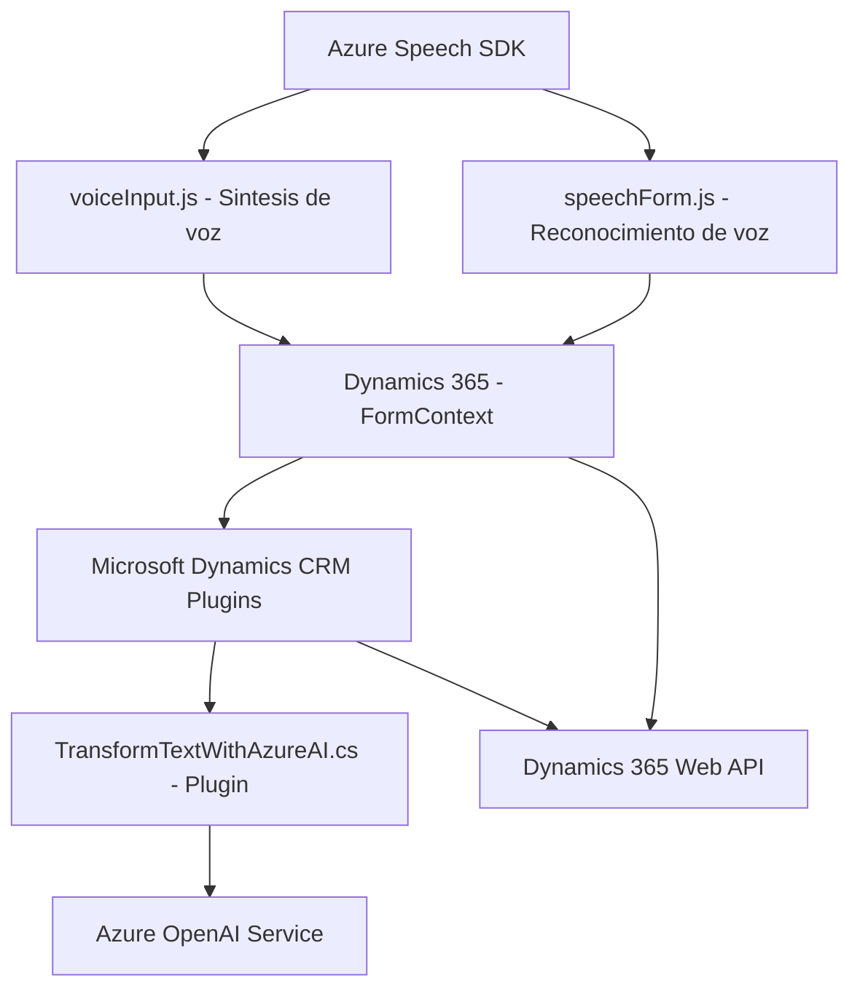

### Breve resumen técnico:
El repositorio presenta un sistema orientado a la integración de entradas por voz y procesamiento de texto mediante tecnologías de Microsoft Dynamics 365 y Azure. Es una solución que actúa en dos capas principales: una capa de frontend en JavaScript y una capa backend con plugins en C#. Principalmente, interactúa con formularios en Dynamics 365 y se conecta a servicios de Azure Speech SDK y Azure OpenAI.

### Descripción de arquitectura:
El sistema utiliza una arquitectura **n-capas**, donde:
1. **Capa de presentación (Frontend)**: Gestiona el reconocimiento de voz (Speech Recognition Handler) y la interacción con los formularios, transformando datos de voz en texto y viceversa mediante Azure Speech SDK.
2. **Capa lógica (Backend)**: Se basa en la ejecución de plugins de Dynamics CRM, que actúan como intermediarios para realizar llamadas a servicios externos, procesar texto con Azure OpenAI y devolver los datos estructurados al sistema.

El sistema se organiza funcionalmente en módulos y aplica principios de modularidad y reutilización, con claras separaciones de preocupaciones. La dependencia hacia Azure Speech SDK y Azure OpenAI Service para tareas de IA añade características de microservicio y una arquitectura integradora basada en servicios externos.

### Tecnologías usadas:
1. **Frontend**:
   - JavaScript: Lenguaje utilizado para desarrollar lógicas de UI y reconexión de voz.
   - Azure Speech SDK: Para realizar síntesis de texto en voz y reconocimiento de voz.
   - Dynamics 365 JavaScript API: Manipulación de formularios y registros en el entorno CRM.

2. **Backend**:
   - C#: Lenguaje usado para desarrollar los plugins compatibles con Dynamics CRM.
   - Microsoft.Xrm.Sdk: SDK para interacciones y extensiones en Dynamics CRM.
   - Azure OpenAI: Para transformación de texto en JSON estructurado.
   - JSON: Serialización y deserialización de solicitudes/respuestas entre CRM y la API de OpenAI.
   - System.Net.Http: Para realizar las solicitudes a servicios externos.

3. **Patrones**:
   - Modularidad: Funciones y clases separadas por responsabilidades específicas.
   - Gestión de dependencias dinámicas: El SDK de Azure Speech se carga en tiempo de ejecución para evitar dependencias innecesarias.
   - Integración de servicios externos: Conexión con APIs (Azure OpenAI y Speech).
   - Event-Driven Programming: Uso extensivo de callbacks para manejar eventos asíncronos.
   - Plugin-based Architecture: Extensiones en Dynamics CRM que implementan un único punto de ejecución para integrar servicios como Azure OpenAI y la API de Dynamics.

### Diagrama Mermaid válido para GitHub:

### Conclusión final:
El repositorio contiene una solución robusta de integración de reconocimiento de voz, texto a voz y enriquecimiento de datos mediante inteligencia artificial. La aplicación se basa en una arquitectura n-capas con una presentación en JavaScript y una lógica backend en C# utilizando Dynamics CRM. La integración con servicios de Azure garantiza capacidad de escalar el procesamiento y síntesis de datos externos. No obstante, sería prudente implementar políticas de autenticación y manejo seguro de claves de Azure.