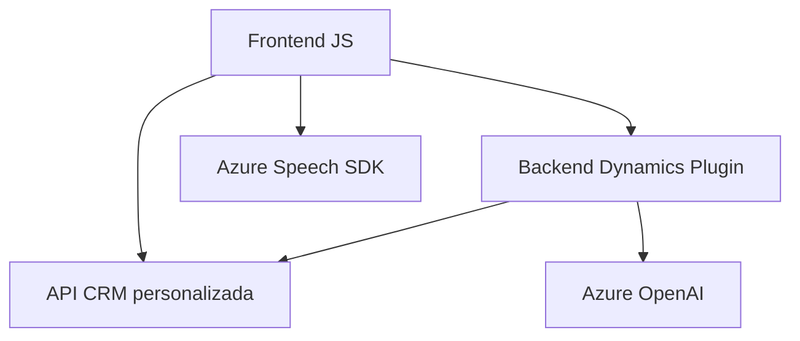

### Resumen técnico:
El repositorio analiza una solución que integra funcionalidades avanzadas de reconocimiento de voz, conversión de texto a JSON estructurado, y procesamiento de formularios en **Dynamics 365**. Utiliza servicios de Azure como **Speech SDK** y **OpenAI**, además de integrar API internas y externas en una arquitectura modular.

---

### Descripción de arquitectura:
La solución genera una arquitectura **n capas**, separando las funcionalidades en tres principales áreas:
1. **Frontend basado en JavaScript**: Gestiona las interacciones del usuario con formularios y voz, procesando datos con Azure Speech SDK.
2. **Backend basado en Plugins CRM**: Implementa lógica de negocio personalizada en Dynamics 365 mediante procesamiento de formularios y extensiones de datos a través de Azure OpenAI.
3. **Integraciones externas**: Servicios de Azure (OpenAI y Speech SDK) son los componentes externos clave para habilitar inteligencia artificial y reconocimiento de voz.

---

### Tecnologías usadas:
- **Frontend**:
  - **JavaScript**: Implementación de lógica para el manejo de voz y formularios.
  - **Azure Speech SDK**: Reconocimiento de voz y síntesis de texto a audio.
- **Backend - Plugins Dynamics 365**:
  - **C#**: Desarrollo de extensiones personalizadas.
  - **Microsoft Xrm SDK**: API para interactuar con objetos y datos de Dynamics.
  - **Newtonsoft.Json** y **System.Text.Json**: Gestión de JSON estructurado.
  - **HTTP Client**: Comunicación con Azure OpenAI.
- **Servicios de nube**:
  - **Azure Speech SDK**: Procesamiento avanzado de voz-texto.
  - **Azure OpenAI**: Transformación de texto a JSON mediante IA.

---

### Diagrama **Mermaid** válido para GitHub:

---

### Conclusión final:
La solución implementa una **arquitectura distribuida en capas**, donde el frontend utiliza servicios de reconocimiento de voz y el backend procesa datos con conectores personalizados y Azure OpenAI. Está orientada a mejorar la interacción multicanal de usuarios dentro de Dynamics 365, utilizando patrones modernos como modularidad y consumo desacoplado de servicios externos. La mezcla de tecnologías muestra un enfoque robusto y adaptable, ideal para entornos empresariales con requisiciones complejas de AI y formularios dinámicos.