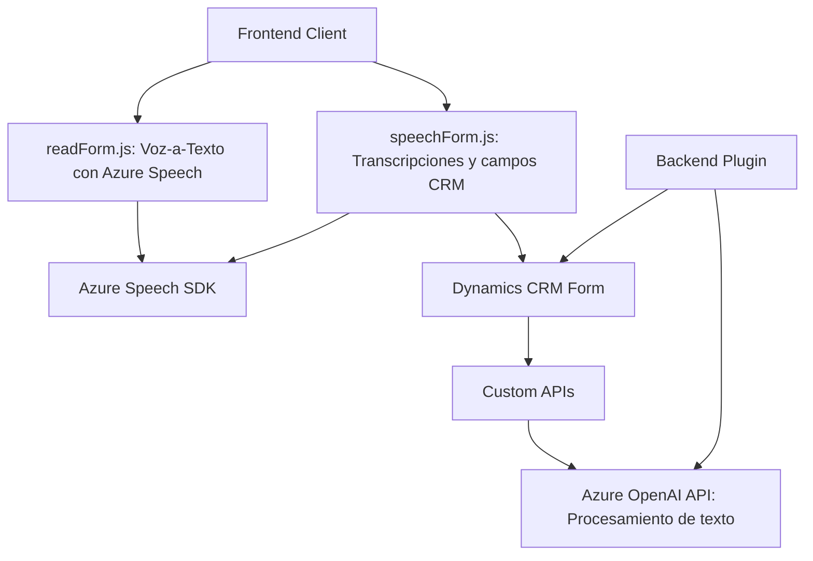

### Breve resumen técnico

El repositorio contiene tres archivos principales que sirven diferentes propósitos en el desarrollo de un sistema integrado entre formularios CRM y servicios de Azure. Las funcionalidades giran en torno a la entrada de voz, síntesis de voz y manejo de procesamiento de texto mediante inteligencia artificial. Se utilizan servicios externos como Azure Speech SDK y Azure OpenAI API, con un enfoque en modularidad y separación de responsabilidades.

---

### Descripción de arquitectura

La arquitectura del repositorio se alinea con un diseño **multicapa**:
1. **Frontend/Cliente:** Archivos `readForm.js` y `speechForm.js` implementan funcionalidades de interacción directa con el usuario a través del navegador. Manejan entrada y salida de voz con Azure Speech SDK, transcripciones dinámicas y asignación de datos en formularios CRM.
   
2. **Backend/Server:** El plugin `TransformTextWithAzureAI.cs` funciona como un componente extendido de Dynamics CRM (Plugin-Based Architecture) que utiliza API de Azure OpenAI para transformar datos en tiempo real.
   
El sistema no está diseñado como un conjunto desacoplado de microservicios, pero sí utiliza servicios externos como Azure mediante **facade patterns** y acceso HTTP para separar responsabilidades.

### Tecnologías usadas

#### 1. **Lenguajes y plataformas:**
   - **JavaScript:** Utilizado en los archivos frontend para manejar la interacción con el formulario y la síntesis/entrada de datos de voz.
   - **C# (NET Framework):** Implementación del plugin en Dynamics CRM.
   
#### 2. **Frameworks/Bibliotecas:**
   - **Azure Speech SDK:** Para entrada y síntesis de voz.
   - **Microsoft Dynamics CRM SDK:** Utilizado en la arquitectura backend del plugin.
   - **Azure OpenAI API:** Para procesamiento avanzado de texto con modelos generativos GPT.

#### 3. **Patrones principales:**
   - **Modularidad:** Cada archivo define un conjunto de funciones o clases independientes con responsabilidades específicas.
   - **Facade Pattern:** Simplifica la interacción con SDKs (ejemplo: `speakText`, `ensureSpeechSDKLoaded`).
   - **Data Mapper:** Usado para enlazar transcripciones o valores procesados de IA con campos de formularios CRM.
   - **Plugin-Based Architecture:** Para integrar lógica personalizada en Dynamics CRM.

---

### Diagrama Mermaid válido para GitHub

---

### Conclusión final

El repositorio representa una solución integradora que utiliza diseño multicapa. Ofrece funcionalidades avanzadas de reconocimiento y síntesis de voz, así como procesamiento de texto mediante inteligencia artificial, combinando frontend para interacción directa del usuario con un robusto backend complementado por un plugin en Dynamics CRM. Se basa en servicios externos de Microsoft Azure, destacando un uso conjunto de programación asíncrona, modularidad y patrones orientados a SDK, siendo ampliamente adaptable y escalable para escenarios CRM modernos.