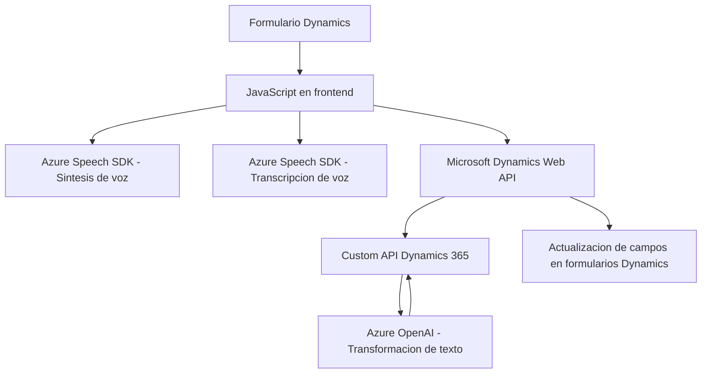

### Resumen técnico

El repositorio analizado se centra en una solución que utiliza servicios de voz y procesamiento de texto mediante Azure Speech SDK y Azure OpenAI en combinación con Microsoft Dynamics 365. Los archivos proporcionados apuntan a características de gestión de datos mediante voz y tecnología de inteligencia artificial integrada dentro del ecosistema Dynamics.

### Descripción de arquitectura

La solución implementa una **arquitectura orientada a servicios** que integra distintas tecnologías externas (SDK de Azure Speech y Azure OpenAI) dentro de los componentes de cliente (JavaScript para Dynamics 365 forms) y servidor (plugin para Dynamics CRM). Esto permite una comunicación fluida y modular entre el frontend (lógica orientada al cliente en Dynamics 365 forms) y el backend (plugins personalizados que coordinan llamadas API y lógica).

En el caso del cliente, la lógica está organizada en módulos funcionales independientes (captura de voz, procesamiento de texto, y asignación de valores), mientras que el servidor aplica una capa API Gateway para tratar solicitudes hacia Azure OpenAI. La arquitectura aboga por una mezcla de patrones de diseño orientados a modularidad y servicio.

### Tecnologías y frameworks usados

**Frontend:**
1. **Lenguaje:** JavaScript.
2. **Frameworks externos:**
   - Azure Speech SDK: Para gestionar la síntesis y transcripción de voz.
   - Microsoft Dynamics 365 APIs: Para manipulación de formularios y datos.
3. **Patrones de diseño:**
   - Modularidad funcional.
   - Delegate pattern para carga dinámica del Azure Speech SDK.

**Backend:**
1. **Lenguaje:** C# (.NET Framework).
2. **Frameworks externos:**
   - Microsoft Dynamics SDK: Para manipulación de entidades en Dynamics CRM.
   - Azure OpenAI: Procesamiento y transformación de texto.
3. **Dependencias de NuGet:**
   - Newtonsoft.Json: Manipulación JSON.
   - System.Net.Http: Llamadas RESTful hacia servicios externos.
4. **Patrones de diseño:**
   - Plugin-based Architecture (Dynamics CRM).
   - API Gateway para intermediación de servicios.

### Dependencias o componentes externos

- **Azure Speech SDK:** Gestión de voz desde el frontend.
- **Azure OpenAI:** Procesamiento avanzado de texto en el backend.
- **Dynamics 365 Web APIs**: Permite manipular datos de formularios y entidades.
- **SDKs específicos de Dynamics CRM**: Extensión de las funcionalidades del sistema.
- **Newtonsoft.Json:** Se utiliza en el plugin para deserialización de JSON.
- **HTTP REST APIs:** Para comunicación entre el backend y servicios como Azure OpenAI.

### Diagrama **Mermaid** de arquitectura

### Conclusión final

El repositorio describe una solución híbrida que integra servicios de nube avanzados (Azure Speech y OpenAI) con Microsoft Dynamics CRM. Esto permite extender las capacidades de los formularios de Dynamics añadiendo capacidades de voz y procesamiento natural de texto. Utiliza una arquitectura orientada a servicios con claros patrones de modularidad y delegación. Aunque altamente dependiente de servicios externos, su diseño modular permite escalabilidad y potencial integración en otros ecosistemas basados en Dynamics 365.