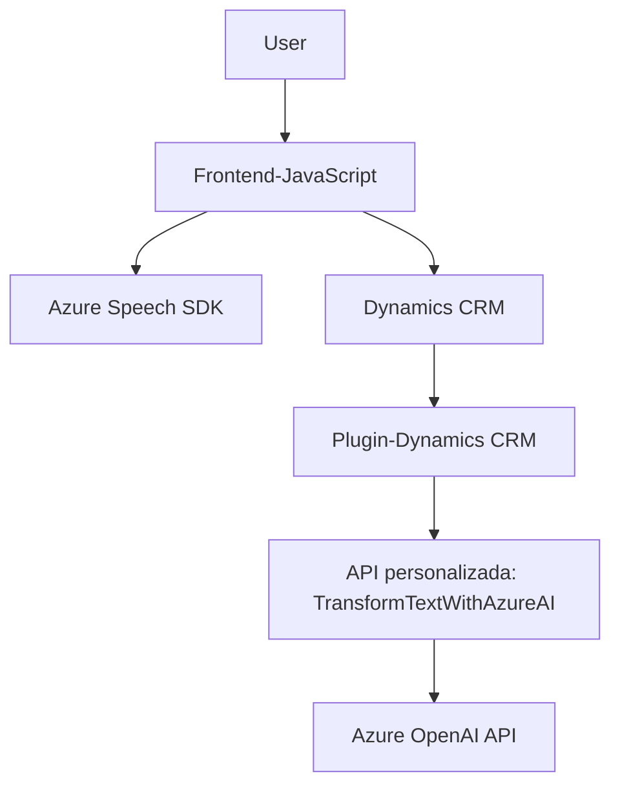

### **Breve resumen técnico**
La solución es un sistema orientado a la integración de servicios de inteligencia artificial y tecnologías de voz con Microsoft Dynamics CRM. Utiliza una combinación de frontend en JavaScript y un plugin en C# implementado en Dynamics CRM. El sistema incluye:
- **Frontend/JS**: Para integrar la lectura de formularios y reconocer la voz mediante Azure Speech SDK. También interactúa con Dynamics CRM y APIs personalizadas.
- **Backend plugin (C#)**: Implementación de un plugin en Dynamics CRM para transformar texto utilizando Azure OpenAI.

---

### **Descripción de la arquitectura**
La arquitectura es de tipo **n capas**, donde el sistema incluye:
1. **Presentación/Frontend**: Donde servicios como la captura de voz o lectura de formularios se integran con la plataforma Dynamics CRM y Azure Speech SDK.
2. **Servicios**: Integra APIs externas, como la de Azure Speech SDK y una API personalizada para texto transformado (por ejemplo, mediante servicios de Azure AI).
3. **Negocio/Backend**: Implementa lógica empresarial dentro de Dynamics CRM mediante plugins personalizados capaces de interactuar con APIs avanzadas como Azure OpenAI.

Importante destacar:
- Existe **acoplamiento directo con servicios en la nube** como Microsoft Dynamics y Azure AI/Speech SDK.
- El diseño demuestra un claro **patrón de separación de responsabilidades**, dividiendo funciones específicas y privilegios entre el frontend, los servicios y el backend.

---

### **Tecnologías usadas**
1. **Frontend:**
   - **JavaScript**
   - **Azure Speech SDK** (para síntesis y reconocimiento de voz).
   - **Asistencia para Microsoft Dynamics CRM**.
   - Interacción con APIs externas como la personalizada diseñada para la solución.

2. **Backend:**
   - **Microsoft Dynamics CRM**: Extensiones mediante plugins (C# `IPlugin`).
   - **Azure OpenAI API**: Para procesamiento avanzado de texto (GPT).
   - **C#/.NET Framework**: Gestión de plugin, manejo de datos, consumo de APIs externas.

3. **Dependencias:**
   - `Newtonsoft.Json` para manipulación de datos JSON.
   - Servicios HTTP (`HttpClient`) para comunicación con Azure APIs.

---

### **Diagrama Mermaid**
Basándonos en los componentes mencionados, este diagrama representa la interacción entre los módulos del sistema y sus dependencias externas.

---

### **Conclusión final**
La estructura del repositorio evidencia un sistema integrado con capacidades avanzadas para la síntesis y reconocimiento de voz, interacción con formularios de Dynamics CRM y un plugin backend basado en Azure AI para operaciones de procesamiento de texto. La solución presenta una arquitectura **n capas**, que divide las responsabilidades entre frontend, servicios intermedios y backend, asegurando la mantenibilidad y escalabilidad del sistema. Sin embargo, la dependencia directa de servicios externos (Azure Speech SDK y Azure OpenAI) aumenta el riesgo de fallos ante interrupciones de dichos servicios, por lo que deberían establecerse planes de contingencia para garantizar estabilidad.