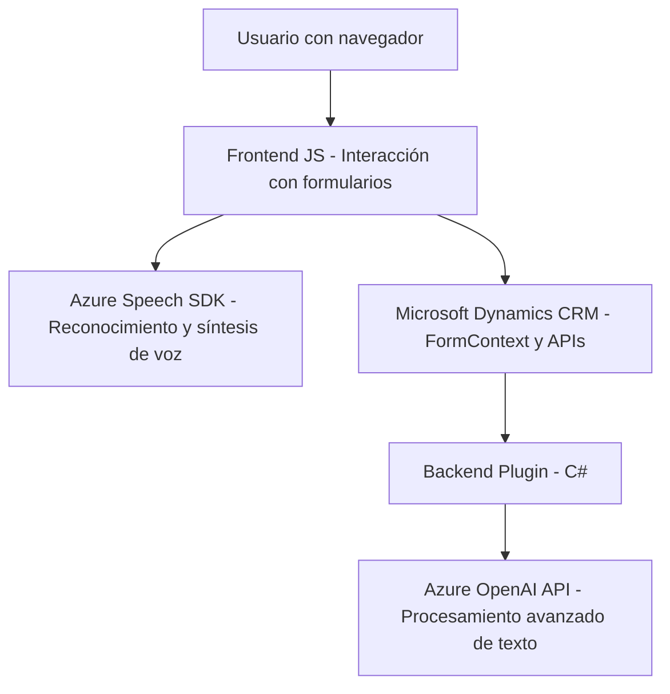

### Breve resumen técnico:
El repositorio analiza y describe una solución orientada a la integración y captura de voz mediante Azure Speech SDK en formularios dinámicos, probablemente Microsoft Dynamics CRM. También incluye un plugin desarrollado en C# que utiliza Azure OpenAI para transformar texto en formato estructurado. Los archivos se enfocan en enriquecer la experiencia de usuario con reconocimiento y síntesis de voz, automatización mediante IA y extensibilidad en el sistema CRM.

---

### Descripción de arquitectura:
La solución sigue una arquitectura **mixta de n capas**:
1. **Frontend (JavaScript)**:
   - Scripts que interactúan directamente con formularios dinámicos en Dynamics CRM.
   - Realizan captura, transcripción y síntesis de voz, interactuando con el SDK de Azure Speech y APIs personalizadas.
   
2. **Backend (C#)**:
   - Plugins que extienden funcionalidades del CRM utilizando la arquitectura de Dynamics (basado en la interfaz `IPlugin`).
   - Comunicación con Azure OpenAI mediante llamadas a servicios HTTP para procesamiento avanzado de texto con IA.

3. **External Integration (Azure SDKs and APIs)**:
   - Conexión con servicios externos como Azure's Speech SDK y OpenAI para tareas específicas.

La separación entre frontend manejando interacción de usuario y backend manejando procesamiento no interactivo sugiere un diseño orientado al **patrón de capas**, pero los elementos externos se asemejan a un sistema **orientado a servicios**. No es monolítico, ya que delega roles específicos a SDKs y APIs externas.

---

### Tecnologías usadas:
1. **Frontend:**
   - **JavaScript** para la lógica del cliente y manipulación de objetos en el contexto del formulario.
   - **Azure Speech SDK** para procesamiento de voz (síntesis y reconocimiento).
   - Integración con **Microsoft Dynamics CRM** para formularios dinámicos y datos en ejecución (`executionContext`).

2. **Backend:**
   - **C#** para el desarrollo del plugin de Dynamics CRM.
   - **Azure OpenAI API** para el procesamiento avanzado de texto.
   - **Microsoft Dynamics SDK** para extender funcionalidades del CRM.

3. **Frameworks/Dependencias:**
   - **System.Text.Json** para manipulación de JSON.
   - **Newtonsoft.Json** (posiblemente) para procesamiento de estructuras complejas en C#.

4. **Patrones utilizados**:
   - Patrón de Plugin en Dynamics CRM.
   - Patrón de integración externa (SDK).
   - Patrón de capas (segregación entre frontend, backend y servicios externos).

---

### Diagrama **Mermaid** válido para GitHub:

---

### Conclusión final:
La solución combina la interacción de usuario en un navegador, funcionalidades dinámicas de un backend y servicios externos como Azure Speech SDK y OpenAI. Esto sugiere una integración robusta orientada a servicios donde se enfoca en la reutilización de bibliotecas y APIs. Mediante patrones conocidos como arquitectura de capas y modelo de plugins, logra flexibilidad y extensibilidad dentro del ecosistema CRM basado en Microsoft Dynamics.

Este diseño es óptimo para el propósito planteado. Sin embargo, sería recomendable considerar aspectos de escalabilidad y latencia en las llamadas a servicios externos, así como la seguridad en el manejo de claves de Azure.