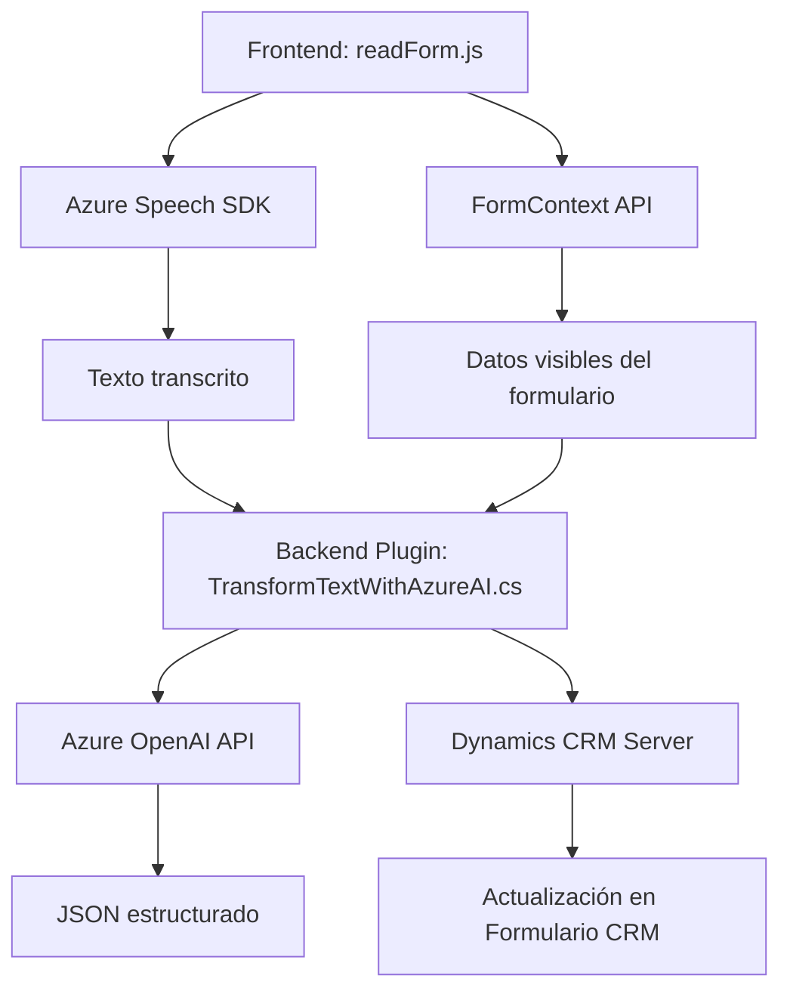

### Breve resumen técnico

Los archivos del repositorio forman parte de una solución integral que combina interacciones entre frontend y backend con integración a plataformas externas como Azure Speech API y Azure OpenAI. La solución está orientada hacia la accesibilidad mediante control de voz y procesamiento de lenguaje natural, aplicado a formularios dinámicos en un sistema CRM de Dynamics 365.

---

### Descripción de arquitectura

#### Tipo de solución
La solución integra un **frontend** (para interactuar con la voz y formularios) y un **backend**, creado como un **plugin** extendido en Dynamics CRM que sirve como un microservicio especializado para procesar texto con Azure OpenAI.

#### Patrón arquitectónico
1. **Multicapa**: Se observa claramente un flujo separado de responsabilidades:
   - **Presentación (Frontend)**: Archivos en JavaScript (p. ej., `readForm.js`, `speechForm.js`) capturan entrada por voz usando Azure Speech SDK y gestionan la comunicación con la API externa o el CRM.
   - **Negocio (Backend/Plugins)**: Se encapsula la funcionalidad de transformación del texto y validación lógica en el plugin `TransformTextWithAzureAI.cs`.
   - **Integración (Externa)**: Comunicación con servicios de Azure (Speech y OpenAI) y gestión de datos en el sistema CRM.

2. **Desacoplamiento**: Todos los módulos muestran manejo de dependencias externas a través de SDKs o APIs separadas, minimizando dependencias directas entre frontend y backend.

3. **Microservicios**: El uso de Azure OpenAI y Azure Speech SDK podría considerarse parte de una arquitectura que delega servicios externos (speech-to-text, transformación de texto).

---

### Tecnologías y patrones usados 

#### Frontend
- **JavaScript**: Desarrollo del cliente para formularios y entrada de voz.
- **Azure Speech SDK**: Para convertir texto en voz y realizar transcripciones.
- **Callback-based Asynchronous Flow**: Implementación basada en callbacks y promesas.

#### Backend
- **Dynamics CRM Plugin (C#)**: Extensión del CRM con `IPlugin` para procesamiento de datos mediante reglas de negocio.
- **Azure OpenAI Service**: Integración con servicio externo (GPT-4) para transformación de texto.
- **Newtonsoft.Json**: Serialización y deserialización de JSON estructurado.

#### Arquitectura y patrones generales
- **Separación de capas**: Desacoplamiento entre la interfaz, la lógica de negocio y la capa de integración.
- **Integración con API externas**: Comunicación eficiente con Azure Speech y Azure OpenAI.
- **Pattern Plugin**: Herencia para compatibilidad con Dynamics 365.

---

### Dependencias o componentes externos

1. **Azure Speech SDK**: Facilita conversión de texto a voz y transcripción de voz a texto.
2. **Azure OpenAI API (GPT-3/GPT-4)**: Utilizada por el backend para transformar texto en JSON siguiendo reglas predefinidas.
3. **API personalizada del CRM**: Comunicación con sistemas internos de Dynamics 365 (`Xrm.WebApi`).
4. **Newtonsoft.Json**: Manipulación de estructuras JSON en el backend.
5. **Microsoft.Xrm.Sdk**: Framework SDK para extensiones dentro del entorno de Dynamics CRM.

---

### Diagrama Mermaid

---

### Conclusión final

La solución está diseñada para mejorar la accesibilidad y automatización en sistemas CRM mediante voz y procesamiento de lenguaje natural. Utiliza una arquitectura multicapa que combina frontend interactivo, lógica de negocio en el backend, y dependencias externas como Azure Speech SDK y OpenAI API. Es escalable, desacoplada y modular, lo que facilita la integración en sistemas existentes de Dynamics CRM.