# Breve Resumen Técnico
El repositorio describe una solución híbrida que integra tecnologías frontend (JavaScript) para interacción con usuarios a través de formularios dinámicos y una capa backend con un plugin en C# para Dynamics CRM que utiliza Azure OpenAI. La solución incluye funcionalidades de accesibilidad (sintetización de voz) y transformación de texto basado en inteligencia artificial. Hay una dependencia evidente de servicios en la nube, específicamente el SDK de Azure Speech y la API de Azure OpenAI.

---

# Descripción de Arquitectura
El sistema tiene una arquitectura multicapa (n capas) que incluye:

1. **Frontend (JavaScript)**: Procesa la interacción del usuario (datos de formularios) con funcionalidades de voz y transcripción, acoplándose dinámicamente a servicios en la nube de Azure Speech SDK.
2. **Backend (C#, Dynamics CRM Plugin)**: Orquesta el procesamiento avanzado de texto mediante Azure OpenAI para cumplir reglas específicas en un entorno de Microsoft Dynamics CRM.
3. **Integración con Cloud Services**: El sistema se conecta con dos servicios clave de Azure (Speech SDK para síntesis/transcripción de voz y OpenAI API para transformación de texto).

La arquitectura está orientada al consumo de APIs y está estructurada para interoperar con dependencias externas (SDKs, APIs).

---

# Tecnologías Usadas
1. **Frontend:**
   - Lenguaje: JavaScript.
   - Frameworks: Ninguno evidente (plain JS).
   - Servicios externos: Azure Speech SDK.
   - Tecnologías del navegador: Manipulación del DOM para cargar dependencias dinámicas.

2. **Backend:**
   - Lenguaje: C#.
   - Plataforma: Dynamics CRM.
   - Librerías:
     - Newtonsoft.Json (procesamiento de JSON).
     - Microsoft.Xrm.Sdk (interacción con CRM).
   - Servicios externos: Azure OpenAI API.

3. **Patrones:**
   - Carga dinámica de dependencias.
   - Modularidad funcional en el frontend.
   - Plugin Architecture para integración con Dynamics CRM.
   - API Client Pattern para la interacción con Azure OpenAI.

---

# Diagrama Mermaid

```mermaid
graph TD
    A["Frontend JS - readForm.js"]
    A1["Get visible fields"]
    A2["Synthesizes text with Azure Speech"]
    A3["Azure Speech SDK loaded dynamically"]
    A --> A1
    A --> A2
    A --> A3

    B["Frontend JS - speechForm.js"]
    B1["Process voice input"]
    B2["Call Custom API via Azure AI"]
    B3["Update form fields dynamically"]
    B --> B1
    B --> B2
    B --> B3

    C["Plugins - TransformTextWithAzureAI.cs"]
    C1["Input Parameters: Text and Rules"]
    C2["Call Azure OpenAI endpoint GPT-4"]
    C3["Return transformed JSON"]
    C4["Update CRM fields using IPlugin"]
    C --> C1
    C --> C2
    C --> C3
    C --> C4

    D["Services"]
    D1["Azure Speech SDK"]
    D2["Azure OpenAI API"]
    B --> D1
    C --> D2
```

---

# Conclusión Final
Este repositorio presenta una solución híbrida que aporta accesibilidad mediante síntesis de voz en el frontend, transformando datos a través de inteligencia artificial en el backend. Es una arquitectura de n capas bien diseñada, con un enfoque modular y una fuerte dependencia de servicios en la nube (Azure). Sin embargo, hay ciertos riesgos, como la exposición de claves API en el código que deben ser solucionados para reforzar la seguridad. Esto podría convertirse en una solución sólida para plataformas como Dynamics CRM que requieren integración avanzada con servicios externos para mejorar la experiencia de usuario.