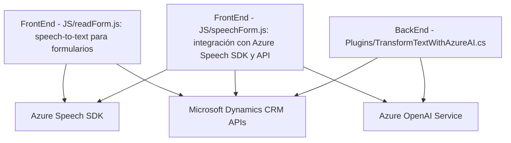

### Breve resumen técnico

El repositorio parece ser una solución que extiende funcionalidades de Microsoft Dynamics CRM mediante el uso de Microsoft Azure Speech SDK y Azure OpenAI. Combina capacidades de síntesis de voz, reconocimiento de voz y procesamiento de texto con IA. Está dividido principalmente en dos partes: un frontend JavaScript que maneja la interacción entre usuarios y formularios, y un backend en .NET como plugin para Dynamics CRM que procesa texto asistido por inteligencia artificial.

---

### Descripción de arquitectura

La arquitectura es híbrida, multifuncional con separación de responsabilidades:
1. **Frontend:** Es modular, basado en funciones que encapsulan características específicas como el reconocimiento de voz, interacción con formularios y generación de entradas de texto.
   - Arquitectura: **n-capas** (presentación, lógica de negocio).
   - Patrón principal: **Interacción por eventos**, aplicado a la comunicación entre componentes y usuarios vía SDK/servicios.
   
2. **Plugin Backend:**
   - Arquitectura: **Hexagonal**. Cuerpo principal centrado en la lógica de negocio que interactúa con servicios externos (Azure OpenAI) a través de puertos/adaptadores.
   - Patrón principal: **Integración con servicios externos**.

Ambos componentes se ejecutan en el contexto de Dynamics CRM, lo que los configura como extensiones para interactuar con formularios y datos, permitiendo una capa adicional de accesibilidad y procesamiento de datos.

---

### Tecnologías usadas

1. **Frontend:**
   - **JavaScript ES6+:** Base del código.
   - **Azure Speech SDK:** Implementa funcionalidades de síntesis y reconocimiento de voz.
   - **REST API calls:** Utilizadas para llamadas a servicios externos y procesamiento de información.

2. **Backend:**
   - **Microsoft Dynamics CRM SDK (`Microsoft.Xrm.Sdk`).**
   - **Azure OpenAI API:** para servicios de inteligencia artificial en el procesamiento de texto.
   - **JSON Manipulation Libraries (`Newtonsoft.Json.Linq`, `System.Text.Json`).**

3. **Servicios externos:**
   - Dynamics CRM APIs: Para interactuar con los datos almacenados en el sistema CRM de Microsoft.
   - Azure cognitive services como Speech SDK y OpenAI.

---

### **Diagrama Mermaid válido para GitHub**

---

### Conclusión final

La solución constituye una arquitectura dividida en un frontend en JavaScript y un backend basado en .NET, enfocado en la extensión de funcionalidades de Microsoft Dynamics CRM mediante integración con servicios en la nube, como Azure Speech SDK y Azure OpenAI. Su enfoque modular y el uso de múltiples patrones como el control por eventos y la integración con APIs externas hacen que la solución sea extensible y adecuada para una variedad de contextos, como mejorar accesibilidad o ampliar capacidades de interacción en sistemas corporativos como Dynamics CRM.