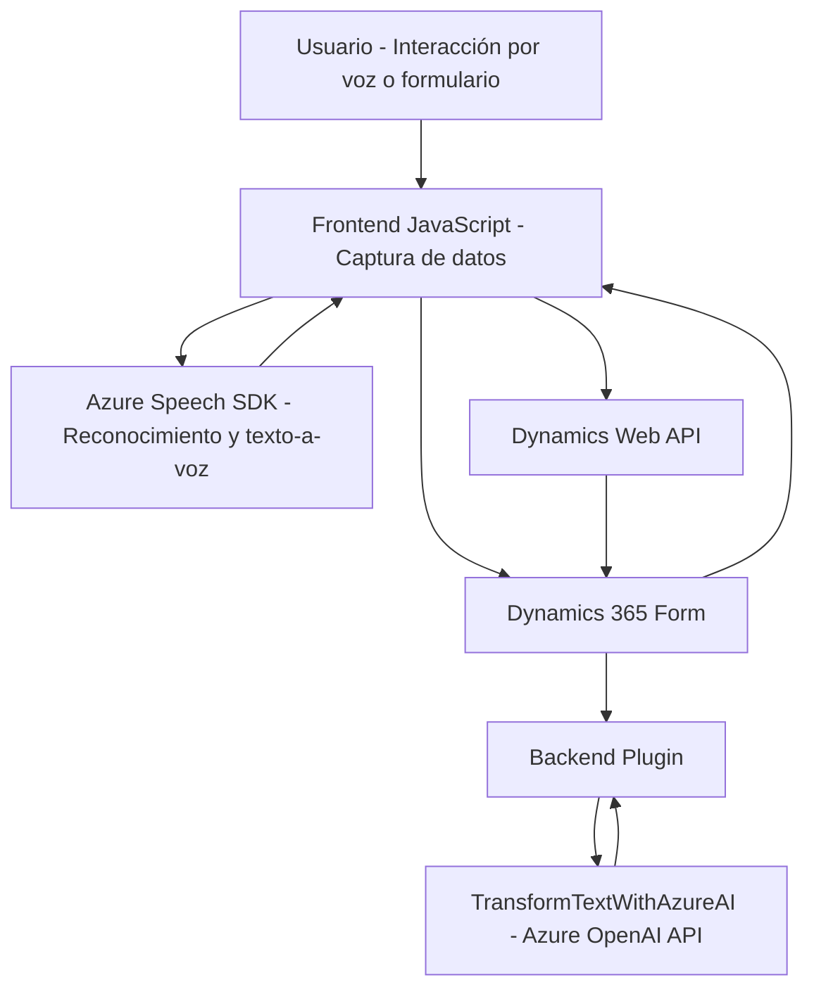

### **Breve resumen técnico**
El repositorio forma parte de una solución tecnológica para integrar funcionalidades de voz y reconocimiento de texto con formularios de Microsoft Dynamics 365. Se apoya en los servicios de Azure AI (OpenAI y Speech SDK) para brindar accesibilidad y procesamiento avanzado de datos escritos y hablados. 

---

### **Descripción de la arquitectura**
El repositorio parece ser parte de una solución de **arquitectura modular**. El frontend tiene lógica especializada para interactuar con formularios y utilizar Azure Speech SDK para la conversión de texto a voz. Por otro lado, en el backend hay un plugin en C# que usa la arquitectura extensible de Dynamics CRM mediante **IPlugin**, conectándose también con la API de Azure OpenAI.

Este enfoque, aunque modular en su implementación, no cumple con una arquitectura orientada a microservicios ni una estrictamente hexagonal. Más bien, está diseñado como un sistema de **N Capas**:
1. **Capa de presentación (Frontend)**: Código JavaScript en formato modular que actúa como interfaz usuario y administración del flujo de datos entre el usuario, formularios y el backend.
2. **Capa lógica (Plugins)**: Encapsulan algoritmos y lógica empresarial para procesamiento en Dynamics CRM.
3. **Capa de acceso a datos (Dynamics Framework)**: Interacción directa con las estructuras de datos propias de Microsoft Dynamics y consultas API.

El uso del SDK de Azure y la integración de las APIs de OpenAI sugiere una combinación de **event-driven architecture** para activaciones en el frontend y un enfoque basado en funciones en el backend.

---

### **Tecnologías usadas**
1. **Azure Speech SDK**: Para sintetizar texto a voz y realizar reconocimiento de voz.
2. **Dynamics 365 SDK & WebAPI**:
   - Manipulación de formularios y datos de manera programática.
   - Utilización de la arquitectura de plugins (implementación de `IPlugin`).
3. **Azure OpenAI API**: Utilizada en el backend (Plugin `TransformTextWithAzureAI`) para la transformación de datos de texto en JSON.
4. **JavaScript**: Gestión del frontend interactivo.
5. **C# (Microsoft .NET)**: Implementación del plugin para la integración con Dynamics CRM.
6. **Microsoft APIs**:
   - SDK de Speech.
   - WebApi.
   - Dynamics Xrm SDK.
7. **Libraries**:
   - `Newtonsoft.Json` y `System.Text.Json` para el manejo de respuestas entre el plugin y el integrador.
   - `HttpClient` para las llamadas a API en el plugin.

---

### **Diagrama Mermaid**

---

### **Conclusión final**
Este repositorio evidencia una solución tecnológica diseñada para mejorar la accesibilidad y automatización en sistemas de CRM, usando el poder de servicios cloud como Azure Speech SDK y Azure OpenAI. La solución emplea una combinación de principios de modularización y n capas. Sin embargo, la arquitectura podría evolucionar hacia microservicios para mayor escalabilidad en grandes entornos corporativos, especialmente si las funcionalidades y cargas crecieran exponencialmente. Además, recomendaría considerar mejoras de seguridad en la gestión de claves de la API, como su externalización en el backend mediante una variable de entorno.