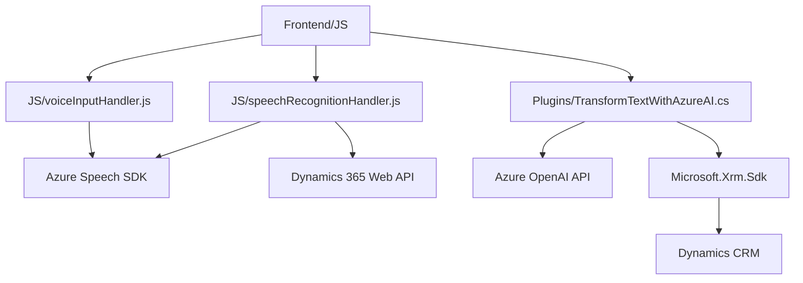

### Breve Resumen Técnico

El repositorio en conjunto forma una solución para mejorar la experiencia de accesibilidad y procesamiento de datos en aplicaciones basadas en Dynamics 365. Los componentes principales incluyen:
1. **Frontend**: Módulos de JavaScript para proporcionar capacidades de síntesis de texto a voz y reconocimiento de voz.
2. **Plugin para Dynamics CRM**: Extiende la funcionalidad del sistema mediante el uso de la API de Azure OpenAI para transformar texto en estructuras JSON específicas.

---

### Descripción de la Arquitectura

#### Tipo de solución:
La solución es **multimódulo** y orientada hacia integraciones en plataformas empresariales:
- **Interfaz de usuario (Frontend)** con funcionalidades de accesibilidad en Dynamics 365 (sintetizadores de texto y transcripción de voz).
- **Back-end por plugins**: Lógica avanzada dentro de Dynamics CRM mediante el uso de capacidades de IA.

#### Tipo de arquitectura:
1. **Frontend**: Aplicación basada en cliente, probablemente estructurada en **arquitectura n-capas**:
   - Capa de presentación (UI basada en JavaScript).
   - Capa lógica (transformación y acceso a servicios como Azure Speech SDK).

2. **Extendibilidad en Dynamics CRM** mediante plugins: Adopta un patrón **Plugin-based architecture**, común en Dynamics CRM, encapsulado en la interfaz `IPlugin`.

---

### Tecnologías Usadas

1. **Frontend**:
   - **JavaScript** como lenguaje base.
   - **Azure Speech SDK** para reconocimiento y síntesis de texto a voz (http/SDK).
   - **Dynamics 365 Web API** (`Xrm.WebApi`) para interactuar con la API de Dynamics CRM.

2. **Plugins en Dynamics CRM**:
   - **C#** como lenguaje base.
   - **Microsoft.Xrm.Sdk**, librería para integrar el plugin con Dynamics CRM.
   - **Azure OpenAI API** para procesamiento de texto.
   - **Newtonsoft.Json** para manipulación de JSON.

#### Patrones y prácticas:
- **Delegación de eventos** en frontend para manejar interacción con Azure Speech SDK.
- **Microservicio externo** para inteligencia artificial (Azure OpenAI).
- **Encapsulación de lógica específica** dentro de varias funciones (e.g., para valores de formularios y transformación de texto).

---

### Dependencias/Componentes Externos

1. **Azure Speech SDK**:
   - Necesario para las funcionalidades de voz (reconocimiento y síntesis).
   - Dependencia principal del frontend.

2. **Azure OpenAI API**:
   - Utilizado por el plugin para estructurar texto mediante inteligencia artificial y devolver datos JSON.

3. **Dynamics 365 Web API**:
   - Gestión de formularios y datos de usuario en Dynamics CRM.

4. **Bibliotecas C#**:
   - **Newtonsoft.Json**: Procesamiento de estructuras JSON.
   - **System.Net.Http**: Comunicación con APIs externas mediante HTTP.
   - **Microsoft.Xrm.Sdk**: Interacción directa con Dynamics CRM.

5. Fuentes de datos:
   - Formularios y entidades de Dynamics 365 como input para transformación y síntesis.

---

### Diagrama Mermaid

---

### Conclusión Final

La solución está diseñada bajo una arquitectura modular que conecta las interfaces cliente (frontend) con servicios avanzados de reconocimiento de voz/síntesis (Azure Speech SDK) y transformación de datos usando inteligencia artificial (Azure OpenAI). La integración con Dynamics CRM amplía funcionalidad, lo que favorece la personalización de procesos empresariales.

Puntos clave:
1. **Ventajas**:
   - Modular y extensible.
   - Uso de servicios cloud (Azure) para tareas complejas como voz y inteligencia artificial.
   - Arquitectura bien distribuida entre frontend, servicios externos y plugins.

2. **Consideraciones**:
   - Mejorar el manejo de errores para depender menos de respuestas exitosas de servicios externos.
   - Añadir pruebas unitarias y documentación más exhaustiva para códigos críticos como los plugins.

En general, la solución está optimizada para entornos empresariales, integrando accesibilidad y automatización eficientemente mediante servicios de terceros como Azure.