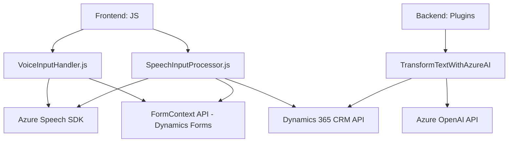

### Breve resumen técnico
El contenido del repositorio presenta una solución de interacción avanzada con el sistema CRM Dynamics 365 utilizando el SDK de Azure Speech y Azure OpenAI API. Incluye capacidades para convertir texto en voz, procesar transcripciones de voz en texto para actualizar dinámicamente los formularios del CRM, y transformar texto mediante IA. Las funciones y clases se diseñan bajo principios de modularidad y separación de responsabilidades.

---

### Descripción de arquitectura
1. **Tipo de solución:**  
   Este repositorio contiene una infraestructura que combina frontend y backend, diseñados para interactuar con un sistema CRM. Se trata de un sistema híbrido compuesto de:
   - **Frontend:** Scripts JavaScript que manejan la interfaz de usuario del formulario, reconocimiento de voz, síntesis de voz y comunicación con APIs externas.
   - **Plugins para el backend:** Código creado con .NET (C#) que extiende la funcionalidad del CRM a través del modelo de desarrollo de plugins en Dynamics 365.

2. **Arquitectura:**  
   La solución se asemeja a una **arquitectura de micro frontend** integrada con un sistema modular de backend basado en plugins (**plugin-based architecture**) y una **arquitectura orientada a servicios (SOA)** que utiliza APIs de Azure para servicios cognitivos y AI en la nube.

---

### Tecnologías usadas
1. **Frontend:**
   - **JavaScript**
   - **Azure Speech SDK**: Reconocimiento de voz y síntesis de voz.
   - **Dynamics 365 context API**(`formContext API`): Acceso y manipulación de datos en formularios del CRM.
   - **HTML DOM manipulation**: Carga dinámica de scripts (por ejemplo, el SDK de Azure Speech).

2. **Backend:**
   - **C#**
   - **Microsoft.Xrm.Sdk**: Framework para desarrollo de plugins en Dynamics 365.
   - **System.Text.Json** y **Newtonsoft.Json.Linq**: Para la manipulación de datos JSON.
   - **System.Net.Http**: Realización de solicitudes HTTP.
   - **Azure OpenAI API**: Uso de IA para transformar texto.

3. **Integración de servicios externos:**  
   - Azure Speech SDK: Para el reconocimiento y síntesis de voz.  
   - Azure OpenAI API: Para procesamiento avanzado de texto.

4. **Patrones de diseño:**  
   - **Callback Pattern:** Para verificar la carga del SDK antes de usarlo.  
   - **Facade Pattern:** Simplificación del flujo complejo mediante funciones principales (`startVoiceInput`, `startVoiceInput` en JavaScript).
   - **Repository Pattern:** Acceso controlado y encapsulado al Web API de Dynamics 365.

---

### Dependencias o componentes externos
1. SDK y APIs externas:
   - **Azure Speech SDK:** Para reconocimiento de voz y síntesis de voz.
   - **Azure OpenAI API:** Para transformación avanzada de texto.
   - **Dynamics 365 Web API:** Para manejo de datos del CRM.

2. Librerías utilizadas:
   - `Newtonsoft.Json.Linq`
   - `System.Text.Json`
   - `System.Net.Http`

3. Sistema externo:
   - CRM basado en Dynamics 365, donde los formularios interactúan con los datos y API del sistema.

---

### Diagrama Mermaid válido para GitHub

---

### Conclusión final
La solución del repositorio combina eficientemente el frontend y backend para proporcionar servicios avanzados, como reconocimiento de voz, síntesis de voz y transformación inteligente de texto. Se destaca el uso de APIs de Azure (Speech SDK y OpenAI) para extender las capacidades del CRM Dynamics 365. La arquitectura orientada a servicios asegura escalabilidad y flexibilidad al interactuar con recursos en la nube. Sin embargo, se puede considerar refactorizar ciertas partes de los archivos JS para una reducción de acoplamiento y mejorar la cohesión utilizando clases o abstraer las implementaciones repetidas.