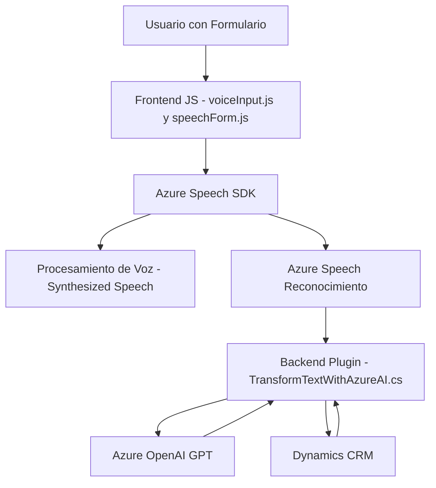

### Breve resumen técnico

El repositorio dispone de varios archivos con funcionalidades específicas para integrar **Azure Speech SDK** y **Azure OpenAI** en un entorno de Microsoft Dynamics CRM. Los archivos se dividen entre frontend (JavaScript), plugins backend (.NET) y funcionalidades de integración con APIs y servicios externos, destacándose por el enfoque en interacción con formularios y transformación de datos basados en IA.

---

### Descripción de arquitectura

### Tipo de solución:
La solución constituye una combinación de **frontend** en JavaScript, que consume servicios externos (SDK de Azure), y **plugins backend** en C#, integrándose en una **plataforma de CRM dinámica**.

#### Arquitectura:
- **Componentes frontend** en **JavaScript** contienen funciones que gestionan interacciones con usuarios mediante voz, procesan formularios,
y envían resultados a servicios externos.
- **Plugins backend** siguen un **patrón n capas**, con división funcional entre la lógica de ejecución del plugin y la comunicación REST a **Azure OpenAI**.
- **Uso de servicios externos** como **Azure Speech SDK** y **Azure OpenAI Service** implica una arquitectura orientada a servicios con patrones de integración API.

La arquitectura en general combina patrones de **n capas** y **arquitectura modular**, con apoyo de servicios externos optimizados para tareas específicas (synthesized speech y AI text processing).

---

### Tecnologías usadas
1. **Frontend**:
   - **JavaScript**.
   - **Azure Speech SDK**.
   - Comunicación con **Dynamics CRM** (`Xrm.WebApi.online`).

2. **Backend Plugins (.NET)**:
   - **Microsoft Dynamics CRM SDK** (extensiones mediante `IPlugin`).
   - **Azure OpenAI GPT**.
   - Librerías .NET Core:
     - `System.Net.Http` (solicitudes HTTP).
     - `System.Text.Json` y `Newtonsoft.Json.Linq` (manejo JSON).

3. **Servicios Externos**:
   - **Azure Speech** (synthesized speech y reconocimiento de voz).
   - **Azure OpenAI GPT-4** (transformaciones inteligentes de texto estructurado).

---

### Diagrama Mermaid válido para GitHub

---

### Conclusión final
El repositorio es un ecosistema diseñado para extender la funcionalidad de Microsoft CRM, permitiendo interacción avanzada en tiempo real: desde manejo de formularios mediante síntesis/reconocimiento de voz hasta aplicaciones de inteligencia artificial mediante Azure OpenAI. La combinación de JavaScript en frontend con .NET plugins para backend sigue una arquitectura **modular y escalable**, optimizada para la integración de APIs y servicios externos como **Azure Speech SDK** y **Azure OpenAI Service**.