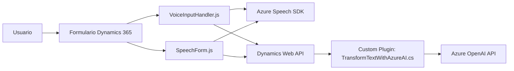

### Resumen técnico

El repositorio expuesto contiene archivos que implementan características relacionadas con input/output de voz y texto, utilizando el SDK de Azure para reconocimiento de voz y síntesis de texto hablado, además de integración con servicios externos como Azure OpenAI y Dynamics CRM. La solución es una mezcla de frontend JavaScript y backend de microservicios y plugins en C#, destinados a soportar un sistema CRM avanzado con interacción por voz y procesamiento de datos.

---

### Descripción de arquitectura

1. **Tipo de solución**:
   - Este repositorio representa una integración funcional para CRM (probablemente Microsoft Dynamics 365), extendida con capacidades de voz y procesamiento de texto avanzado. Incluye:
     - **Frontend**: Archivos JavaScript para interacción directa con formularios y captura de comandos de voz.
     - **Backend/plugin**: Un microservicio/plugin en C# que integra Azure OpenAI para el procesamiento del texto transformado.

2. **Arquitectura**:
   - **Multicapa**:
     - Capa del cliente: Archivos de frontend (JS) ejecutados directamente sobre la interfaz de usuario del CRM.
     - Capa de integración: Plugins en C# para lógica avanzada y comunicación con APIs externas como Azure OpenAI.
     - Capa externa: Servicios externos como Azure Speech SDK y Azure OpenAI para voz y procesamiento de texto.
   - Uso de patrones de integración externa y enfoque modular en el código.

---

### Tecnologías usadas

1. **Standard CRM Technologies**:
   - Microsoft Dynamics 365 CRM.
   - SDK Dynamics para manipulación de formularios (Xrm.WebApi.online).

2. **Frontend**:
   - **JavaScript**: Encargado de manipulación de formularios y comunicación con SDKs externos.
   - **Azure Speech SDK**: Para reconocimiento y síntesis de voz.

3. **Backend**:
   - **C#**: Desarrollo de plugins mediante SDK de Dynamics CRM.
   - **System.Net.Http y Newtonsoft.Json**: Comunicación con APIs externas y manejo de datos JSON.
   - **Azure OpenAI API**: Integración con GPT para transformación inteligente de texto.

4. **Integración con servicios externos**:
   - Dependencia de Speech SDK y OpenAI SDK para capacidades de inteligencia artificial de última generación.

5. **Patrones usados**:
   - Modularidad: Separación clara de responsabilidades entre funciones.
   - Dependency injection (en plugins CRM y SDK JS).
   - Lazy loading y carga dinámica (Azure Speech SDK en frontend).
   - Encapsulación de lógica específica en métodos (`GetOpenAIResponse`, etc.).

---

### Componentes externos necesarios

1. **Azure Speech SDK**:
   - Herramienta clave para captura y síntesis de voz del frontend.
   - Cargado dinámicamente si no está disponible.

2. **Azure OpenAI**:
   - Servicio utilizado para transformar texto mediante GPT, integrado en un plugin CRM.

3. **Dynamics 365 CRM Web APIs**:
   - Para manipulación de formularios y acceso a entidades internas.

---

### Diagrama Mermaid

---

### Conclusión final

La solución presentada tiene una arquitectura multicapa donde los componentes frontend en JavaScript interactúan directamente con formularios en Dynamics 365 CRM. Se integra dinámicamente con el SDK de Azure Speech para funciones de reconocimiento y síntesis de voz, mientras que utiliza un plugin en C# para transformaciones avanzadas de texto mediante Azure OpenAI. La estructura es modular y bien diseñada, optimizada para escalabilidad y facilidad de integración con servicios externos.