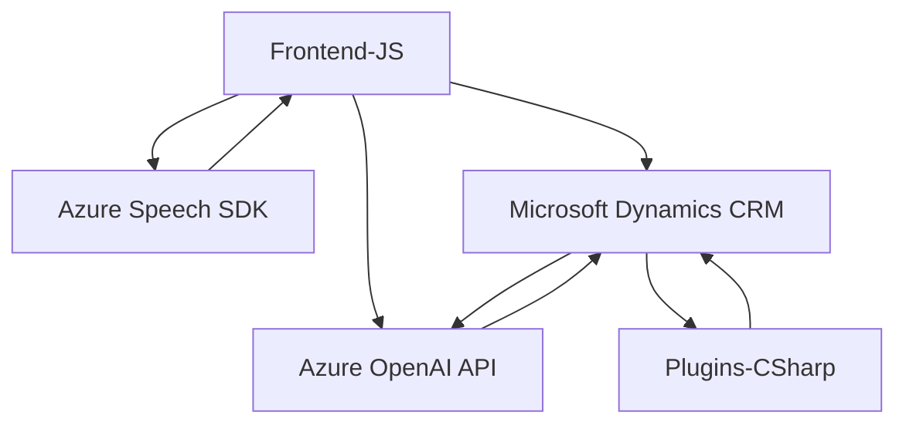

### Breve resumen técnico

El repositorio proporciona una solución centrada en la interacción con formularios mediante reconocimiento de voz y síntesis de voz con **Azure Speech SDK**, integra una funcionalidad basada en inteligencia artificial a través de **Azure OpenAI**, y extiende la funcionalidad de Microsoft Dynamics CRM mediante un plugin personalizado. La solución combina **frontend (JavaScript)** y **backend (C#)**.

---

### Descripción de arquitectura

La arquitectura tiene una estructura híbrida que combina varias capas:

1. **Frontend dinámico**: La parte escrita en JavaScript maneja el reconocimiento y síntesis de voz, realizando interacción local con el DOM y usando servicios en la nube (APIs de Azure y Microsoft Dynamics).
2. **Backend orientado a eventos**: El plugin basado en C#, ejecutado dentro del contexto de Dynamics CRM, utiliza la API de Azure OpenAI para transformar datos textuales según reglas predefinidas y devolver respuestas estructuradas.
3. **Integración API**: Se implementa un patrón de integración por medio de SDKs (Azure Speech) y API REST (Azure OpenAI y Dynamics).

Patrón observado:
- El **frontend** actúa como una capa de presentación que procesa voz y datos visibles, delegando tareas complejas al **backend**, el cual sigue una arquitectura de plugins acoplada al entorno de Dynamics CRM.
- El acoplamiento con **servicios en la nube** (Azure Speech y OpenAI) indica un enfoque de **arquitectura orientada a servicios**.

---

### Tecnologías usadas

1. **Frontend (JavaScript)**:
   - **Azure Speech SDK**: Para reconocimiento de voz y síntesis.
   - Manipulación DOM estándar.
   - Carga dinámica de dependencias (`ensureSpeechSDKLoaded`).

2. **Backend (C#)**:
   - **Microsoft Dynamics SDK**: `IPlugin`, `IPluginExecutionContext`, `IOrganizationService`.
   - **Azure OpenAI API**: Para transformación de texto avanzada.
   - **System.Net.Http**: Para integraciones REST.
   - **JSON management**: `System.Text.Json` y `Newtonsoft.Json.Linq`.

3. **Dependencias externas**:
   - Azure Speech SDK.
   - Azure OpenAI API.
   - API REST de Dynamics CRM.
   
4. **Patrones aplicados**:
   - **Carga dinámica**: En frontend, para garantizar que dependencias como Speech SDK estén disponibles.
   - **Plugin architecture**: Backend acoplado a Dynamics mediante implementación de interfaces estándar.
   - **Modularidad**: Funciones JavaScript bien divididas en tareas elementales.
   - **Validación y mecanismos de error**: Buen manejo de errores en integraciones y parámetros en ambas capas.

---

### Diagrama Mermaid válido para GitHub

---

### Conclusión final

La solución es una integración multiplataforma basada en un diseño modular y servicios en la nube, orientada al procesamiento de entrada y salida de datos (voz y texto) desde formularios interactivos gestionados en Dynamics CRM. Produce un flujo híbrido entre frontend (interacción con usuarios) y backend (procesamiento avanzado y reglas empresariales). Aunque su arquitectura sigue principios básicos de **n capas**, se observa una transición hacia una arquitectura orientada a servicios apoyándose en APIs externas robustas como Azure Speech y Azure OpenAI. La implementación considera buenas prácticas como separación de responsabilidades, validación de datos y tolerancia a errores.