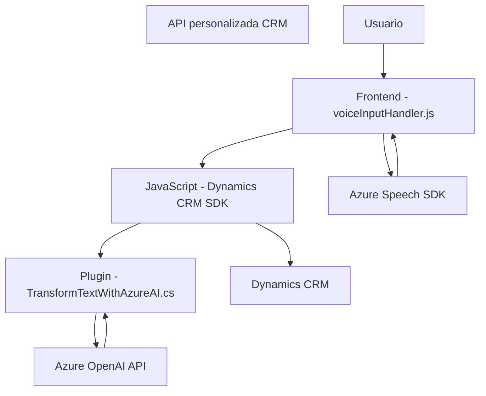

### Breve Resumen Técnico
El repositorio contiene una combinación de componentes: un **Frontend en JavaScript** (que interactúa con usuario y servicios externos) y un **plugin para Dynamics CRM** (en C#) que actúa como middleware para integrar con la API del servicio externo de **Azure OpenAI**. Los dos componentes trabajan en conjunto para ofrecer un flujo que permite la interacción por voz con un formulario y su integración con servicios de inteligencia artificial.

---

### Descripción de la Arquitectura
La arquitectura tiene características de **multicapa** en un entorno heterogéneo donde coexisten:
1. **Capa de presentación:** implementada en el frontend (JavaScript). Permite la interacción con el usuario mediante reconocimiento de voz y audio generado por Azure Speech SDK. Su estructura es modular para cumplir funciones específicas como procesar y asignar datos a formularios CRM.
2. **Capa de negocio/intermediación:** el plugin en C# implementa la lógica de negocio para transformar el texto mediante un servicio externo (Azure OpenAI) y regresarlo al sistema principal (CRM).
3. **Capa de integración:** la interacción con servicios externos (Azure Speech SDK y OpenAI) es una integración explícita y externalizada siguiendo un patrón de **microservicios** (REST APIs utilizadas para síntesis de voz y procesamiento de texto).

Aspectos como el uso de SDKs y APIs externas reflejan un enfoque de **arquitectura modular y orientada a eventos**, mientras que el uso de servicios que interactúan entre sí revela características de una arquitectura **orientada a microservicios**.

---

### Tecnologías Usadas
1. **Frontend:**
   - **JavaScript:** Implementación de lógica de negocio ligera en el navegador.
   - **Azure Speech SDK:** Servicio en la nube para síntesis y reconocimiento de voz.
   - **Dynamics CRM SDK:** Para interactuar con los datos y metadatos del formulario CRM.

2. **Backend:**
   - **C#:** Implementación de plugins para customización avanzada en Microsoft Dynamics CRM.
   - **Azure OpenAI:** Servicio de transformación de texto en JSON estructurado basado en normas definidas por el negocio.
   - **Newtonsoft.Json.LINQ y System.Text.Json:** Manipulación de datos JSON.
   - **System.Net.Http:** Comunicación con servicios REST externos.

3. **Patrones:**
   - **Event-Driven Programming:** Uso de callbacks, promesas y la carga dinámica de dependencias para ejecutar la lógica.
   - **Plug-in Design Pattern:** Cumple con las directrices de arquitectura de Microsoft para integraciones basadas en eventos dentro de Dynamics CRM.
   - **Lazy Loading:** Utilizado en el frontend para cargar dependencias bajo demanda.
   - **Mapper Pattern:** Para traducir datos entre texto hablado (transcripción) y los datos del formulario CRM.

---

### Diagrama **Mermaid** válido para GitHub

---

### Conclusión Final
El repositorio implementa una solución híbrida orientada al reconocimiento de voz y al procesamiento texto por inteligencia artificial, integrándose con un sistema CRM (Dynamics) para manejar datos de formularios mediante interacción directa con el usuario. La arquitectura muestra características de diseño multicapa con una fuerte integración de microservicios a través de llamadas a APIs externas (Azure Speech SDK y Azure OpenAI). También utiliza patrones de diseño robustos como carga diferida, inyección de dependencias y mapeo de datos. La estructura es modular y optimizada para su uso en un sistema basado en eventos.