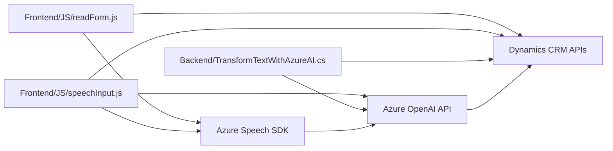

# Análisis Técnico del Repositorio

### Breve resumen técnico

Este repositorio representa una solución que permite integrar funcionalidades avanzadas de entrada y salida de voz con formularios en un entorno CRM, específicamente Dynamics 365. Además, incorpora transformación avanzada de texto mediante Azure OpenAI y reconocimiento/síntesis de voz con Azure Speech SDK. Por lo tanto, las funcionalidades están orientadas a mejorar la interacción entre usuarios y formularios dinámicos mediante audio y texto procesado.

---

### Descripción de arquitectura

La arquitectura general parece estar diseñada de forma modular y con enfoque hacia la integración de servicios externos. La combinación de archivos frontend en JavaScript y el plugin backend en C# sugiere una arquitectura **n-capas**, donde se divide la responsabilidad entre presentación (frontend), lógica de negocio y capa de datos (backend Dynamics CRM). Adicionalmente, se observa la inclinación hacia el uso de microservicios o servidores externos para la lógica avanzada (Azure OpenAI y Speech SDK), lo que introduce principios de arquitectura distribuida.

1. **Frontend**: Divide la lógica de entrada y salida de voz en diversas funcionalidades que interactúan con la API de Speech SDK y los formularios dinámicos de Dynamics.
2. **Backend Plugin**: Contiene una única clase que se ejecuta como extensión del ciclo de vida de eventos en Dynamics CRM. Además, interactúa con la API de Azure OpenAI para realizar transformaciones de texto a JSON.
3. **Integración con Servicios Externos**:
   - Speech SDK: Para síntesis y reconocimiento de voz.
   - OpenAI en Azure: Procesamiento avanzado de lenguaje con modelos GPT.
   - Dynamics CRM APIs: Para manipular datos de formularios dinámicos.

---

### Tecnologías usadas

1. **Lenguajes**:
   - **JavaScript**: Usado para las funcionalidades del frontend, principalmente la interacción de entrada/salida de voz y actualización de formularios en HTML/CRM.
   - **C# (.NET Framework)**: Usado para el desarrollo del plugin de negocio en Dynamics 365.

2. **Frameworks y SDKs**:
   - **Azure Speech SDK**: Implementa la síntesis y reconocimiento de voz a través de un SDK y un endpoint remoto de Azure.
   - **Azure OpenAI API (GPT-4)**: Utilizado desde el backend para estructurar texto en JSON.
   - **Dynamics CRM API**: Se utilizan métodos del espacio de nombres `Xrm.WebApi` para manipular registros y formularios CRM.

3. **Patrones de diseño**:
   - **Callback para carga condicional de SDKs**: Diseñado para cargar dependencias como Azure Speech SDK solo cuando es necesario.
   - **Encapsulación de lógica por función**: Cada operación está claramente definida y segmentada en funciones, tanto en el frontend como en el backend.
   - **Arquitectura de Servicio**: La solución depende de APIs externas como Azure Speech y Azure OpenAI para funciones clave, alineándose con modelos de microservicios.
   - **Modularidad**: El diseño modula funciones y clases para mantener independencia entre responsabilidades.

---

### Dependencias y componentes externos presentes

1. **Azure Speech SDK**: Cargado dinámicamente a través de un enlace remoto desde el script del cliente. Soluciona entrada/salida de voz en tiempo real.
2. **Azure OpenAI API**: Utilizada en el backend para transformar texto en objetos JSON estructurados.
3. **Dynamics CRM APIs**:
   - APIs de datos como `execute` y `retrieveMultipleRecords`.
   - Contextos y atributos del formulario (`Xrm.WebApi`).
4. **Bibliotecas de serialización**:
   - `Newtonsoft.Json.Linq` y `.NET System.Text.Json` para procesamiento de JSON en el código .NET.
5. **HttpClient (C#)**: Empleado para la comunicación con endpoints como los de Azure OpenAI.

---

### Diagrama Mermaid compatible con GitHub

---

### Conclusión Final

El repositorio, que incluye archivos relacionados con la lectura de formularios en voz, reconocimiento de voz y un plugin para transformación de texto con Azure OpenAI, son parte de una solución más amplia que probablemente se integra con un sistema CRM como Dynamics 365. Es una arquitectura **n-capas** con inclinaciones hacia el **modelo distribuido**, dado su implementación modular y dependencia en servicios externos de Azure.

En cuanto a tecnología, combina JavaScript para el frontend que manipula la interacción y datos de formularios, así como C# para extender funcionalidades de Dynamics CRM mediante un plugin. Ambas capas interactúan con servicios externos —Azure Speech SDK y Azure OpenAI— para integrar funcionalidades avanzadas y modernas como la síntesis de voz y el procesamiento semántico de datos.

El diagrama mermaid especificado explica cómo las distintas piezas se relacionan entre sí dentro del sistema. Sin embargo, para producción se recomienda optimizar la seguridad en el manejo de claves API y considerar herramientas de gestión como Azure Key Vault. La solución es eficiente y moderna, aprovechando la nube para intensificar sus operaciones, pero será necesario evaluar su desempeño en un entorno de producción en términos de latencia y coste de utilización de servicios externos.