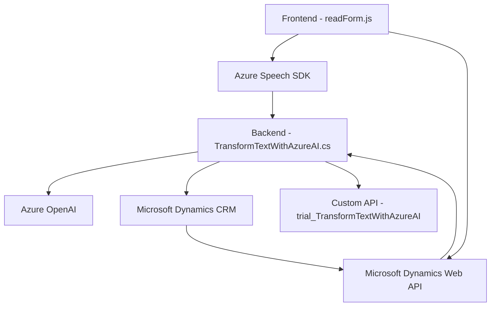

### Resumen Técnico 
Este repositorio tiene módulos que se centran en la integración de sistemas CRM (Microsoft Dynamics) con tecnologías de voz y procesamiento de lenguaje natural, específicamente utilizando **Azure Speech SDK** y **Azure OpenAI**. La principal funcionalidad es la interacción con formularios mediante comandos de voz y transformación de texto con IA.

---

### Descripción de la Arquitectura 
La arquitectura general está diseñada para una solución híbrida: integra funcionalidad de frontend basada en JavaScript y plugins para la plataforma Microsoft Dynamics CRM escritos en C#. Utiliza patrones como arquitectura **a n capas** al separar presentación, lógica empresarial y acceso a datos.

#### Características Principales:
1. **Frontend**:
   - Implementa interacción cliente con lógica de síntesis de voz y entrada de comandos de voz usando el **Azure Speech SDK**.
   - Modula la interacción entre componentes visuales (formularios) y servicios externos.

2. **Backend (Plugins)**:
   - Usa extensiones de Microsoft Dynamics CRM mediante un modelo basado en plugins C#.
   - Integra el servicio **Azure OpenAI** para el procesamiento de texto mediante solicitudes HTTP en el backend.

En conjunto, la arquitectura combina capas claramente separadas entre presentación, lógica de negocio y acceso a datos, manteniendo modularidad y desacoplamiento. Incluye una fachada para interactuar con servicios externos (ej.: Speech SDK) y hace uso de APIs externas para extender funcionalidades IA.

---

### Tecnologías Usadas 
1. **Frontend**:
   - **JavaScript** para interacción dinámica.
   - **Azure Speech SDK** para síntesis y reconocimiento de voz. 
   - **Microsoft Dynamics Web API** para conectividad a la base de datos CRM.

2. **Backend**:
   - **C#/.NET SDK** para implementar plugins en Dynamics CRM.
   - **Azure OpenAI Service** para procesamiento de lenguaje natural basado en inteligencia artificial.
   - **Newtonsoft.Json** para manejo de JSON en C#.
   - **System.Net.Http** para solicitudes HTTP.

3. **CRM Integration**:
   - Utiliza el modelo de plugins de **Microsoft Dynamics CRM**.
   - Invoca funciones relacionadas con la lógica del formulario mediante APIs personalizadas dentro de la plataforma.

---

### Dependencias o Componentes Externos 
1. **Azure Speech SDK**:
   - Procesamiento de voz: habilita síntesis y reconocimiento con un modelo IA proporcionado por Microsoft.
   - Dinámica de carga mediante descarga de scripts desde la web.

2. **Azure OpenAI Service**:
   - Implementa soluciones de procesamiento de lenguaje natural (NLP).
   - Convierte texto en JSON estructurado para la integración con Dynamics CRM.

3. **Microsoft Dynamics CRM APIs**: 
   - Modificaciones y consultas de datos de formularios del sistema.
   - Extensiones mediante plugins y Xrm framework.

4. **Custom API**:
   - Se utiliza una API personalizada, `trial_TransformTextWithAzureAI`, para procesamiento adicional de datos.

---

### Diagrama **Mermaid**

---

### Conclusión Final 
Esta solución constituye una arquitectura **híbrida de n capas**, donde el frontend interactúa con usuario y recoge datos de formularios mientras el backend procesa y transforma información usando servicios avanzados de inteligencia artificial. Destaca por integrar tecnologías de Microsoft como Dynamics CRM, Azure Speech SDK y Azure OpenAI para una experiencia rica y moderna en interacción por voz y automatización basada en IA.

#### Posibilidades de Mejora:
1. Asegurar las claves API mediante sistemas seguros de configuración (ex.: Azure KeyVault).
2. Optimizar solicitudes HTTP en el plugin mediante técnicas asíncronas para evitar bloqueos.
3. Adaptar el repositorio para ampliar su uso en entornos multitenant y reducir acoplamientos entre módulos.
