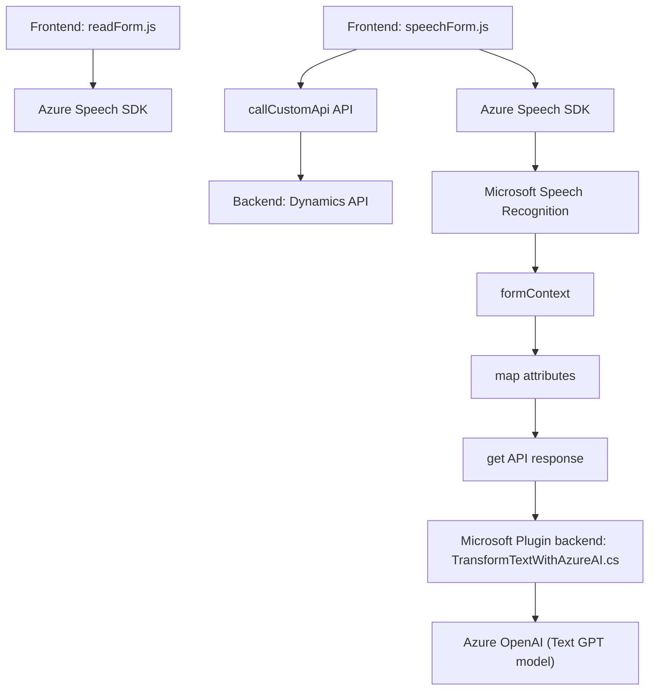

### Breve resumen técnico
El repositorio parece adherirse a una solución compleja que combina frontend con procesamiento de voz, integración de APIs externas (como Azure Speech SDK y Azure OpenAI), y un backend extensible mediante plugins para Dynamics CRM. El objetivo principal es enriquecer la funcionalidad de formularios en Dynamics 365 mediante entrada de voz, reconocimiento de voz y generación de texto procesado automáticamente.

---

### Descripción de arquitectura
#### Tipo de solución:
Esta solución parece ser una arquitectura híbrida que soporta:
1. **Frontend**: Código JavaScript para manejar interacción en formularios, entrada de voz, y síntesis de texto.  
2. **Backend**: Plugins adaptados para Dynamics 365 con integración de Azure OpenAI y servicios internos.

#### Componentes principales de la arquitectura:
1. **Frontend modular**:
   - JavaScript que implementa funciones para entrada y procesamiento de voz (reconocimiento y síntesis).
   - Dependencias en SDKs externos como Azure Speech SDK para interacciones asíncronas y procesamiento de voz.
2. **Backend basado en plugins**:
   - CLR plugins para Dynamics CRM que integran Azure OpenAI para generar datos estructurados en formato JSON.
   - Uso de APIs de Dynamics CRM para manejar la lógica de negocio y almacenamiento.

#### Tipo de arquitectura utilizada:
- **Multicapa**:
  - **Capa de presentación**: Implementación en JavaScript para interacción de usuario en frontend (formularios de Dynamics).
  - **Capa de procesamiento**: Uso de plugins y APIs para lógica de negocio en Dynamics.
  - **Capa de integración**: Comunicación con servicios externos como Azure Speech SDK y Azure OpenAI.
- Influencia de **Hexagonal Architecture** en el backend:
  - Los plugins están diseñados para interactuar con servicios externos mediante abstracción y desacoplamiento.

---

### Tecnologías usadas
1. **Frontend**:
   - **JavaScript** para eventos y lógica en formularios.
   - **Azure Speech SDK** para entrada de voz, síntesis de texto y reconocimiento.
   - **Dynamics CRM APIs** para manipular entidades y atributos del formulario.
2. **Backend (Plugins)**:
   - **Microsoft Dynamics SDK**: Implementa bajo la interfaz `IPlugin`.
   - **Azure OpenAI Service**: Usado para generar información enriquecida desde texto.
   - **C#**: Desarrollo del plugin en .NET.
   - **System.Net.Http**: Para hacer llamadas a servicios externos.
   - **Newtonsoft.Json** (o similar): Parseo y manejo de estructuras JSON.
3. **Patrones arquitectónicos**:
   - Modularización.
   - External API Integration.
   - Service abstraction vía backend.

---

### Diagrama Mermaid
El siguiente diagrama muestra la interacción principal de componentes y dependencias:

---

### Conclusión final
Este repositorio incluye una solución híbrida orientada a mejorar la entrada y procesamiento de datos en formularios de Dynamics CRM mediante tecnologías de voz e inteligencia artificial. Utiliza una arquitectura modular que combina:
- JavaScript para la capa de presentación e interacción directa con usuarios.
- Plugins basados en .NET para lógica de negocio extensible dentro del backend de Dynamics CRM.
- SDKs y servicios de Azure para integrar capacidades avanzadas de reconocimiento y procesamiento de voz, así como generación estructurada de datos.

La solución es escalable, con un backend desacoplado que utiliza servicios externos para tareas específicas. Esto la hace ideal para sistemas ERP/CRM que requieren enriquecimiento dinámico y capacidades de IA.