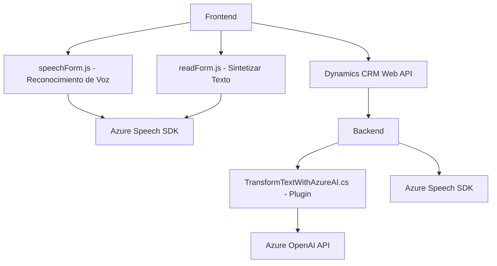

## Breve resumen técnico

Este repositorio contiene archivos implementados con diferentes tecnologías (JavaScript y C#) que están diseñados para integrar funcionalidades avanzadas de entrada/salida por voz y procesamiento de texto en aplicaciones web y de Dynamics CRM. La solución utiliza el **Azure Speech SDK**, llamadas API personalizadas, y servicios externos como **Azure OpenAI**. El objetivo es mejorar la experiencia de usuario en el trabajo con formularios a través de transcripción de voz, síntesis de texto a voz y transformación de texto con inteligencia artificial.

---

## Descripción de arquitectura

La solución tiene una arquitectura híbrida basada en:
1. **Frontend:** Módulos JavaScript que interactúan con formularios web en Dynamics CRM, centrándose en el reconocimiento de voz y la síntesis de texto a voz (archivos `readForm.js` y `speechForm.js`).
2. **Plugin CRM:** Una extensión del backend (archivo `TransformTextWithAzureAI.cs`) en Dynamics CRM que utiliza principios de plugin y patrones de interacción con servicios externos para transformar texto mediante Azure OpenAI.
3. **Integración API:** Comunicación con servicios externos (Azure Speech y Azure OpenAI) para tareas de voz e inteligencia artificial.

La arquitectura tiene características de **N capas**, donde cada capa tiene responsabilidades específicas:
- **Frontend:** Captura los datos del usuario y los comunica con el backend.
- **Backend:** Ejecuta lógica empresarial y delega tareas complejas (inteligencia artificial) a servicios externos.
- **Servicios externos:** Realizan las operaciones de IA (GPT) y procesamiento de voz (Azure Speech SDK).

---

## Tecnologías usadas

1. **Frontend (JavaScript)**:
   - Azure Speech SDK: Reconocimiento de voz y síntesis de texto a voz.
   - JavaScript nativo: Manipulación de DOM y estructuras.
   - Dynamics CRM Web API: Interacción con el sistema de CRM.
   
2. **Backend (C#)**:
   - .NET Framework: Implementación del plugin.
   - Azure OpenAI: Uso de GPT para transformación textual.
   - Microsoft Dynamics CRM:
     - IPluginExecutionContext: Contexto del plugin en CRM.
     - IOrganizationService: Realización de operaciones personalizadas.

---

## Dependencias o componentes externos

1. **Azure Speech SDK:**
   - Función principal: Reconocimiento de voz y síntesis de texto a voz.
   - Dependencia de los archivos `readForm.js` y `speechForm.js`.
   
2. **Azure OpenAI Service API:**
   - Función principal: Transformación de texto.
   - Dependencia del backend (`TransformTextWithAzureAI.cs`).

3. **Xrm.WebApi.online**:
   - Función principal: Comunicación entre el frontend y el backend del entorno Dynamics CRM.

4. **Bibliotecas estándar y externas (C#)**:
   - System.Net.Http, Newtonsoft.Json.Linq, System.Text.Json, etc.

---

## Diagrama Mermaid válido para GitHub

---

## Conclusión final

Este repositorio está diseñado como una solución integrada que utiliza tecnologías de reconocimiento de voz, síntesis de texto y procesamiento con IA para enriquecer la interacción de los usuarios en el sistema Dynamics CRM. La arquitectura sigue principios de **modularidad** y **responsabilidad única**, integrando servicios externos mediante APIs para delegar tareas avanzadas de procesamiento de voz e IA. Esto lo hace flexible y escalable, con soporte para futuras ampliaciones técnicas.