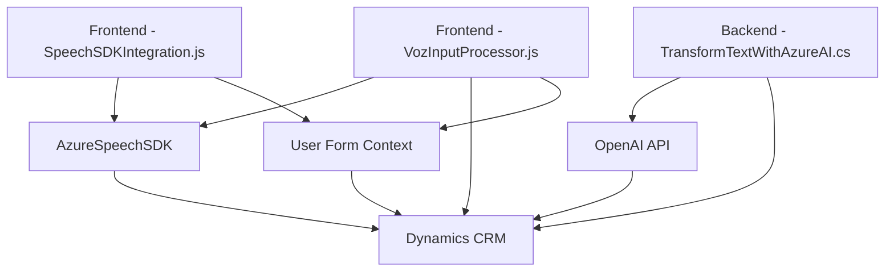

## Breve Resumen Técnico

El repositorio contiene módulos que integran procesamiento de voz, texto y servicios inteligentes de Azure, diseñados para un sistema basado en formularios, probablemente usado en un contexto CRM (Customer Relationship Management). 

1. **Identificación de solución:** Mayormente orientada a la construcción de un servicio API y frontend que interactúan con un CRM mediante SDKs y plugins.
2. **Tecnologías usadas:** Integration con Azure Speech SDK, OpenAI API, y Dynamics CRM (usando plugins y Web API). El frontend está basado en JavaScript, mientras que los plugins están implementados en .NET C#.
3. **Arquitectura:** Predomina un enfoque de **arquitectura en capas** donde cada módulo se separa en capas de interacción de usuario, extracción de datos, procesamiento de negocio, y conexión con APIs externas. También hay un enfoque **cliente-servidor** usando plugins y SDKs externos.
4. **Dependencias/Componentes externos:** Azure Speech SDK, OpenAI API, Dynamics CRM SDK. Además de herramientas como Newtonsoft.Json y librerías estándar para comunicación HTTP y JSON parsing.

---

## Descripción de Arquitectura

La solución combina dos capas esenciales:
1. **Capa frontend:** Abarca funciones para interacción con formularios, reconocimiento de voz y procesamiento de datos en campos dinámicos.
2. **Capa backend:** Plugins y APIs personalizadas en Dynamics CRM que transforman datos según reglas específicas usando IA.

Enfoques principales:
- **Modularidad:** Los métodos están separados por responsabilidades específicas (ejemplo: procesamiento de datos, conversión de voz).
- **Integración con servicios externos:** Uso de SDKs como Azure Speech y OpenAI y APIs de Dynamics CRM.
- **Enfocada en escalabilidad:** Las dependencias se cargan de manera dinámica según la necesidad.

---

## Tecnologías Usadas

1. **Frontend:**
   - **Lenguaje:** JavaScript.
   - **Frameworks externos:** Azure Speech SDK.
   - **Patrones:** Modularización, carga dinámica de dependencias, procesamiento de datos con IA.

2. **Backend:**
   - **Lenguaje:** C# (Dynamics CRM SDK para plugins).
   - **APIs externas:** Azure OpenAI (texto y procesamiento IA).
   - **Framework estándar:** .NET Framework con sistemas de plugin de Dynamics.

---

## Diagrama Mermaid

---

## Conclusión Final

La solución combina tecnologías modernas de procesamiento de voz e integración IA, alineadas con sistemas CRM empresariales. La arquitectura es flexible, basada en módulos con soporte para escalabilidad, y presenta un enfoque claro hacia interacciones cliente-servidor. Se trata de un diseño profesional ideal para implementar soluciones inteligentes integradas en entornos corporativos.