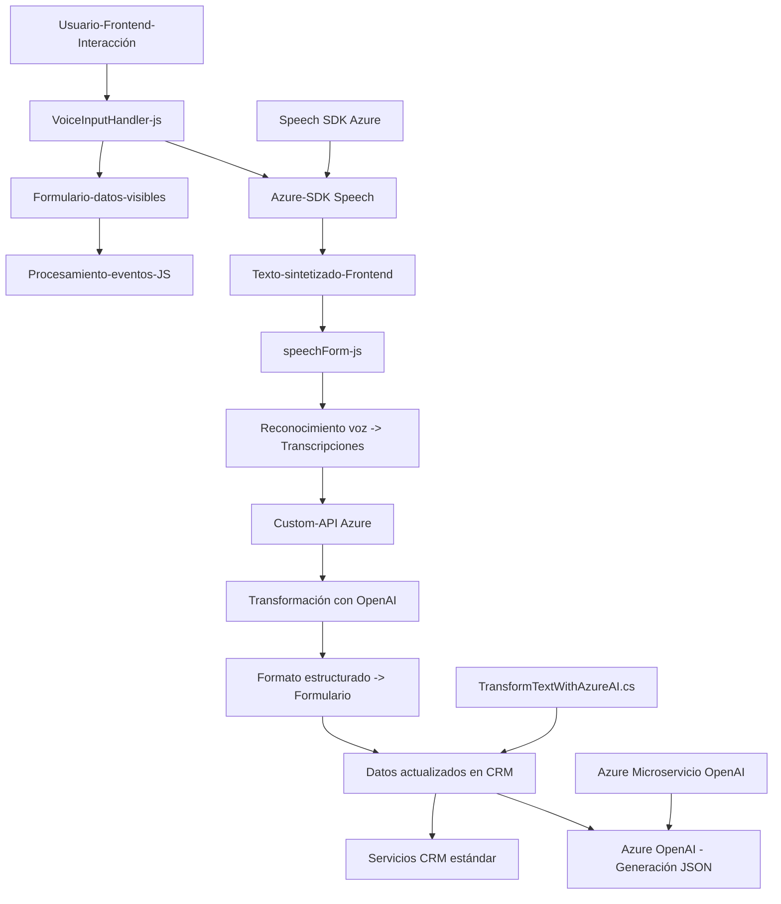

### Breve resumen técnico
El repositorio contiene diferentes componentes funcionales que interactúan tanto con el frontend como con servicios backend y servicios en la nube, incluyendo Azure Speech SDK y Azure OpenAI. Las piezas analizadas implementan funcionalidades desde reconocimiento y síntesis de voz en tiempo real en el cliente (frontend) hasta plugins que extienden Microsoft Dynamics CRM en el servidor.

---

### Descripción de arquitectura
1. **Arquitectura funcional de frontend**:
   - Los archivos `readForm.js` y `speechForm.js` están orientados al procesamiento y manipulación de formularios en el navegador basados en eventos. Integran Azure Speech SDK para reconocimiento de voz y síntesis de texto.
   - Modularidad: Las funciones se encuentran organizadas y desacopladas para cumplir tareas específicas (lectura de campos, síntesis de voz, integración de API).
   - Uso de eventos y asincronía: El procesamiento de texto y la integración con APIs trabajan de forma asíncrona mediante promesas y callbacks.
   - Técnica "event-driven": El reconocimiento de voz es iniciado a partir de la interacción del usuario en el frontend.

2. **Arquitectura del plugin de Dynamics CRM**:
   - El archivo `TransformTextWithAzureAI.cs` implementa un plugin basado en la arquitectura extensional de Microsoft Dynamics CRM.
   - Usa patrones estándar como **Plugin Pattern** y se basa en **SOA (Service-Oriented Architecture)** al conectar Dynamics con un microservicio de Azure OpenAI.
   - Principio de Inversión de Dependencias: Utiliza interfaces como `IPlugin`, `IServiceProvider` para desacoplar la interacción con el entorno CRM.

3. **Patrón Global**:
   - La solución utiliza **n-capas**:
     - Capa cliente: `readForm.js`, `speechForm.js` gestionan eventos y la interfaz de usuario.
     - Capa servicio: `TransformTextWithAzureAI.cs` realiza solicitudes a Azure (OpenAI) y se ejecuta como plugin en el backend.
   - Integración con servicios cloud: Azure Speech SDK para reconocimiento de voz y Azure OpenAI para procesamiento de texto.

---

### Tecnologías usadas
1. **Frontend**:
   - JavaScript (ES6+).
   - Servicios en la nube: Azure Speech SDK.
   - Event-driven processing y modularidad.

2. **Backend**:
   - C#: Framework específico de Microsoft Dynamics CRM (`IPlugin`, `IOrganizationService`).
   - Solicitudes HTTP a API externas (Azure OpenAI) usando `HttpClient`.
   - Serialización/deserialización JSON (`System.Text.Json`).

3. **Servicios cloud**:
   - **Azure Speech SDK**: Para reconocimiento y síntesis de voz.
   - **Azure OpenAI**: Para procesamiento avanzado mediante GPT.

---

### Diagrama Mermaid válido para GitHub

---

### Conclusión final
Este repositorio combina varios paradigmas arquitectónicos, incluyendo **n-capas** y microservicios, para lograr una solución completa que abarca frontend interactivo y extensiones backend para Microsoft Dynamics CRM. La integración con servicios cloud (Azure Speech y OpenAI) es clave para las funcionalidades avanzadas, como reconocimiento de voz y transformación de texto. Mientras los archivos de frontend se centran en la experiencia del usuario y captura de datos mediante voz, Backend (plugin) extiende capacidades de Dynamics aprovechando un servicio de procesamiento inteligente, lo que convierte la solución en una arquitectura híbrida moderna.