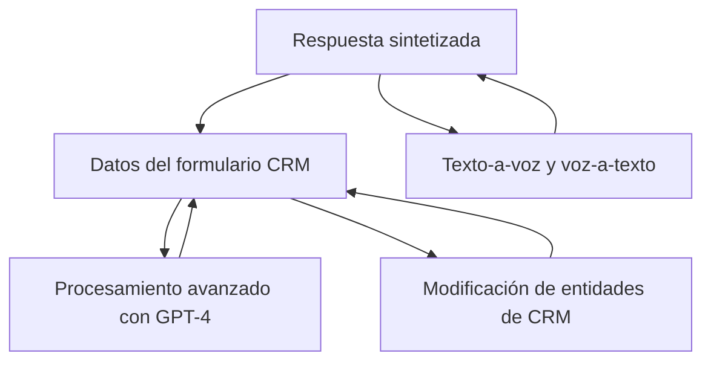

### Breve resumen técnico
El repositorio se enfoca en solucionar problemas relacionados con la integración de la tecnología **Azure Speech SDK** y **Azure OpenAI** en formularios de Dynamics 365. Utiliza componentes frontend como JavaScript para manejar funcionalidades relacionadas con texto a voz y entrada de voz en tiempo real. Además, incluye un plugin de backend para transformar texto utilizando inteligencia artificial de Azure OpenAI. 

### Descripción de arquitectura
La solución presenta una arquitectura **cliente-servidor** en la que:
- **Frontend (JavaScript):** Realiza la interacción directa con el usuario, manejando la entrada y salida de voz en el navegador.
- **Backend (Dynamics 365 Plugin):** Procesa texto mediante un modelo de lenguaje (GPT-4o) habilitado en Azure OpenAI, y manipula los datos de los formularios de Dynamics 365.

La separación de responsabilidades y la modularidad en el código sugieren un enfoque **n-capas**, con capas divididas claramente entre presentación (frontend), lógica de negocio (código del plugin) y servicios externos (Azure APIs).

### Tecnologías usadas
1. **Frontend (JavaScript):**
   - Azure Speech SDK: Manejo de entrada/síntesis de voz.
   - Navegador Web: Manipulación dinámica del DOM y configuración de servicios.
   - Calls a API externas (Azure Speech).

2. **Backend (.NET y C#):**
   - Dynamics CRM Plugin Framework (`Microsoft.Xrm.Sdk`).
   - Azure OpenAI (endpoint para procesamiento de texto).
   - `Newtonsoft.Json` y `System.Text.Json`: Procesamiento de JSON.
   - `System.Net.Http`: Solicitudes HTTP para integrarse con la API de Azure OpenAI.

### Dependencias o componentes externos presentes
1. **Azure Speech SDK:**
   - Maneja la síntesis de voz desde texto y el reconocimiento de voz.
   - Utiliza claves y regiones configuradas por el usuario.
2. **Azure OpenAI Service:**
   - Se conecta al modelo GPT-4o para realizar transformaciones del texto.
3. **Dynamics 365 Web API (`Xrm.WebApi`):**
   - Interactúa con la base de datos de Dynamics CRM.

### Diagrama Mermaid (para GitHub Markdown)

### Conclusión final
La solución aborda la integración de interacción de voz y procesamiento textual avanzado en formularios de Dynamics 365 mediante una arquitectura **n-capas** que es modular y flexible. La combinación de tecnologías de Azure Speech SDK y OpenAI aporta capacidades avanzadas de reconocimiento y síntesis, mientras que el uso de Dynamics Plugins y JavaScript garantiza una integración directa con el entorno CRM. Este diseño es escalable y reutilizable para extender funcionalidades y evolucionar hacia sistemas más complejos.