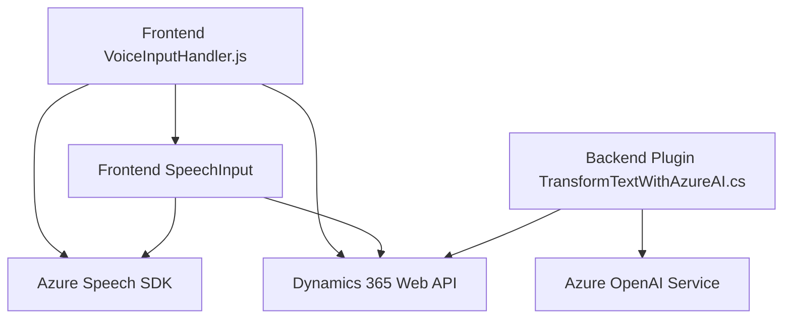

### Resumen técnico
Este repositorio presenta varias soluciones modulares que interactúan con Microsoft Dynamics CRM y Azure Cloud Services. Los archivos están diseñados para manejar formularios y entrada de voz, realizar transformaciones de texto con inteligencia artificial y gestionar procesos automáticos mediante APIs externas.

---

### Descripción de la arquitectura
1. **Tipo de solución:**  
   - Predominantemente componentes backend y frontend que asisten la interacción de usuarios con formularios y servicios de voz/inteligencia artificial.
   - Incluye una integración directa con APIs de Azure Speech SDK y Azure OpenAI, y plug-ins personalizados para Dynamics CRM.

2. **Arquitectura principal:**  
   - **Frontend:** Modular, basado en funciones pequeñas que encapsulan tareas específicas (manipulación DOM, integración SDK).  
   - **Backend (plugin):** Plugin basado en el patrón `IPlugin` de Dynamics 365, integrándose con microservicios de Azure para delegar lógica a servicios externos.  
   - **Global:** Arquitectura **n capas**, donde la capa de frontend interactúa con APIs y servicios backend.

3. **Tecnologías y patrones:**  
   - **Frontend:**  
     - Manejo de la DOM con JavaScript.  
     - Uso dinámico de Azure Speech SDK.  
     - Modularidad basada en funciones.  
   - **Backend:**  
     - C# con: `IPlugin` de Dynamics, integración HTTP (`HttpClient`) e interacción con JSON.  
     - **Integración de servicios externos:** Comunicación directa vía APIs con Azure (Speech SDK/OpenAI).  
   - **Patrones:**  
     - SDK loader (para el manejo dinámico de dependencias en frontend).  
     - **Plug-in design:** División clara de responsabilidades en el plugin Dynamics CRM.
     - **API Gateway/Service Gateway:** Los microservicios externos (Azure) funcionan como puntos de delegación.  
   - **Frameworks:** Dynamics CRM SDK, Azure Speech SDK, Azure OpenAI Service.

4. **Dependencias o componentes externos:**  
   - **Azure Speech SDK:** Para convertir texto a audio y realizar reconocimiento de voz.  
   - **Microsoft Dynamics 365 API:** Interacción con formularios CRM desde frontend y plug-ins backend.  
   - **Azure OpenAI Service:** Para transformar texto aplicando reglas personalizadas.  
   - **Newtonsoft.Json:** Manejo especializado de objetos JSON en el plugin del backend.  
   - **System.Net.Http:** Comunicación HTTP en `TransformTextWithAzureAI`.

---

### Diagrama **Mermaid**

---

### Conclusión final
Este repositorio ofrece un híbrido de soluciones integradas cuyo objetivo central es mejorar la automatización y facilidad de uso de formularios en la plataforma Dynamics CRM. Utiliza una arquitectura n capas con integración de servicios externos como Azure Speech SDK y OpenAI API para permitir interacción mediante dispositivos frontend y servicios backend. Destaca por la división clara de responsabilidades, modularidad y adaptabilidad a contextos empresariales dinámicos.