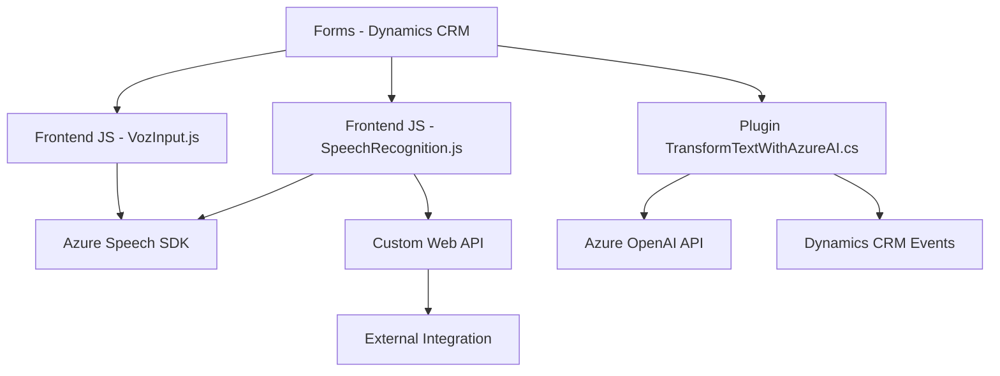

### Breve resumen técnico
El repositorio presenta componentes que habilitan funcionalidades avanzadas como síntesis de voz, reconocimiento de voz y procesamiento de texto mediante servicios en la nube. Las herramientas están diseñadas para mejorar la interactividad y accesibilidad de formularios en aplicaciones basadas en Microsoft Dynamics CRM. Se utilizan tanto tecnologías de frontend mediante JavaScript como extensiones del CRM por medio de un plugin en C#.

---

### Descripción de arquitectura
La solución tiene dos capas principales:
1. **Frontend**: Maneja la interacción directa con el usuario utilizando funciones de reconocimiento de voz y síntesis de texto a voz mediante el SDK de Azure.
2. **Backend**: Extiende la funcionalidad del sistema CRM mediante un plugin en C# que conecta con servicios externos (Azure OpenAI).

El diseño general es una arquitectura de **n capas**, en donde el frontend se comunica con servicios externos (Azure Speech SDK, APIs) y el backend amplía el CRM utilizando un plugin personalizado. Esto apunta a una integración Cliente-Servidor enriquecida con servicios en la nube.

---

### Tecnologías usadas
1. **Frontend**:
   - **JavaScript**:
     - Gestión de formularios dinámicos.
     - Uso de APIs externas como SDK de Azure Speech.
   - **Azure Speech SDK**: Para síntesis de voz y reconocimiento de texto a voz.
   - **Microsoft Dynamics CRM Web API**: Para manipular datos del formulario y entidades del CRM.
2. **Backend**:
   - **C#**:
     - Implementa un plugin de Dynamics CRM.
   - **Azure OpenAI**: Transforma texto usando IA.
   - **Microsoft Dynamics CRM SDK**: Para interacción programática, eventos y API de CRM.
   - **System.Text.Json**: Serialización y deserialización JSON.
3. **Arquitectura integrada**:
   - Patrón Cliente-Servidor.
   - Integración con servicios externos mediante HTTP.

---

### Diagrama Mermaid válido

---

### Conclusión final
El repositorio es una arquitectura basada en **n capas**, con integración profunda de herramientas de Microsoft Dynamics CRM, Azure Speech y Azure OpenAI. Los archivos de frontend interactúan con usuarios en tiempo real mediante reconocimiento y síntesis de voz, mejorando la accesibilidad y automatización. A su vez, el plugin backend extiende la funcionalidad del CRM mediante inteligencia artificial. La solución depende extensivamente de servicios en la nube, reflejando compatibilidad con ecosistemas Microsoft.