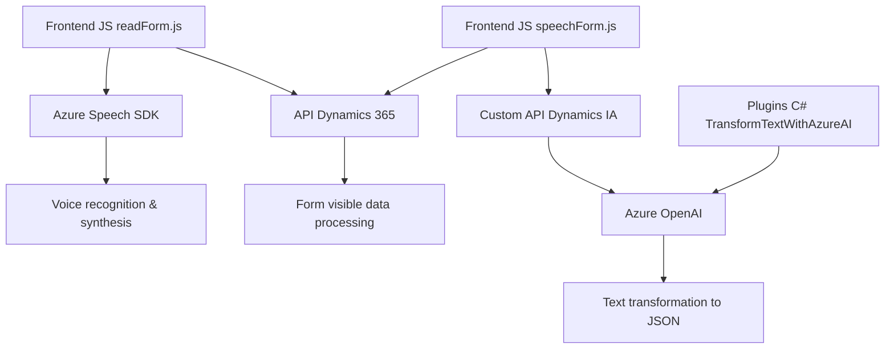

### **Breve resumen técnico**
El repositorio contiene un conjunto de scripts y un plugin, enfocados en la integración entre formularios en aplicaciones basadas en Microsoft Dynamics 365 y servicios de IA proporcionados por Azure. Las tres piezas clave desempeñan funciones específicas:
1. **Frontend (JavaScript)**: Manejo de interacción basada en voz en los formularios (lectura y reconocimiento de voz), utilizando Azure Speech SDK.
2. **Backend (C# Plugin)**: Transformación de texto en objetos JSON estructurados mediante Azure OpenAI.

---

### **Descripción de la arquitectura**
La arquitectura general del sistema refleja una **n capas**:  
1. **Presentación**: Los scripts de frontend implementan interacción con Dynamics 365 en el navegador y habilitan la interacción por voz.  
2. **Lógica de Aplicación (Servicios/Tareas)**: Las funciones JavaScript del Frontend y el Plugin de C# encapsulan funciones específicas, como síntesis de voz, reconocimiento de habla, mapeo de datos de formularios y transformación avanzada basada en IA.  
3. **Capas de Integración**:
   - **Azure OpenAI**: Procesamiento y transformación de texto.
   - **Azure Speech SDK**: Reconocimiento y síntesis de voz.

**Patrones usados**:  
1. Modularización con separación de funcionalidad específica.  
2. Carga dinámica de dependencias (SDK de Azure).  
3. HTTP Client para integración con servicios externos.  
4. Diseño de plugins que encapsulan procesos disparados en Dynamics 365.

---

### **Tecnologías usadas**
1. **Frontend (JavaScript)**:
   - Azure Speech SDK para voz y reconocimiento.
   - Integración con Dynamics 365 para manipulación de formularios y atributos.
2. **Backend (C#)**:
   - Microsoft Dynamics CRM SDK para plugins.
   - Azure OpenAI (GPT) para procesamiento avanzado de texto.
   - JSON libraries: Newtonsoft.Json y System.Text.Json.

---

### **Dependencias o componentes externos**
1. **Servicios Externos**:
   - Azure OpenAI: Modelo de lenguaje avanzado para transformación de texto.
   - Azure Speech SDK: Reconocimiento y síntesis de voz.
2. **Integración Interna**:
   - API de Dynamics 365 para manipulación de formularios y atributos (`Xrm.WebApi`).
3. **Librerías Core**:
   - Newtonsoft.Json para manejo de JSON.
   - System.Net.Http para peticiones HTTP en C#.

---

### **Diagrama Mermaid**

---

### **Conclusión final**
La solución presentada implementa una **arquitectura de n capas**, que integra el frontend con servicios de IA (Azure OpenAI y Azure Speech SDK) y amplía la funcionalidad de Dynamics 365 mediante un plugin backend diseñado con patrones orientados a servicios. Su enfoque modular permite interactuar eficientemente con servicios en la nube para brindar experiencias avanzadas basadas en voz y en inteligencia artificial, ideal para aplicaciones empresariales modernas en entornos CRM.