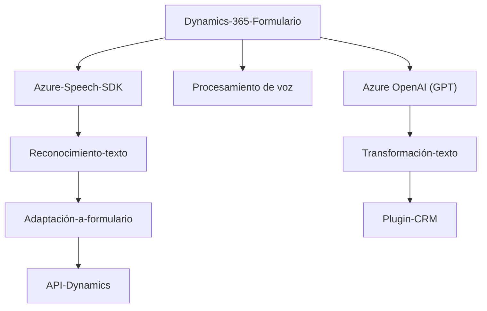

### Resumen técnico

El repositorio representa una solución orientada a la integración entre Microsoft Dynamics 365 y servicios externos de Azure, específicamente Azure Speech SDK y Azure OpenAI. El objetivo principal es mejorar la accesibilidad y las capacidades de procesamiento de voz, reconocimiento de voz y transformación de texto en contextos de formularios de Dynamics 365.

---

### Descripción de arquitectura

#### Estructura general:
1. **Frontend**:
   - Los archivos `voiceInput.js` y `speechForm.js` implementan una capa de interacción en el frontend mediante el uso de SDKs externos para reconocimiento y síntesis de voz.
   - Modularización basada en funciones específicas para facilitar integración con los formularios de Microsoft Dynamics.

2. **Backend**:
   - El archivo `TransformTextWithAzureAI.cs` es un plugin basado en el SDK de Microsoft Dynamics CRM, encargado de procesar texto y transformarlo utilizando IA de Azure OpenAI. 
   - El diseño tiene características de arquitectura de microservicios, ya que cada módulo o plugin depende de servicios externos para realizar tareas específicas.

#### Arquitectura:
- **Híbrida: n-capas + Microservicios**.
  - En el **frontend**, la interacción con Azure Speech SDK sigue un enfoque modular que se acopla a Dynamics 365 en tiempo real.
  - En el **backend**, el plugin usa servicios externos como módulos independientes para extender cualidades específicas (transformación de texto).

- **Integraciones externas**: Es notable el uso de componentes de terceros (Azure Speech SDK, Azure OpenAI) y la integración directa con APIs de Dynamics 365.

---

### Tecnologías usadas

1. **Frontend**:
   - **JavaScript**.
   - SDK: Azure Speech SDK, cargado dinámicamente.
   - Contexto de Dynamics 365 (`executionContext`) para procesar datos de formularios.

2. **Backend**:
   - **C#** para el desarrollo del plugin.
   - **Microsoft Dynamics SDK** para interacción con datos del CRM.
   - **Azure OpenAI Service** para transformación avanzada de texto.
   - **JSON Manipulation**: Librerías como `System.Text.Json` y `Newtonsoft.Json.Linq`.

3. **Patrones**:
   - **Modularidad**: División funcional por responsabilidades específicas.
   - **Integración externa dinámica**: Carga condicional de SDKs y APIs según necesidad.
   - **Separación de responsabilidades**: El código refleja una clara división entre la lógica de negocio, la interacción con APIs externas y la gestión de los datos del formulario.

---

### Diagrama Mermaids

A continuación, se describe visualmente la relación entre módulos, dependencias y arquitectura de la solución:

---

### Conclusión final:

Esta solución mezcla tecnologías frontend (JS + Azure Speech SDK) con un backend basado en Microsoft Dynamics CRM mediante plugins en C#. La arquitectura híbrida (n capas + microservicios) distingue claramente las responsabilidades de procesamiento en forma modular. El uso de Azure como núcleo de servicios externos demuestra la potencia de IA y procesamiento de voz integrado. El diseño es extensible, orientado a accesibilidad y adaptado específicamente al entorno empresarial de Microsoft Dynamics 365.

