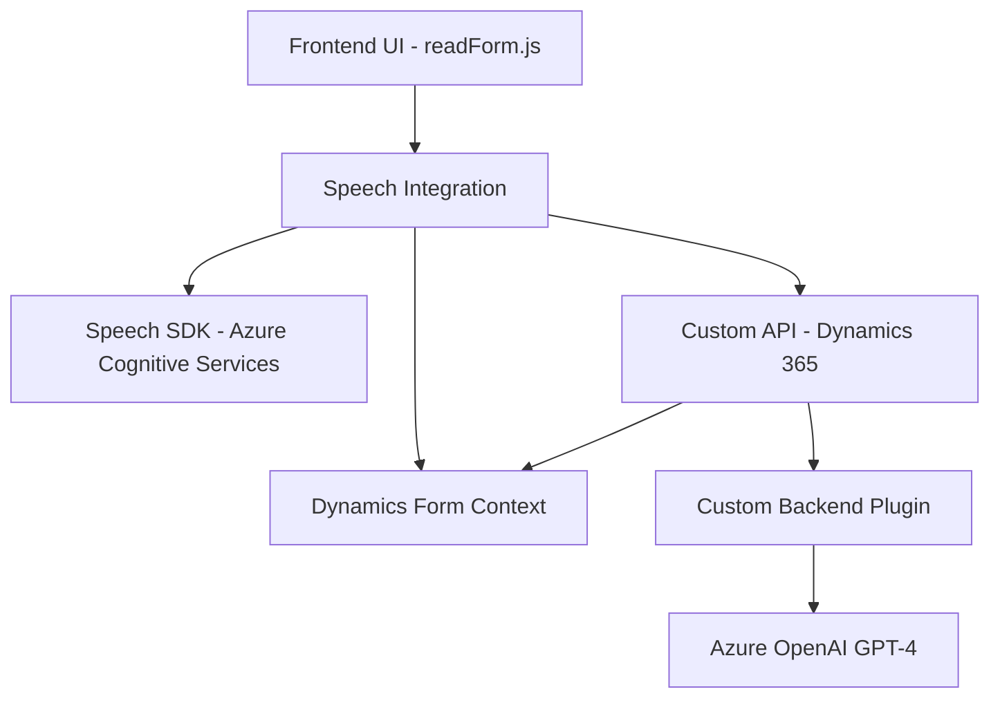

### Breve resumen técnico
El repositorio presenta una solución orientada a la integración de Azure Speech SDK en una aplicación que interactúa con Microsoft Dynamics 365. Está compuesta por dos partes principales:
1. Un **Frontend** que implementa funcionalidades relacionadas con la recogida de entrada por voz del usuario, síntesis de contenido de un formulario, y su integración directa con APIs externas como Azure Speech SDK.
2. Un **backend Plugin** de Microsoft Dynamics desarrollado en `C#`, que actúa como una extensión para procesar texto mediante Azure OpenAI y realizar transformaciones específicas.

---

### Descripción de arquitectura
La solución adopta una **arquitectura cliente-servidor** con los siguientes componentes:
1. **Frontend (JavaScript)**: Implementa la lógica de interacción entre el usuario, las APIs externas (Speech SDK), y los formularios de la interfaz Dynamics 365. Utiliza el navegador como cliente y hace llamadas sobre Dynamics y Azure para la ejecución de comandos.
2. **Backend Plugin (C#)**: Corresponde a un plugin basado en eventos que procesa textos mediante un microservicio externo, Azure OpenAI, aprovechando su capacidad de respuestas inteligentes. Implementa una integración **plugin-based architecture** y usa un patrón **getter-transformer** para convertir mensajes en formato estructurado.

De forma general, todo se articula alrededor de una **arquitectura de tres capas**:
1. **Presentación (Frontend/JS)**: Contiene lógica en el navegador para interacción UI y reconocimiento/síntesis de voz.
2. **Negocios (Dynamics 365 Context)**: Maneja la lógica empresarial en Dynamics, como gestión de formularios y procesamiento de comandos.
3. **Datos y Servicios (Backend Plugin)**: Se ocupa de integrarse con APIs externas (Azure OpenAI y Speech SDK) para transformar y almacenar o recuperar datos.

---

### Tecnologías usadas
1. **Microsoft Dynamics 365**: Plataforma SaaS empresarial para gestión de CRM.
   - Uso de plugins para manejar eventos y extender las funcionalidades predeterminadas de Dynamics.
2. **Azure Speech SDK** (JavaScript): Solución de Microsoft para reconocimiento de voz y síntesis de texto a audio.
3. **Azure OpenAI**: Procesamiento de datos mediante servicios GPT-4 en REST API.
4. **JavaScript (Frontend)**: Lenguaje para implementar lógica de interacción usuario-UI-API.
5. **Microsoft CRM SDK & C#:** Framework para desarrollo y extensión de Dynamics.
6. **HTTP REST API**: Comunicación asincrónica con los servidores de Azure.

---

### Diagrama Mermaid válido para GitHub Markdown

---

### Conclusión final
La solución presentada se basa en la integración de servicios externos para habilitar funcionalidades avanzadas dentro del ecosistema de Dynamics 365. Usa el **Azure Speech SDK** en el frontend para recoger y procesar datos, y en el backend emplea un plugin en C# para manejar la interacción con **Azure OpenAI**. La arquitectura está orientada hacia una estructura de tres capas, asegurando una clara separación entre presentación, lógica empresarial y datos. El uso de SDKs y APIs asegura flexibilidad y escalabilidad futura.