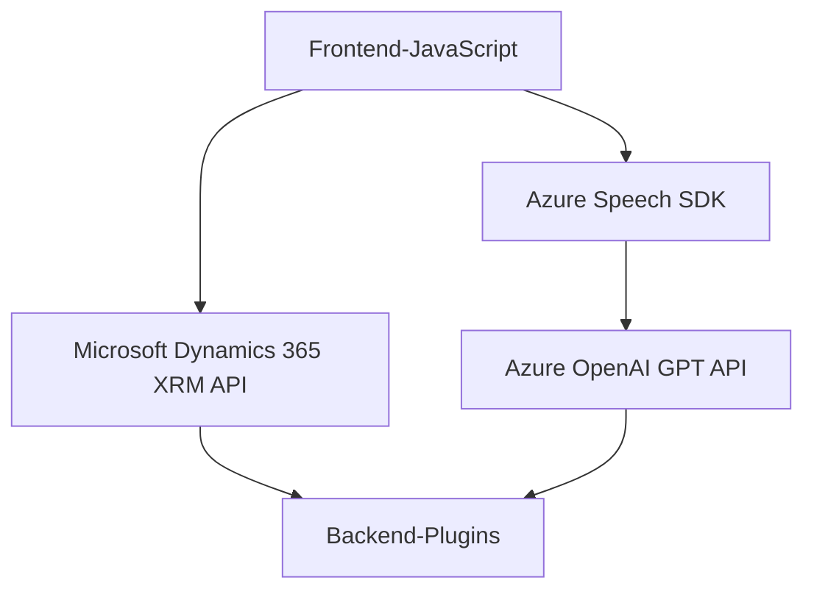

### Breve resumen técnico

La solución encontrada en el repositorio está diseñada para interactuar con formularios en Dynamics 365, proporcionando capacidades avanzadas de entrada de datos y procesamiento mediante voz y texto. Utiliza servicios externos, como el SDK de Azure Speech y Azure OpenAI, para transcribir audio, sintetizar voz y transformar texto en formatos estructurados. Esta solución combina frontend modular con un backend de procesamiento basado en plugins en Dynamics CRM.

---

### Descripción de arquitectura

La arquitectura global se podría describir como **n-capas integradas con servicios externos**, donde:

1. **Capa de presentación (Frontend)**:
   - Módulos JavaScript (`readForm.js`, `speechForm.js`) se integran directamente en el cliente Dynamics 365 para capturar voz, procesar datos y actualizar formularios.
   - Modularización del código frontend siguiendo líneas específicas para entrada/salida, procesamiento del contexto y comunicación con servicios externos en una arquitectura cliente-servidor.

2. **Capa de negocio (CRM Plugins)**:
   - Implementación de los plugins con `TransformTextWithAzureAI.cs`, que procesa las solicitudes contextuales usando el patrón de ejecución asincrónica propio de Dynamics CRM.
   - Proporciona una capa que transforma texto en objetos JSON estructurados, manteniendo la lógica de negocio dentro de Dynamics.

3. **Integración de servicios externos**:
   - Uso de SDK y APIs de Azure Speech (para transcripción/síntesis de voz) y Azure OpenAI (para procesamiento avanzado del texto).
   - Modularización para asegurar que las dependencias externas se carguen de forma dinámica.

La arquitectura global combina **modularización en n-capas** con **integración de microservicios externos**, como Azure Speech y Azure AI, manteniendo un flujo dinámico entre el frontend y el backend Dynamics CRM.

---

### Tecnologías usadas

1. **Frontend**:
   - **Microsoft Dynamics 365 Xrm API**: Interacción bidireccional con atributos y formularios.
   - **Azure Speech SDK**: Transcripción de voz a texto y síntesis de texto a voz.
   - **JavaScript**: Modularización y programación específica para frontend.

2. **Backend**:
   - **Dynamics CRM Plugins (C#)**: Procesamiento de datos y ejecución en contexto CRM.
   - **Azure OpenAI GPT API**: Transformación de texto usando Machine Learning y procesamiento de reglas.
   - **Newtonsoft.Json** y `System.Text.Json`: Manejo de datos JSON para intercambiar información procesada.

3. **Patrones observados**:
   - **Callback Pattern**: En el frontend para cargar dependencias como el SDK de Azure.
   - **Single Responsibility Principle (SRP)**: En el backend para mantener los métodos bien aislados por funcionalidad específica.
   - **Modularización**: Aplicada en el código frontend y backend para simplificar la introducción de nuevos módulos y funcionalidades.

---

### Diagrama Mermaid válido para GitHub

---

### Conclusión final

Esta solución brinda capacidades de procesamiento avanzadas para formularios en Microsoft Dynamics 365 mediante integración con tecnologías de Azure. Su estructura modular y su alineación con patrones como SRP, junto con la integración asincrónica de servicios externos, la hacen flexible y escalable para adaptarse a futuros desarrollos. La combinación de frontend dinámico y backend basado en plugins define una arquitectura de **n-capas** robusta y efectiva.