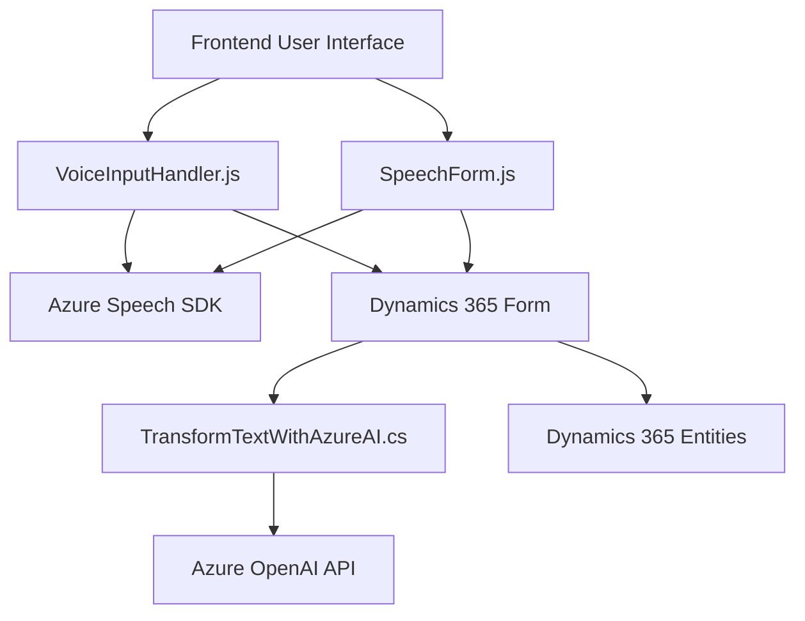

### Breve resumen técnico
El repositorio contiene módulos para una solución que emplea reconocimiento de voz, síntesis de texto y transformación de datos empleando Azure Speech SDK y Azure OpenAI, integrada en Microsoft Dynamics CRM. La solución combina componentes de frontend escritos en JavaScript y plugins en C# para utilizar APIs cognitivas y realizar operaciones directamente en formularios de Dynamics CRM.

---

### Descripción de arquitectura
El sistema tiene una arquitectura **n-capas** (multi-tier), donde los componentes presentan las siguientes capas:  
1. **Presentación (Frontend)**: Los módulos JavaScript (`readForm.js`, `speechForm.js`) interactúan con el usuario a través del navegador, integrando Azure Speech SDK para la entrada y salida de voz.  
2. **Lógica empresarial (Middleware)**: La lógica para transformar texto con Azure OpenAI y gestionar dinámicamente atributos en formularios reside en plugins en C# (`TransformTextWithAzureAI.cs`).  
3. **Integración con servicios externos**: La solución consume APIs cognitivas de Azure (Speech SDK y OpenAI) mediante llamadas HTTP y SDKs específicos.  
4. **Base de datos y modelo de datos (Persistencia)**: Los datos manipulados corresponden a la estructura de formularios y entidades de Dynamics CRM, accediendo directamente a los modelos definidos por la plataforma.

---

### Tecnologías usadas
#### Frontend:
- **Lenguaje**: JavaScript.
- **Azure Speech SDK**: Para reconocimiento y síntesis de voz en tiempo real.
- **Dynamic 365 SDK**: Para manipular formularios del CRM.

#### Backend:
- **Lenguaje**: C#.
- **Microsoft Dynamics CRM SDK**: Para crear plugins con interacción directa con las entidades y operaciones del CRM.
- **Azure OpenAI API**: Para procesamiento de texto asistido por inteligencia artificial.
- **HTTPClient y JSON Libraries**: Comunicación con servicios externos y manipulación eficiente de datos recibidos.

#### Patrones de diseño:
- **Encapsulación**: Código modular distribuyendo funcionalidad en métodos y clases especializadas.  
- **Service-Oriented Architecture (SOA)**: Integración de APIs cognitivas y servicios externos.  
- **Plugin-based Architecture**: Implementación específica para Dynamics CRM como plugins que se ejecutan dentro de eventos del sistema.  

---

### Dependencias o componentes externos presentes
1. **Azure Speech SDK**: Usado en frontend para voz a texto y síntesis de texto a voz.  
2. **Azure OpenAI API**: Procesamiento avanzado de texto en backend para transformar datos.  
3. **Microsoft Dynamics CRM SDK**: Dependencia clave para cargar, manipular y guardar datos en formularios.  
4. **NET Framework Libraries**: Uso de manejo HTTP, serialización JSON y expresiones regulares para integración backend.  

---

### Diagrama Mermaid 100 % compatible con GitHub Markdown

---

### Conclusión final
La solución es una combinación de frontend y backend orientada a integrar funcionalidades avanzadas de voz y procesamiento de texto con Microsoft Dynamics CRM utilizando Azure technologies. Su diseño modular, capaz de interactuar con servicios cognitivos, la hace altamente adaptable y extensible. La arquitectura **n-capas** y el uso de APIs conducen a una separación adecuada entre las interfaces, lógica de negocio y persistencia, optimizando la capacidad de mantenimiento y escalabilidad del sistema.